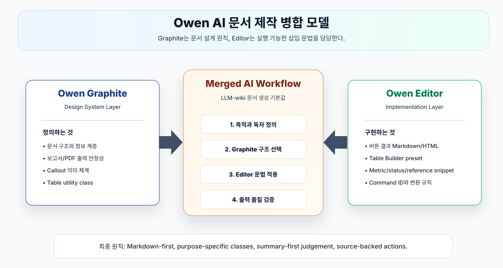
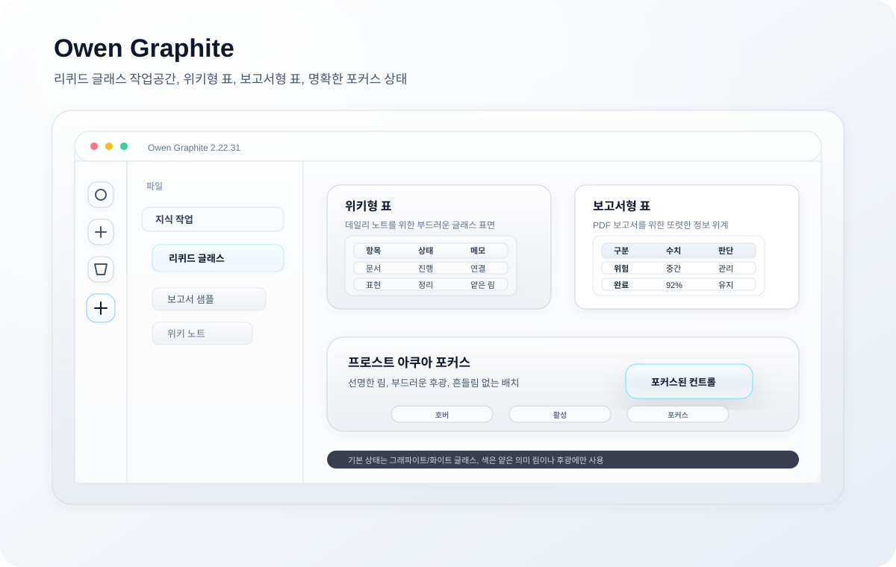

# Owen Graphite — Obsidian Theme

Owen WIKI, Owen Graphite, Owen Editor는 LLM 기반 지식 정리부터 Obsidian 보고서 작성, Markdown 편집 UI까지 이어지는 Owen의 지식 작업 스택입니다.




[](https://github.com/towishy/Owen-Graphite/releases/latest)
[](LICENSE)
[](https://obsidian.md)
[](#2-테마-기능-요약)

---

## 1. 테마 소개

**Owen Graphite**는 그래파이트(graphite) 톤의 라이트/다크 Obsidian 테마입니다. 한국어 보고서·기술 문서·위키 작성에 최적화되어 있으며, A3 인쇄 친화 레이아웃과 Live Preview ↔ Reading View 시각 동기화를 핵심 가치로 삼습니다.

| 분야 | 내용 |
|------|------|
| **타깃** | 보고서·기술 문서·위키 작성자 (특히 한국어) |
| **버전** | `2.22.40` |
| **모드 지원** | ✅ Light / Dark / Report — 모든 위젯 패리티 보장 |
| **플랫폼** | ✅ Desktop & Mobile |
| **디자인 정책** | Glass+Shadow 코어 · 샘플-우선 워크플로우 |



<details>
<summary>📷 Light / Dark / Report 모드 스크린샷</summary>


</details>

---

## 2. 테마 기능 요약

| 분류 | 주요 기능 | 요약 |
|------|----------|------|
| **디자인 코어** | Graphite 톤 · Liquid-glass chrome | 차분한 graphite 기반에 ribbon·사이드바·탭·툴바·command palette·tooltip glass surface 적용 |
| **상태 표현** | Table mode split · Frost Aqua focus | 위키형/보고서형 표를 분리하고 focus 상태는 aqua rim + soft halo로 표시 |
| **워크스페이스** | Workspace Surfaces Pack · Polish Pack | Graph view·Canvas·Folder cues·Mini TOC·Cover page·Dark parity·Mobile·Tab·Search HL 정리 |
| **보고서·인쇄** | A3 PDF Export · 모던 헤더 · 자동 넘버링 | A3 가로/15mm 여백, 첫 페이지 헤더, H1 페이지 분할, 표지 유틸리티 지원 |
| **분할 안정성** | 자동 분할 회피 | callout·표·Mermaid·코드·이미지가 PDF에서 중간 분할되지 않도록 보정 |
| **커스터마이징** | Style Settings 28종 · 사용자 클래스 | 폰트·간격·컬러·보고서 모드 토글과 `.ogd-blur`·`.ogd-cover`·테이블/callout 유틸리티 제공 |
| **접근성·환경** | 시선 보호 · OS 다크 모드 · CJK 보정 | 시선 보호 모드, OS 다크 모드 자동 추종, CJK +0.5px 자동 보정 지원 |
| **Style Settings 분류** | 타이포 · 표 · 보고서 · PDF · 컬러/모션 | Style Settings 플러그인에서 전체 옵션을 사이드바 UI로 조정 |

---

## 3. 테마 설치 방법

### 옵션 A — Obsidian 커뮤니티 마켓 (승인 후)

1. 설정 → **외관 → 테마 관리**
2. 검색: `Owen Graphite`
3. 설치 → 사용

### 옵션 B — ZIP 수동 설치

[Releases 페이지](https://github.com/towishy/Owen-Graphite/releases/latest)에서 **`Owen-Graphite-<version>.zip`** 을 다운로드해 압축 해제합니다.

> **⚠️ 주의** Release Assets에는 GitHub 자동 생성 `Source code (zip)`도 함께 표시됩니다. 반드시 `Owen-Graphite-<version>.zip` 을 받으세요.

| 플랫폼 | 테마 대상 경로 |
| --- | --- |
| Windows | `<YourVault>\.obsidian\themes\Owen Graphite\` |
| macOS / Linux | `<YourVault>/.obsidian/themes/Owen Graphite/` |

설치 후 Obsidian → 설정 → **외관 → 테마** → `Owen Graphite` 선택.

<details>
<summary>옵션 C — Git 수동 설치 / 업데이트</summary>

#### Git 수동 설치 / 업데이트

Obsidian vault의 `.obsidian/themes/Owen Graphite/` 경로에 클론합니다. **같은 명령을 다시 실행하면 자동으로 업데이트**됩니다. 이미 클론된 폴더는 `fetch → reset --hard origin/main → clean` 순서로 최신 릴리스 상태를 맞춥니다.

| 플랫폼 | Git 설치 | 설치 / 업데이트 명령 |
| --- | --- | --- |
| Windows | `winget install --id Git.Git -e --source winget` | PowerShell 스크립트 (아래) |
| macOS | `brew install git` | bash 스크립트 (아래) |
| Linux | `sudo apt install git` (또는 `dnf install git`) | macOS와 동일 |

#### Windows (PowerShell)

```powershell
$ErrorActionPreference = "Stop"
$Vault = "D:\Path\To\YourVault"    # vault 경로로 교체
$Repo = "https://github.com/towishy/Owen-Graphite.git"
$ThemesDir = Join-Path $Vault ".obsidian\themes"
$ThemeDir = Join-Path $ThemesDir "Owen Graphite"

New-Item -ItemType Directory -Force -Path $ThemesDir | Out-Null

if (Test-Path -LiteralPath (Join-Path $ThemeDir ".git")) {
  git -C "$ThemeDir" fetch --quiet origin main
  git -C "$ThemeDir" reset --quiet --hard origin/main
  git -C "$ThemeDir" clean -qfd
  Write-Host "OK: Owen Graphite updated."
} elseif (Test-Path -LiteralPath $ThemeDir) {
  $Backup = "${ThemeDir}.backup-$(Get-Date -Format 'yyyyMMdd-HHmmss')"
  Move-Item -LiteralPath $ThemeDir -Destination $Backup
  git clone --quiet $Repo "$ThemeDir"
  Write-Host "OK: Owen Graphite reinstalled. Backup: $Backup"
} else {
  git clone --quiet $Repo "$ThemeDir"
  Write-Host "OK: Owen Graphite installed."
}
```

#### macOS / Linux (bash)

최신 버전의 macOS에서는 git이 기본 포함되어 있으며, 아래 스크립트는 **설치 / 업데이트 / 손상된 폴더 복구**를 모두 처리합니다.

```bash
set -e
VAULT="/path/to/YourVault"          # ← vault 경로로 교체
REPO="https://github.com/towishy/Owen-Graphite.git"
THEME_DIR="$VAULT/.obsidian/themes/Owen Graphite"

mkdir -p "$VAULT/.obsidian/themes"

if [ -d "$THEME_DIR/.git" ]; then
  # 이미 설치됨 → 최신화 (rebase 대신 hard reset 으로 충돌 회피)
  git -C "$THEME_DIR" fetch --quiet origin main
  git -C "$THEME_DIR" reset --quiet --hard origin/main
  git -C "$THEME_DIR" clean -qfd
  echo "OK: Owen Graphite updated to $(git -C "$THEME_DIR" describe --tags --abbrev=0 2>/dev/null || echo 'main HEAD')."
elif [ -e "$THEME_DIR" ]; then
  # 폴더는 있으나 git 저장소가 아님 (수동 ZIP 설치 등) → 백업 후 재클론
  BACKUP="$THEME_DIR.backup-$(date +%Y%m%d-%H%M%S)"
  echo "WARN: 기존 비-Git 폴더 발견 → $BACKUP 으로 백업 후 재설치"
  mv "$THEME_DIR" "$BACKUP"
  git clone --quiet "$REPO" "$THEME_DIR"
  echo "OK: Owen Graphite 재설치 완료 (이전 폴더는 $BACKUP 에 보관)."
else
  git clone --quiet "$REPO" "$THEME_DIR"
  echo "OK: Owen Graphite 설치 완료."
fi
```

**한 줄 버전** (이미 vault 경로에서 실행 중일 때):

```bash
THEME_DIR=".obsidian/themes/Owen Graphite"; REPO="https://github.com/towishy/Owen-Graphite.git"; mkdir -p "$(dirname "$THEME_DIR")"; if [ -d "$THEME_DIR/.git" ]; then git -C "$THEME_DIR" fetch -q origin main && git -C "$THEME_DIR" reset -q --hard origin/main && git -C "$THEME_DIR" clean -qfd; else if [ -e "$THEME_DIR" ]; then mv "$THEME_DIR" "$THEME_DIR.backup-$(date +%Y%m%d-%H%M%S)"; fi; git clone -q "$REPO" "$THEME_DIR"; fi && echo "OK"
```

> [Style Settings](https://github.com/mgmeyers/obsidian-style-settings) 플러그인을 함께 설치하면 28개 옵션을 사이드바 UI에서 토글할 수 있습니다.

</details>

---

## 4. 테마 신기능

### ✨ v2.22.31 — README Liquid Glass Overview

README 대표 이미지와 실제 테마 CSS를 같은 liquid glass 기준으로 맞추고, 표와 focus 상태의 최신 시각 기준을 정리했습니다.


| # | 항목 | 내용 |
|---|------|------|
| 1 | README 대표 이미지 | 실제 작업공간 chrome, 위키형 표, 보고서형 표, Frost Aqua focus를 한 장에 요약 |
| 2 | Table mode split | 위키형 표는 airy glass surface, 보고서형 표는 PDF 친화 contrast/rule 중심으로 분리 |
| 3 | Frost Aqua focus | ribbon, nav, tab, search/modal, settings focus를 aqua rim + soft halo로 통일 |
| 4 | QA guard | README SVG, liquid glass token map, table/focus smoke sample을 validator로 보호 |

---

## 5. Change Log

README에는 **v2.22.20 이상** 주요 변경만 간략히 요약합니다. 전체 이력은 [CHANGELOG.md](CHANGELOG.md)에서 확인할 수 있습니다.

| 버전 | 핵심 변경 |
|------|----------|
| **v2.22.40** | Live Preview 표 헤더 인라인 편집 높이 팽창 hotfix |
| **v2.22.39** | Mermaid 진단용 control fixture의 DOM-only 상태 명확화 |
| **v2.22.38** | Mermaid Live Preview control DOM 표시 fix와 진단 샘플 추가 |
| **v2.22.37** | fixture 추적 정책, 릴리즈 guard, side pane QA matrix 보강 |
| **v2.22.36** | 사이드 pane glass parity와 회귀 fixture 보강 |
| **v2.22.35** | 백링크 설명 카드와 오른쪽 pane glass surface 정렬 |
| **v2.22.34** | 우상단 view header action 버튼 glass surface 정렬 |
| **v2.22.33** | toolbar/plugin token 정리와 community theme search fixture guard 추가 |
| **v2.22.32** | 커뮤니티 테마 탐색 검색창 focus 하이라이트 완화 |
| **v2.22.31** | README 대표 이미지, 표 모드 분리, Frost Aqua focus 정리 |
| **v2.22.30** | 탭 rim과 active file row focus hotfix |
| **v2.22.29** | core state matrix 기반 liquid glass 토큰 적용 |
| **v2.22.28** | CSS guard, QA, fixture 검증 체계 강화 |
| **v2.22.27** | Live Preview editable table 샘플 hotfix |
| **v2.22.26** | core glass sample 반영과 active/selected rim 정리 |
| **v2.22.25** | MAP info 축소 및 overlay/search/graph 안정화 |
| **v2.22.24** | ribbon/toggle/tab/focus/graph control 소유권 정리 |
| **v2.22.23** | file explorer hierarchy와 compatibility warning 정리 |
| **v2.22.22** | README knowledge work stack 이미지 교체 |
| **v2.22.21** | active path, ribbon/graph, backlink row liquid glass baseline |
| **v2.22.20** | 상태바, modal close, Dataview chip, sync/git pill polish |

> 전체 릴리즈 노트 → [CHANGELOG.md](CHANGELOG.md)

---

## 6. 기타

### 🤝 기여
- 이슈: [GitHub Issues](https://github.com/towishy/Owen-Graphite/issues)
- 토론: [Discussions](https://github.com/towishy/Owen-Graphite/discussions)
- 기여 가이드: [CONTRIBUTING.md](CONTRIBUTING.md)
- 개발 모듈 워크플로우: [dev/README.md](dev/README.md)

### 📁 파일 구조

```
Owen Graphite/
├── theme.css         # 테마 본체 (~10,600줄)
├── manifest.json     # Obsidian 테마 메타데이터
├── README.md         # 본 문서
├── CHANGELOG.md      # 전체 릴리즈 노트
├── CONTRIBUTING.md   # 기여 가이드
├── LICENSE           # MIT
├── dev/test-samples/ # 개발/검증용 샘플 문서
├── docs/             # 디자인 기준, QA, 토큰 매핑 문서
├── dev/MAP/          # dev CSS 기준 theme.css risk map 산출물
├── dev/temp/         # 임시 요청 산출물 보관소 (내용물은 커밋 제외)
├── screenshots/      # README/마켓 이미지
└── scripts/          # Python 검증/릴리즈 스크립트
```

### 🅰️ 권장 폰트
- **Pretendard** / **Noto Sans KR** — 본문 (sans)
- **Noto Serif KR** / **나눔명조** — 보고서 모드 (serif)
- **JetBrains Mono** / **D2Coding** — 코드 (mono)

### 📜 라이선스
[MIT License](LICENSE) © 2026 Owen ([@towishy](https://github.com/towishy))

### 🙏 크레딧
- 글꼴: Pretendard (Kil Hyung-jin), Noto Sans/Serif KR (Google), JetBrains Mono (JetBrains), D2Coding (Naver)
- 영감: Obsidian Minimal, Things, AnuPpuccin
- 빌드: Obsidian 1.6.x / macOS · Windows · Linux
