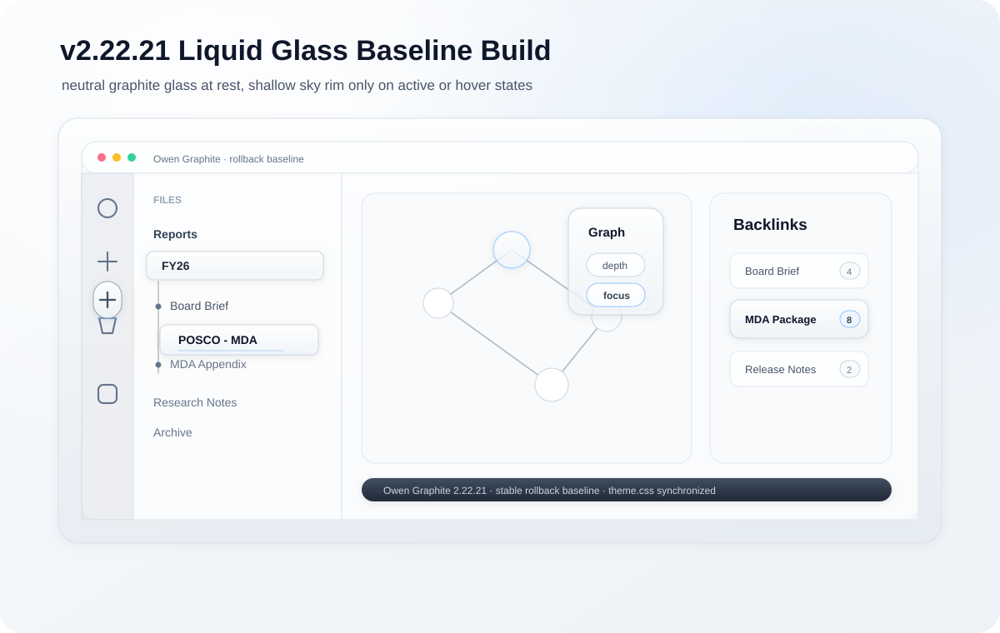
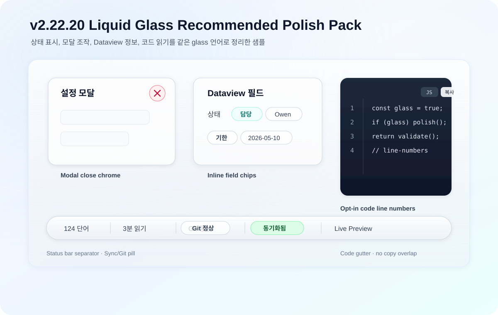

# Owen Graphite — Obsidian Theme

Owen WIKI, Owen Graphite, Owen Editor는 LLM 기반 지식 정리부터 Obsidian 보고서 작성, Markdown 편집 UI까지 이어지는 Owen의 지식 작업 스택입니다.


[](https://github.com/towishy/Owen-Graphite/releases/latest)
[](LICENSE)
[](https://obsidian.md)
[](#-스타일-설정-style-settings)

---

## 1. 테마 소개

**Owen Graphite**는 그래파이트(graphite) 톤의 라이트/다크 Obsidian 테마입니다. 한국어 보고서·기술 문서·위키 작성에 최적화되어 있으며, A3 인쇄 친화 레이아웃과 Live Preview ↔ Reading View 시각 동기화를 핵심 가치로 삼습니다.

| 분야 | 내용 |
|------|------|
| **타깃** | 보고서·기술 문서·위키 작성자 (특히 한국어) |
| **버전** | `2.22.27` (Obsidian 1.6.0+ · 현 롤백 베이스라인) |
| **모드 지원** | ✅ Light / Dark / Report — 모든 위젯 패리티 보장 |
| **플랫폼** | ✅ Desktop & Mobile |
| **디자인 정책** | 좌측 라인 영구 밴 · Glass+Shadow 코어 · 샘플-우선 워크플로우 |


<details>
<summary>📷 Dark / Report 모드 스크린샷</summary>


</details>

---

## 2. 테마 기능 요약

### 🎨 디자인 코어
- **Graphite 톤** — 차분한 그레이 베이스 + accent 컬러 프리셋 (Graphite/Blue/Teal/Violet/Amber)
- **Liquid-glass chrome** — ribbon·사이드바·탭·툴바·command palette·tooltip 전반에 backdrop-blur (강도 변수 `--og-glass-blur`)
- **좌측 라인 영구 밴** — chrome 영역 좌측 4px bar 디자인 사용 금지 (callout/quote 등 본문은 예외)
- **Workspace Surfaces Pack** — Graph view·Canvas·Folder cues·Mini TOC·Cover page
- **Polish Pack** — Dark parity·Mobile 반응형·Tab 대비·코드 라벨·Heading anchor·Search HL

### 📑 보고서·인쇄
- **A3 PDF Export** — 가로 / 15mm 여백 / H1마다 페이지 분할
- **PDF 첫 페이지 모던 헤더** — Side Bar + Two-line (라벨/본문/사이드바 색 커스터마이징)
- **헤더 자동 넘버링** — 1. / 1.1 / 1.1.1
- **표지 페이지 유틸리티** — `.cover-page` / `.cover-meta` / `.cover-rule`
- **자동 분할 회피** — callout·표·Mermaid·코드·이미지

### ⚙️ 사용자 커스터마이징
- **Style Settings 28종** — 폰트·간격·컬러·보고서 모드 등 UI 토글
- **사용자 클래스** — `.ogd-blur`·`.ogd-cover`·테이블 유틸리티·callout 14종
- **시선 보호 모드** · **OS 다크 모드 자동 추종** · **CJK +0.5px 자동 보정**

### 📋 Style Settings (Style Settings)

플러그인 설치 후 사이드바에서 토글로 즉시 적용. 전체 28개 옵션:

| 분류 | 대표 옵션 |
|------|----------|
| **타이포** | 본문 폰트 크기·줄간격·최대 폭·세리프 본문·CJK 보정 |
| **표** | zebra 줄무늬·모던 스타일·sticky header |
| **보고서** | 보고서 모드·헤더 자동 넘버링·드롭 캡·간격 프리셋 |
| **PDF** | 페이지 크기·블록 분할 방지·첫 페이지 모던 헤더 (좌/우 라벨·본문·사이드바 색) |
| **컬러/모션** | 액센트 프리셋·코드블록 테마·시선 보호·OS 다크 모드 추종·Glass 강도·Hover 움직임 |

> 전체 옵션 표는 [docs/style-settings.md](docs/style-settings.md) 또는 플러그인 UI에서 확인할 수 있습니다.
> AI 문서 생성 규칙은 [docs/ai-document-guide.md](docs/ai-document-guide.md)에서 확인할 수 있습니다.

---

## 3. 테마 설치 방법

> 💡 **2026-04-29 업데이트** — 옵션 B(Git) 설치 명령이 **idempotent** 하게 개선되었습니다.
>
> 이제 폴더가 이미 존재해도 **같은 스크립트를 다시 실행하면 자동 업데이트**됩니다. 수동 ZIP 설치 등 비-Git 폴더는 자동로 백업(`*.backup-YYYYMMDD-HHMMSS`) 후 재설치됩니다. 이전의 *"destination path already exists"* 오류가 해소됩니다.

### 옵션 A — Obsidian 커뮤니티 마켓 (승인 후)

1. 설정 → **외관 → 테마 관리**
2. 검색: `Owen Graphite`
3. 설치 → 사용

### 옵션 B — Git 수동 설치 / 업데이트

Obsidian vault의 `.obsidian/themes/Owen Graphite/` 경로에 클론합니다. **같은 명령을 다시 실행하면 자동으로 업데이트**됩니다 (이미 클론된 폴더는 `git pull --ff-only`).

| 플랫폼 | Git 설치 | 설치 / 업데이트 명령 |
|--------|----------|-----------|
| Windows | `winget install --id Git.Git -e --source winget` | PowerShell 스크립트 (아래) |
| macOS | `brew install git` | bash 스크립트 (아래) |
| Linux | `sudo apt install git` (또는 `dnf install git`) | macOS와 동일 |

#### Windows (PowerShell)

```powershell
$ErrorActionPreference = "Stop"
cd "D:\Path\To\YourVault"
New-Item -ItemType Directory -Force ".obsidian\themes" | Out-Null
$ThemeDir = ".obsidian\themes\Owen Graphite"
$Repo = "https://github.com/towishy/Owen-Graphite.git"
if (Test-Path "$ThemeDir\.git") {
    git -C $ThemeDir fetch --quiet origin main
    git -C $ThemeDir reset --quiet --hard origin/main
} elseif (Test-Path $ThemeDir) {
    throw "Owen Graphite folder already exists but is not a Git clone."
} else {
    git clone --quiet $Repo $ThemeDir
}
Write-Host "OK: Owen Graphite installed or updated."
```

#### macOS / Linux (bash)

최신 버전의 macOS에서는 git이 기본 포함되어 있으며, 아래 스크립트는 **설치 / 업데이트 / 손상된 폴더 복구**를 모두 처리합니다.

```bash
set -e
VAULT="/path/to/YourVault"          # ← vault 경로로 교체
REPO="https://github.com/towishy/Owen-Graphite.git"
THEME_DIR="$VAULT/.obsidian/themes/Owen Graphite"

mkdir -p "$VAULT/.obsidian/themes"

if [ -d "$THEME_DIR/.git" ]; then
  # 이미 설치됨 → 최신화 (rebase 대신 hard reset 으로 충돌 회피)
  git -C "$THEME_DIR" fetch --quiet origin main
  git -C "$THEME_DIR" reset --quiet --hard origin/main
  git -C "$THEME_DIR" clean -qfd
  echo "OK: Owen Graphite updated to $(git -C "$THEME_DIR" describe --tags --abbrev=0 2>/dev/null || echo 'main HEAD')."
elif [ -e "$THEME_DIR" ]; then
  # 폴더는 있으나 git 저장소가 아님 (수동 ZIP 설치 등) → 백업 후 재클론
  BACKUP="$THEME_DIR.backup-$(date +%Y%m%d-%H%M%S)"
  echo "WARN: 기존 비-Git 폴더 발견 → $BACKUP 으로 백업 후 재설치"
  mv "$THEME_DIR" "$BACKUP"
  git clone --quiet "$REPO" "$THEME_DIR"
  echo "OK: Owen Graphite 재설치 완료 (이전 폴더는 $BACKUP 에 보관)."
else
  git clone --quiet "$REPO" "$THEME_DIR"
  echo "OK: Owen Graphite 설치 완료."
fi
```

> **한 줄 버전** (이미 vault 경로에서 실행 중일 때):
> ```bash
> THEME_DIR=".obsidian/themes/Owen Graphite"; mkdir -p "$(dirname "$THEME_DIR")"; if [ -d "$THEME_DIR/.git" ]; then git -C "$THEME_DIR" fetch -q origin main && git -C "$THEME_DIR" reset -q --hard origin/main; else git clone -q https://github.com/towishy/Owen-Graphite.git "$THEME_DIR"; fi && echo "OK"
> ```

### 옵션 C — ZIP 수동 설치

[Releases 페이지](https://github.com/towishy/Owen-Graphite/releases/latest)에서 **`Owen-Graphite-<version>.zip`** 을 다운로드해 압축 해제합니다.

> **⚠️ 주의** Release Assets에는 GitHub 자동 생성 `Source code (zip)`도 함께 표시됩니다. 반드시 `Owen-Graphite-<version>.zip` 을 받으세요.

| 플랫폼 | 테마 대상 경로 |
|--------|----------------|
| Windows | `<YourVault>\.obsidian\themes\Owen Graphite\` |
| macOS / Linux | `<YourVault>/.obsidian/themes/Owen Graphite/` |

설치 후 Obsidian → 설정 → **외관 → 테마** → `Owen Graphite` 선택.

> [Style Settings](https://github.com/mgmeyers/obsidian-style-settings) 플러그인을 함께 설치하면 28개 옵션을 사이드바 UI에서 토글할 수 있습니다.

---

## 4. 테마 신기능

아래 항목은 현재 DEV CSS에서 selector/토큰 구현이 확인된 범위만 기록합니다. 플러그인별 DOM 검증이 필요한 항목이나 설명 대비 구현 범위가 좁은 항목은 README에서 제외했습니다.

### ✨ v2.22.21 — Liquid Glass Baseline Build

선택 문서와 포함 폴더, Ribbon, Graph, Backlinks/Outgoing links처럼 반복적으로 보는 workspace control을 neutral graphite glass 기준으로 맞췄습니다.



| # | 항목 | 내용 |
|---|------|------|
| 1 | Active Document Path | 선택 문서와 포함 폴더를 neutral glass + 얕은 sky rim/line으로 정리 |
| 2 | Ribbon / Graph Controls | 활성 ribbon action과 Graph/local graph controls를 graphite glass control cluster로 정리 |
| 3 | Backlinks / Outgoing Row v2 | backlink/outgoing row hover와 count flair를 조용한 glass row/pill로 개선 |

---

### ✨ v2.22.20 — Liquid Glass Recommended Polish Pack

검증된 강력 추천 5개 항목을 실제 테마 CSS로 반영했습니다.



| # | 항목 | 내용 |
|---|------|------|
| 1 | Status bar separator | 상태바 항목 사이에 layout shift 없는 graphite 미세 구분선 추가 |
| 2 | Modal close chrome | `.modal-close-button` hover/focus에 rose tint + inset ring glass chrome 적용 |
| 3 | Dataview inline field chip | Dataview inline field key/value를 본문 흐름에 맞는 glass chip으로 정리 |
| 4 | Sync/Git status pill | sync/git status bar item을 attribute 기반으로 좁게 감지해 semantic glass pill 처리 |
| 5 | Code block line numbers | `pre.line-numbers` opt-in 코드블록에 CSS counter 기반 line wrapper 행 번호 gutter 추가 |

---

### ✨ v2.22.13 — Windows tab/button stable baseline

Windows Obsidian에서 상단 탭과 titlebar 버튼이 정상 표시되도록 검증된 `v1.8.66` CSS baseline으로 복원했습니다. 중간 테스트 빌드의 Windows chrome 강제 레이어는 제거했고, macOS/Windows 공통 데스크톱 탭 구조는 Obsidian 기본 동작에 맡깁니다.

---

### ✨ v2.20.0 — Inputs & Settings Controls

Toggle switch · Search input control glass.

| # | 항목 | 내용 |
|---|------|------|
| 1 | Toggle switch glass | `.checkbox-container` glass track + thumb + hover/focus lift |
| 2 | Search input control glass | `.search-input-container` glass surface + 검색 아이콘/clear 버튼 control glass |

---

### ✨ v2.19.0 — Editor Depth & Glass Surface Sweep

Task glyph · prompt/suggestion glass · Canvas controls · status bar segment hover · color picker controls.

| # | 항목 | 내용 |
|---|------|------|
| 1 | Task checkbox glyphs | `[x]` `[/]` `[?]` `[!]` `[>]` `[-]` `[*]` 등 task 상태별 색상/글리프 |
| 2 | Prompt / suggestion glass | `.prompt`, `.suggestion-container`, `.suggestion-item.is-selected` glass surface |
| 3 | Canvas node/control cards | `.canvas-node` hover lift + selected/focused ring + controls glass |
| 4 | Status bar segment hover | `.status-bar-item-segment` hover glass + lift |
| 5 | Color picker controls | `input[type="color"]`, `.pickr .pcr-button` control surface 통일 |

---

### ✨ v2.18.0 — Surface Divider Polish

워크스페이스 split divider의 hover affordance를 정리했습니다.

| # | 항목 | 내용 |
|---|------|------|
| 1 | Workspace split divider | 기본 divider line 제거 + resize handle hover 시 subtle tint 표시 |

---

### ✨ v2.13.0 — Reading Polish & Surfaces

읽기/검색/그래프/플러그인 표면 중 현재 구현이 확인된 항목입니다.

| # | 항목 | 내용 |
|---|------|------|
| 1 | Search 결과 패널 Polish | row glass + hover lift + match HL underline-gradient |
| 2 | Graph view legend / control | 우상단 controls glass card (blur·border·shadow) |
| 3 | Footnote compact refs | footnote ref/backref 크기·weight·hover hint 정리 |
| 4 | Inline tag pill v2 | 본문 `#tag` / CM6 hashtag pill 스타일 통일 |
| 5 | Callout 다크 패리티 재감사 | note/warning/danger/success 다크 대비 보강 |
| 6 | Dataview 표 자동 매핑 | sticky header + zebra + tabular-nums (`@media print` sticky off) |
| 7 | docs/style-settings.md | Style Settings 풀 레퍼런스 문서 신설 |

---

### ✨ v2.12.0 — Panels & Code Polish (6종)

우측 패널 가시성 + 코드/테이블 사용성 강화.

#### 라이트 모드


#### 다크 모드


| # | 항목 | 내용 |
|---|------|------|
| 1 | Tab bar 활성 탭 underline | 그라디언트 underline + soft shadow (좌측 라인 X) |
| 2 | Backlinks / Outgoing card lift | 우측 패널 padded glass row + hover transform |
| 3 | 테이블 zebra + sticky | 짝수행 미세 톤 + sticky header (accent underline) |
| 4 | Code block language/copy chrome | language badge + copy button contrast/collision 보정 |
| 5 | Embed 노트 카드 Polish | `.markdown-embed` / internal embed surface 정리 |
| 6 | Glass 강도 변수 | `--og-glass-blur` CSS 변수 (8/12/16/20px override) |

---

### ✨ v2.11.0 — Reading & Properties Polish

| # | 항목 | 내용 |
|---|------|------|
| 1 | Properties 패널 Glass | `.metadata-container` 카드형 glass + tabular-nums |
| 2 | 본문 강조 종류별 차등 | strong/em/mark/del 톤·굵기·배경 분리 (CM6 포함) |
| 3 | 인용문 좌측 라인 대체 | 배경 tint + radius + 코너 글리프(") |
| 4 | Code block 언어 + copy 일체화 | data-lang ::before + .copy-code-button 단일 chrome |

---

### ✨ v2.10.0 — Improvements Pack

| # | 항목 | 내용 |
|---|------|------|
| 1 | Quick Switcher / Command Palette Glass | prompt/suggestion surface glass |
| 2 | Notice / Toast | 좌측 라인 없이 floating notice glass |
| 3 | Note Hover Popover Glass | hover popover surface 통일 |
| 4 | Outline 레벨별 위계 강화 | outline/bookmarks pane hierarchy polish |
| 5 | Tag pane 카운트 알약 | tag count/tree-item flair pill |
| 6 | 각주 dotted hover hint | footnote ref/link hover polish |
| 7 | Diff 코드블록 색상 | inserted/deleted line tint |
| 8 | Selection 색조 통일 | selection tint |
| 9 | 링크 hover 인디케이터 | internal/external link hover treatment |

---

## 5. Change Log

현 롤백 베이스라인은 **v2.22.27**입니다. 베이스라인 이후 변경만 요약하며, 이전 이력은 [CHANGELOG.md](CHANGELOG.md)에서 확인할 수 있습니다.

| 버전 | 핵심 변경 |
|------|----------|
| **v2.22.27** | Live Preview editable table sample hotfix — Owen Editor 샘플의 Risk/Numeric 표를 Markdown table로 전환하고, 편집용 Markdown table vs 출력용 HTML utility table 기준을 문서화 |
| **v2.22.26** | Core glass sample and left-accent cleanup — chrome active/selected 좌측 inset accent를 전체 ring으로 정리, MAP info 보존/감축 기준 문서화, 승인된 glass state fixture와 MAP HTML 진단 개선 추가 |
| **v2.22.25** | MAP info reduction stabilization — overlay/search/graph 좌측 accent 잔여 표현을 전체 ring/border로 정리, tab/focus/workspace frame 중복 소유권 축소, MAP `info=70` 안정화 |
| **v2.22.24** | MAP-driven liquid glass stabilization — ribbon/toggle/tab/focus/graph control 소유권 정리, 직접 부모 폴더 halo 세로 여백 보정, MAP `info=82` 안정화 |
| **v2.22.23** | File explorer hierarchy stabilization — 직접 부모 폴더 halo를 변수 기반으로 정리하고 CSS compatibility 경고를 제거 |
| **v2.22.22** | README knowledge work stack 이미지 교체 — Owen Editor 기준 SVG로 첫 번째 README 이미지를 갱신하고 캐시 버스터를 적용 |
| **v2.22.21** | Liquid glass baseline build — 선택 문서/포함 폴더 active path · Ribbon/Graph controls · Backlinks/Outgoing row v2를 neutral graphite glass 원칙으로 정리 |
| **v2.22.20** | Liquid glass recommended polish pack — 상태바 separator · 모달 닫기 버튼 chrome · Dataview inline field chip · Sync/Git status pill · opt-in 코드 행 번호 추가 |
| **v2.22.19** | File explorer active path release — 선택 문서의 최상위 폴더 glass selected state와 중간 경로 폴더 Path Rail 표시 추가 |
| **v2.22.18** | Active document icon glow hotfix — 선택 문서 cyan underline을 아이콘 아래에서 제목 끝까지 확장 |
| **v2.22.17** | Liquid glass polish release — glass token 정규화, active 문서 아이콘 강화, breadcrumb C안 centerline glow + hover glass icon, tooltip/nav proximity 보정 |
| **v2.22.16** | Dev CSS stabilization release — motion-off horizontal hover shift 누락 수정, file explorer glass 소유권 정리, reduced-motion scope 축소, raw transform validator guard 추가 |
| **v2.22.15** | Live Preview table inflation regression hotfix — 표 셀 편집 행 팽창 차단, `v2.22.15`를 안정 롤백 베이스라인으로 고정 |
| **v2.22.13** | Windows tab/button stable baseline — 검증된 v1.8.66 CSS baseline으로 복원, 중간 테스트 chrome 강제 레이어 제거 |
| **v2.20.1** | Hotfix — search-input 이중 ring/아이콘 오버랩 수정 |
| **v2.20.0** | Inputs & Settings Controls — Toggle switch · Search input control glass |
| **v2.19.0** | Editor Depth & Glass Surface Sweep — Task glyph · Prompt glass · Canvas controls · Status bar segment hover · Color picker controls |
| **v2.18.0** | Surface divider polish — Workspace divider line removal and resize handle hover tint |
| **v2.17.0** | Surface Gaps & Tokenization — Scrollbar polish · Empty state 일러스트 · Wiki-link unresolved 톤 · Calendar today/active · CSS 토큰화 v2 |
| **docs** (2026-04-29) | 맥OS/Linux 설치 명령 idempotent 보강 — 폴더 존재 시 자동 업데이트 · 비-Git 폴더는 백업 후 재클론 · 한 줄 버전 제공 |
| **v2.16.0** | Interaction & A11y Deep Polish — Bookmarks chrome · reduced-motion 안전망 · high-contrast 대응 |
| **v2.15.0** | Surfaces & A11y Polish — Context menu glass · Mermaid card · Tasks 플러그인 · Focus-visible 링 |
| **v2.14.0** | Chrome & Indicator Polish — Settings 검색 강조 · Heading anchor `#` · Popover favicon · Properties focus ring |
| **v2.13.0** | Reading Polish & Surfaces — Search row glass · Graph controls · Footnote ref polish · Tag pill v2 · Callout dark 재감사 · Dataview 자동 · docs/style-settings.md |
| **v2.12.0** | Panels & Code Polish — Tab underline · Backlinks lift · Table zebra+sticky · Code language/copy chrome · Embed card · Glass 강도 변수 |
| **v2.11.0** | Reading & Properties Polish — Properties Glass · 강조 차등 · 인용문 no-left-line · Code chrome |

> 전체 릴리즈 노트 → [CHANGELOG.md](CHANGELOG.md)

---

## 6. 기타

### 🤝 기여
- 이슈: [GitHub Issues](https://github.com/towishy/Owen-Graphite/issues)
- 토론: [Discussions](https://github.com/towishy/Owen-Graphite/discussions)
- 기여 가이드: [CONTRIBUTING.md](CONTRIBUTING.md)
- 개발 모듈 워크플로우: [dev/README.md](dev/README.md)

### 📁 파일 구조

```
Owen Graphite/
├── theme.css         # 테마 본체 (~13,300줄)
├── manifest.json     # Obsidian 테마 메타데이터
├── README.md         # 본 문서
├── CHANGELOG.md      # 전체 릴리즈 노트
├── CONTRIBUTING.md   # 기여 가이드
├── LICENSE           # MIT
├── docs/ai-document-guide.md # AI/LLM-WIKI 문서 작성 가이드
├── dev/test-samples/ # 개발/검증용 샘플 문서
├── dev/MAP/          # dev CSS 기준 theme.css risk map 산출물
├── dev/temp/         # 임시 요청 산출물 보관소 (내용물은 커밋 제외)
├── screenshots/      # README/마켓 이미지
└── scripts/          # Python 검증/릴리즈 스크립트
```

### 🅰️ 권장 폰트
- **Pretendard** / **Noto Sans KR** — 본문 (sans)
- **Noto Serif KR** / **나눔명조** — 보고서 모드 (serif)
- **JetBrains Mono** / **D2Coding** — 코드 (mono)

### 📜 라이선스
[MIT License](LICENSE) © 2026 Owen ([@towishy](https://github.com/towishy))

### 🙏 크레딧
- 글꼴: Pretendard (Kil Hyung-jin), Noto Sans/Serif KR (Google), JetBrains Mono (JetBrains), D2Coding (Naver)
- 영감: Obsidian Minimal, Things, AnuPpuccin
- 빌드: Obsidian 1.6.x / macOS · Windows · Linux
