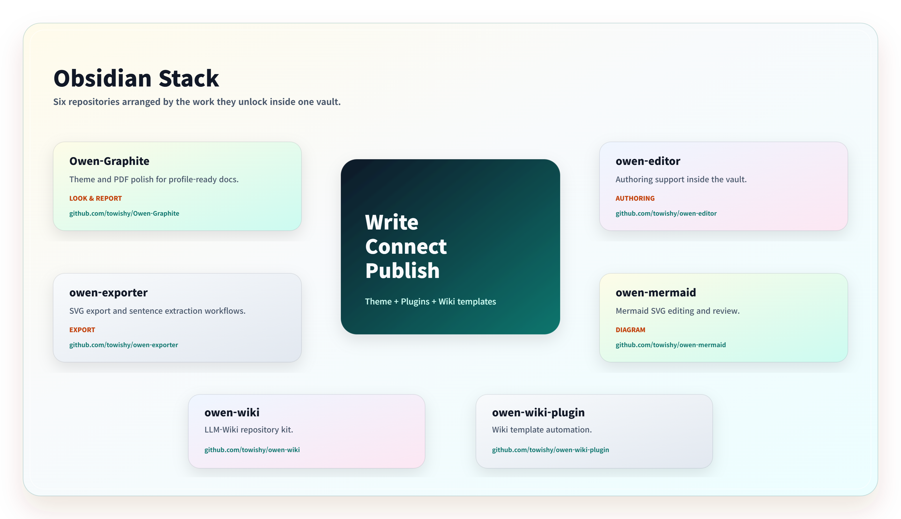

<!-- markdownlint-disable MD022 MD032 MD033 MD040 MD041 -->



[](https://github.com/towishy/Owen-Graphite/releases/latest)
[](LICENSE)
[](https://obsidian.md)
[](dev/WIKI/DOCS/v3/cascade-research.md)

[Style Settings presets](dev/WIKI/DOCS/v3/style-settings-presets.md) · [Compatibility matrix](dev/WIKI/DOCS/v3/plugin-compatibility.md) · [Changelog](CHANGELOG.md)

# Owen Graphite — Obsidian Theme

**Owen Graphite v3.1.97** is a liquid-glass Obsidian theme for technical documentation, knowledge bases, and report-ready notes, giving Korean/English typography, long tables, code blocks, workspace chrome, Style Settings controls, and PDF export layouts one calm graphite surface across Live Preview, Reading View, and print.

> **Theme-first, optional companion:** Owen Graphite keeps its Style Settings schema and English/Korean metadata inside the theme. Owen Graphite Companion 1.3.0 supplies the Style Settings locale fallback and structures Obsidian's title/metadata tooltips for wrapped bold titles. Persistent code-title editing, code copying, and canonical Frosted ScrollArea controls are available through Owen Editor 0.6.31.

## Why Owen Graphite?

| Workflow | What you feel immediately |
| --- | --- |
| Long technical notes | CJK/Latin paragraphs, headings, code, and dense tables keep a stable rhythm without feeling cramped. |
| Live Preview writing | Editing, Reading View, and rendered widgets share the same quiet surfaces for tables, code blocks, callouts, and embeds. |
| Report and PDF handoff | Header/footer labels, page numbering, paper-size-preserving readability, and page-break guards support recurring report delivery. |
| Daily workspace navigation | Tabs, long-name folder ellipsis, unified metadata tooltips, search, settings, popovers, and type badges use a restrained graphite liquid-glass language. |

## Design And Function Snapshot

| Surface | Design signal | Function signal |
| --- | --- | --- |
| Workspace chrome | Frosted white/graphite panels, connected tooltip tails, shallow rims, and soft lift states | Active files, long folder names, parent folders, tabs, and vault controls stay scannable in large vaults. |
| Writing surface | Calm document panes with balanced body, code, table, and callout density | Long Korean/English technical pages remain readable through editing and review. |
| Settings and presets | Compact glass controls instead of loud colored panels | Style Settings exposes PDF, typography, spacing, chrome, and accessibility options without visual clutter. |
| PDF export | Report labels, selected-paper readability presets, and print-safe spacing | Notes can become screen-shared PDFs or formal report output without silently changing the selected paper size. |

## Release Confidence

| Guard | Current status | Evidence |
| --- | --- | --- |
| Bundle freshness | `theme.css` must match `dist/theme-v3.css` | [release plan](dev/WIKI/DOCS/v3/release-plan.md) |
| Zero-important cascade | declaration-level `!important` policy is enforced | [cascade research](dev/WIKI/DOCS/v3/cascade-research.md) |
| Style Settings contract | option ids/defaults are audited against the contract | [contract](dev/WIKI/DOCS/v3/style-settings-contract.md) |
| Docs/assets links | local Markdown links and README images are audited | [contributing](CONTRIBUTING.md) |
| Live Preview/PDF parity | LP hit-routing, PDF header/footer, and visual fixture checks are scripted | [release plan](dev/WIKI/DOCS/v3/release-plan.md) |

## Visual Tour

| Surface | Preview |
| --- | --- |
| Light mode |  |
| Dark mode |  |
| Top tabs and floating toolbar |  |
| Writing surface and floating toolbar |  |
| Style Settings report controls |  |
| Owen Editor toolbar controls |  |
| File explorer type badges |  |

New comparison screenshots should follow the [visual comparison guide](dev/WIKI/DOCS/v3/visual-comparison-guide.md) so default Obsidian and Owen Graphite are captured with the same note, viewport, and state.

---

## 1. Theme Profile

| Item | Value |
| --- | --- |
| **Version** | `3.1.97` |
| **Baseline / rollback target** | `v3.1.97` |
| **Mode support** | Light / Dark |
| **Platform** | Desktop & Mobile |
| **Design policy** | Liquid Glass core · token-first surfaces · zero-important cascade |

<details>
<summary>Light / Dark mode screenshots</summary>


</details>

---

## 2. Latest Highlights

Install the [Style Settings plugin](https://community.obsidian.md/plugins/obsidian-style-settings) to unlock the report, typography, spacing, PDF, and workspace polish controls referenced below.

### v3.1.97 — Canonical Scroll And Code Controls

This release connects Owen Editor's canonical Frosted ScrollArea to Obsidian vertical viewports, removes the theme's native scrollbar approximation, and tightens code-block and vault action controls.

| Area | What changed |
| --- | --- |
| Vertical scrolling | Owen Editor 0.6.31 preserves native wheel, touch, and keyboard scrolling while adding a fixed glass grip, rail click, and pointer drag. |
| Scroll surface | The interaction rail stays transparent, the workspace separator remains faint, and the grip keeps measured clearance from file-explorer rows. |
| Code blocks | Live Preview adds one-click copying, left-aligned editable titles, compact icons, and one static PDF title. |
| Vault controls | The help and settings buttons keep an explicit 8px gap. |

### v3.1.96 — PDF And Explorer Clarity

This release removes fixed screen-delivery/report-mode branches, keeps PDF readability independent from paper size, and turns long file-explorer labels plus folder metadata into one coherent tooltip surface.

| Area | What changed |
| --- | --- |
| PDF readability | The readability preset adjusts typography and table/code spacing while preserving the selected A4/A3 portrait or landscape page. |
| Removed modes | Fixed `1920×1080`, customer-delivery visibility, and bundled report mode options and implementation paths are removed. |
| File explorer | Long top-level and nested folder names stay within the explorer boundary with ellipsis; the native hover tooltip reveals the full title and folder statistics. |
| Tooltip companion | Companion 1.3.0 structures wrapped titles and metadata into one white tonal-gradient balloon with an 800-weight title, measured divider spacing, and a connected triangular tail. |
| Validation | Obsidian 1.12.7 runtime checks cover PDF paper preservation, LP/PDF parity, ellipsis geometry, tooltip content, two-line titles, spacing, and tail attachment. |

### v3.1.95 — Reliable Style Settings Localization

This release restores Owen Graphite's language selector when Obsidian is Korean but Style Settings cannot resolve its legacy locale key, and fills the new Interface heading's semantic icon tile.

| Area | What changed |
| --- | --- |
| Language selector | `Automatic (Obsidian)`, `Korean`, and `English` preserve the existing `ogd-language-*` values. |
| Compatibility bridge | The optional localization companion translates only Owen Graphite rows and Style Settings chrome without modifying Style Settings data. |
| Interface icon | The Interface heading uses the existing semantic icon owner with an 18px Languages glyph and graphite light/dark ink. |
| Validation | Obsidian 1.12.7 runtime checks cover automatic fallback, explicit English/Korean classes, translated labels, and the computed icon mask. |

### v3.1.94 — Semantic Settings Cards

This release aligns Obsidian's core settings plus Owen Graphite, Owen Editor, and Owen Exporter with the same grouped-card language used by Owen Mermaid while keeping each function visually distinct.

| Area | What changed |
| --- | --- |
| Settings groups | Eight Obsidian core tabs plus Graphite, Editor, and Exporter use compact grouped cards with independent 32px icon tiles where native headings exist. |
| Semantic icons | Every section has a purpose-specific Lucide glyph and color instead of a repeated collapse chevron. |
| Ownership | Editor and Exporter expose stable semantic section hooks so the theme does not depend on child position. |
| Validation | Obsidian 1.12.7 runtime checks cover core card counts, icon uniqueness, clipping, overflow, row overlap, and section borders. |

Older feature notes are kept in [dev/WIKI/DOCS/v3/feature-history.md](dev/WIKI/DOCS/v3/feature-history.md).

---

## 3. Installation Details

### Option A — Obsidian Community Theme Browser

1. Open `Settings` → `Appearance` → `Manage` under Themes.
2. Search for `Owen Graphite`.
3. Install and enable the theme.

### Option B — Manual ZIP Install

Download **`Owen-Graphite-3.1.97.zip`** from the [latest release](https://github.com/towishy/Owen-Graphite/releases/latest), then extract it into your vault theme folder.

| Platform | Target path |
| --- | --- |
| Windows | `<YourVault>\.obsidian\themes\Owen Graphite\` |
| macOS / Linux | `<YourVault>/.obsidian/themes/Owen Graphite/` |

After extraction, open Obsidian and select `Owen Graphite` from `Settings` → `Appearance` → `Themes`.

> Release assets also include GitHub's generated `Source code (zip)`. Use `Owen-Graphite-3.1.97.zip` for the installable theme package.

### Optional Owen Graphite Companion

Download `Owen-Graphite-Companion-1.3.0.zip` from the same release when Style Settings needs the Korean locale fallback or when you want wrapped title/metadata tooltips to use the full Owen Graphite hierarchy. Extract its `owen-graphite-style-settings-l10n` folder into:

```text
<YourVault>/.obsidian/plugins/owen-graphite-style-settings-l10n/
```

Reload Obsidian, enable **Owen Graphite Companion** under Community plugins, then choose **Settings → Style Settings → Owen Graphite → Interface → Language**. The companion preserves tooltip text while separating a wrapped bold title from metadata, and it leaves Style Settings `data.json` unchanged.

### Optional Code-Title Editing

The companion does not edit Markdown. To edit fenced code-block titles directly in Live Preview or Reading View, install [Owen Editor 0.6.28 or later](https://github.com/towishy/owen-editor/releases/latest). Owen Editor stores the title in Markdown:

````markdown
```bash title="Package update"
winget upgrade
```
````

### Option C — Git Install Or Update

Clone into `.obsidian/themes/Owen Graphite/`. Running the same command again updates the theme.

#### Windows (PowerShell)

```powershell
$ErrorActionPreference = "Stop"
$Vault = "D:\Path\To\YourVault"            # replace with your vault path
$Repo = "https://github.com/towishy/Owen-Graphite.git"
$ThemesDir = Join-Path $Vault ".obsidian\themes"
$ThemeDir = Join-Path $ThemesDir "Owen Graphite"

New-Item -ItemType Directory -Force -Path $ThemesDir | Out-Null

if (Test-Path -LiteralPath (Join-Path $ThemeDir ".git")) {
  git -C "$ThemeDir" fetch --quiet origin main
  git -C "$ThemeDir" reset --quiet --hard origin/main
  git -C "$ThemeDir" clean -qfd
  Write-Host "OK: Owen Graphite updated."
} elseif (Test-Path -LiteralPath $ThemeDir) {
  $Backup = "${ThemeDir}.backup-$(Get-Date -Format 'yyyyMMdd-HHmmss')"
  Move-Item -LiteralPath $ThemeDir -Destination $Backup
  git clone --quiet $Repo "$ThemeDir"
  Write-Host "OK: Owen Graphite reinstalled. Backup: $Backup"
} else {
  git clone --quiet $Repo "$ThemeDir"
  Write-Host "OK: Owen Graphite installed."
}
```

#### macOS / Linux (bash)

```bash
set -e
VAULT="/path/to/YourVault"                  # replace with your vault path
REPO="https://github.com/towishy/Owen-Graphite.git"
THEME_DIR="$VAULT/.obsidian/themes/Owen Graphite"
mkdir -p "$VAULT/.obsidian/themes"

if [ -d "$THEME_DIR/.git" ]; then
  git -C "$THEME_DIR" fetch --quiet origin main
  git -C "$THEME_DIR" reset --quiet --hard origin/main
  git -C "$THEME_DIR" clean -qfd
  echo "OK: Owen Graphite updated."
elif [ -e "$THEME_DIR" ]; then
  BACKUP="$THEME_DIR.backup-$(date +%Y%m%d-%H%M%S)"
  mv "$THEME_DIR" "$BACKUP"
  git clone --quiet "$REPO" "$THEME_DIR"
  echo "OK: Owen Graphite reinstalled. Backup: $BACKUP"
else
  git clone --quiet "$REPO" "$THEME_DIR"
  echo "OK: Owen Graphite installed."
fi
```

---

## 4. Developer Workflow

The v3 source lives in `src/` and is split into tokens, base, surfaces, chrome, features, themes, and plugins. Build and audit work should use the v3 tools in `dev/scripts/`.

| Task | Command |
| --- | --- |
| Build bundle | `python dev/scripts/bundle_v3.py` → `dist/theme-v3.css` |
| Refresh `theme.css` | `Copy-Item dist/theme-v3.css theme.css -Force` on Windows, or the equivalent copy command on macOS/Linux |
| Live Preview hit-routing audit | `python dev/scripts/audit_v3_hit_routing.py` |
| Duplicate selector audit | `python dev/scripts/v3_audit_duplicate_selectors.py` |
| Unused CSS candidate report | `python dev/scripts/build_unused_css_report.py` |
| Computed-style fingerprint capture | `python dev/scripts/capture_computed_fingerprint.py --build v3 --theme {light,dark}` |
| fingerprint diff | `python dev/scripts/fp_diff_summary.py [--theme dark]` |
| Release ZIP | `python dev/scripts/build_release.py` |
| Obsidian vault sync | `python dev/scripts/sync_obsidian_theme.py` |
| Companion test and ZIP | `python compat/owen-graphite-style-settings-l10n/test.py` then `python dev/scripts/build_companion_release.py` |

See [CONTRIBUTING.md](CONTRIBUTING.md) for contribution details, [CHANGELOG.md](CHANGELOG.md) for release history, and [dev/WIKI/DOCS/v3/design-spec.md](dev/WIKI/DOCS/v3/design-spec.md) for the design and validation contract.

---

## 5. Support

<p align="center">
  <a href="https://github.com/sponsors/towishy">
    
  </a>
</p>

Owen Graphite is free and open source. If it helps your report, wiki, or documentation workflow, you can support maintenance through [GitHub Sponsors](https://github.com/sponsors/towishy).

---

## 6. License

MIT — [LICENSE](LICENSE)
