# Owen Graphite — Obsidian Theme

Owen WIKI, Owen Graphite, Owen Editor는 LLM 기반 지식 정리부터 Obsidian 보고서 작성, Markdown 편집 UI까지 이어지는 Owen의 지식 작업 스택입니다.

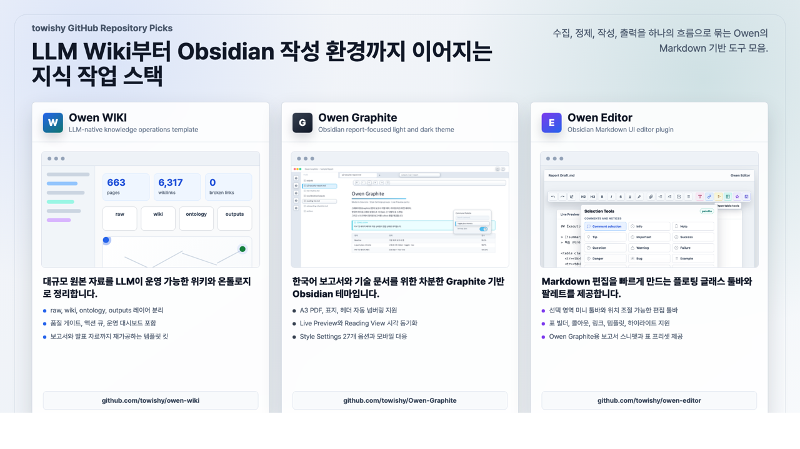

[](https://github.com/towishy/Owen-Graphite/releases/latest)
[](LICENSE)
[](https://obsidian.md)
[](#-스타일-설정-style-settings)

---

## 1. 테마 소개

**Owen Graphite**는 그래파이트(graphite) 톤의 라이트/다크 Obsidian 테마입니다. 한국어 보고서·기술 문서·위키 작성에 최적화되어 있으며, A3 인쇄 친화 레이아웃과 Live Preview ↔ Reading View 시각 동기화를 핵심 가치로 삼습니다.

| 분야 | 내용 |
|------|------|
| **타깃** | 보고서·기술 문서·위키 작성자 (특히 한국어) |
| **버전** | `2.22.3` (Obsidian 1.6.0+ · 현 베이스라인) |
| **모드 지원** | ✅ Light / Dark / Report — 모든 위젯 패리티 보장 |
| **플랫폼** | ✅ Desktop & Mobile |
| **디자인 정책** | 좌측 라인 영구 밴 · Glass+Shadow 코어 · 샘플-우선 워크플로우 |


<details>
<summary>📷 Dark / Report 모드 스크린샷</summary>


</details>

---

## 2. 테마 기능 요약

### 🎨 디자인 코어
- **Graphite 톤** — 차분한 그레이 베이스 + accent 컬러 프리셋 (Graphite/Blue/Teal/Violet/Amber)
- **Liquid-glass chrome** — ribbon·사이드바·탭·툴바·command palette·tooltip 전반에 backdrop-blur (강도 변수 `--og-glass-blur`)
- **좌측 라인 영구 밴** — chrome 영역 좌측 4px bar 디자인 사용 금지 (callout/quote 등 본문은 예외)
- **Workspace Surfaces Pack** — Graph view·Canvas·Folder cues·Mini TOC·Cover page
- **Polish Pack** — Dark parity·Mobile 반응형·Tab 대비·코드 라벨·Heading anchor·Search HL

### 📑 보고서·인쇄
- **A3 PDF Export** — 가로 / 15mm 여백 / H1마다 페이지 분할
- **PDF 첫 페이지 모던 헤더** — Side Bar + Two-line (라벨/본문/사이드바 색 커스터마이징)
- **헤더 자동 넘버링** — 1. / 1.1 / 1.1.1
- **표지 페이지 유틸리티** — `.cover-page` / `.cover-meta` / `.cover-rule`
- **자동 분할 회피** — callout·표·Mermaid·코드·이미지

### ⚙️ 사용자 커스터마이징
- **Style Settings 33종** — 폰트·간격·컬러·보고서 모드 등 UI 토글
- **사용자 클래스** — `.ogd-blur`·`.ogd-cover`·테이블 유틸리티·callout 14종
- **시선 보호 모드** · **OS 다크 모드 자동 추종** · **CJK +0.5px 자동 보정**

### 📋 Style Settings (Style Settings)

플러그인 설치 후 사이드바에서 토글로 즉시 적용. 전체 33개 옵션:

| 분류 | 대표 옵션 |
|------|----------|
| **타이포** | 본문 폰트 크기·줄간격·최대 폭·세리프 본문·CJK 보정 |
| **표** | zebra 줄무늬·모던 스타일·sticky header |
| **보고서** | 보고서 모드·헤더 자동 넘버링·드롭 캡·간격 프리셋 |
| **PDF** | 페이지 크기·블록 분할 방지·첫 페이지 모던 헤더 (좌/우 라벨·본문·사이드바 색) |
| **컬러** | 액센트 프리셋·코드블록 테마·시선 보호·OS 다크 모드 추종·Glass 강도 변수 `--og-glass-blur` |

> 전체 옵션 표는 [docs/style-settings.md](docs/style-settings.md) 또는 플러그인 UI에서 확인할 수 있습니다.

---

## 3. 테마 설치 방법

> 💡 **2026-04-29 업데이트** — 옵션 B(Git) 설치 명령이 **idempotent** 하게 개선되었습니다.
>
> 이제 폴더가 이미 존재해도 **같은 스크립트를 다시 실행하면 자동 업데이트**됩니다. 수동 ZIP 설치 등 비-Git 폴더는 자동로 백업(`*.backup-YYYYMMDD-HHMMSS`) 후 재설치됩니다. 이전의 *"destination path already exists"* 오류가 해소됩니다.

### 옵션 A — Obsidian 커뮤니티 마켓 (승인 후)

1. 설정 → **외관 → 테마 관리**
2. 검색: `Owen Graphite`
3. 설치 → 사용

### 옵션 B — Git 수동 설치 / 업데이트

Obsidian vault의 `.obsidian/themes/Owen Graphite/` 경로에 클론합니다. **같은 명령을 다시 실행하면 자동으로 업데이트**됩니다 (이미 클론된 폴더는 `git pull --ff-only`).

| 플랫폼 | Git 설치 | 설치 / 업데이트 명령 |
|--------|----------|-----------|
| Windows | `winget install --id Git.Git -e --source winget` | PowerShell 스크립트 (아래) |
| macOS | `brew install git` | bash 스크립트 (아래) |
| Linux | `sudo apt install git` (또는 `dnf install git`) | macOS와 동일 |

#### Windows (PowerShell)

```powershell
$ErrorActionPreference = "Stop"
cd "D:\Path\To\YourVault"
New-Item -ItemType Directory -Force ".obsidian\themes" | Out-Null
$ThemeDir = ".obsidian\themes\Owen Graphite"
$Repo = "https://github.com/towishy/Owen-Graphite.git"
if (Test-Path "$ThemeDir\.git") {
    git -C $ThemeDir fetch --quiet origin main
    git -C $ThemeDir reset --quiet --hard origin/main
} elseif (Test-Path $ThemeDir) {
    throw "Owen Graphite folder already exists but is not a Git clone."
} else {
    git clone --quiet $Repo $ThemeDir
}
Write-Host "OK: Owen Graphite installed or updated."
```

#### macOS / Linux (bash)

최신 버전의 macOS에서는 git이 기본 포함되어 있으며, 아래 스크립트는 **설치 / 업데이트 / 손상된 폴더 복구**를 모두 처리합니다.

```bash
set -e
VAULT="/path/to/YourVault"          # ← vault 경로로 교체
REPO="https://github.com/towishy/Owen-Graphite.git"
THEME_DIR="$VAULT/.obsidian/themes/Owen Graphite"

mkdir -p "$VAULT/.obsidian/themes"

if [ -d "$THEME_DIR/.git" ]; then
  # 이미 설치됨 → 최신화 (rebase 대신 hard reset 으로 충돌 회피)
  git -C "$THEME_DIR" fetch --quiet origin main
  git -C "$THEME_DIR" reset --quiet --hard origin/main
  git -C "$THEME_DIR" clean -qfd
  echo "OK: Owen Graphite updated to $(git -C "$THEME_DIR" describe --tags --abbrev=0 2>/dev/null || echo 'main HEAD')."
elif [ -e "$THEME_DIR" ]; then
  # 폴더는 있으나 git 저장소가 아님 (수동 ZIP 설치 등) → 백업 후 재클론
  BACKUP="$THEME_DIR.backup-$(date +%Y%m%d-%H%M%S)"
  echo "WARN: 기존 비-Git 폴더 발견 → $BACKUP 으로 백업 후 재설치"
  mv "$THEME_DIR" "$BACKUP"
  git clone --quiet "$REPO" "$THEME_DIR"
  echo "OK: Owen Graphite 재설치 완료 (이전 폴더는 $BACKUP 에 보관)."
else
  git clone --quiet "$REPO" "$THEME_DIR"
  echo "OK: Owen Graphite 설치 완료."
fi
```

> **한 줄 버전** (이미 vault 경로에서 실행 중일 때):
> ```bash
> THEME_DIR=".obsidian/themes/Owen Graphite"; mkdir -p "$(dirname "$THEME_DIR")"; if [ -d "$THEME_DIR/.git" ]; then git -C "$THEME_DIR" fetch -q origin main && git -C "$THEME_DIR" reset -q --hard origin/main; else git clone -q https://github.com/towishy/Owen-Graphite.git "$THEME_DIR"; fi && echo "OK"
> ```

### 옵션 C — ZIP 수동 설치

[Releases 페이지](https://github.com/towishy/Owen-Graphite/releases/latest)에서 **`Owen-Graphite-<version>.zip`** 을 다운로드해 압축 해제합니다.

> **⚠️ 주의** Release Assets에는 GitHub 자동 생성 `Source code (zip)`도 함께 표시됩니다. 반드시 `Owen-Graphite-<version>.zip` 을 받으세요.
>
> 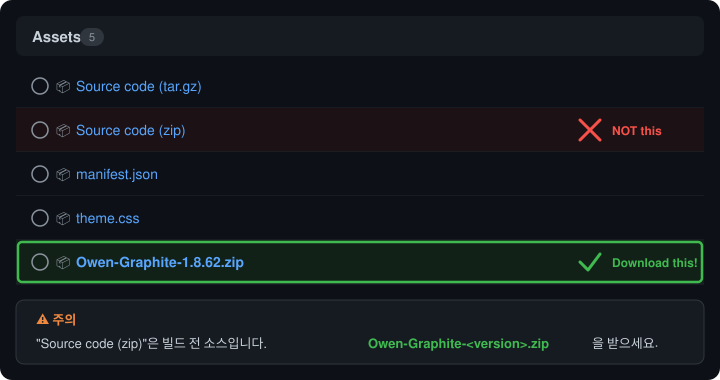

| 플랫폼 | 테마 대상 경로 |
|--------|----------------|
| Windows | `<YourVault>\.obsidian\themes\Owen Graphite\` |
| macOS / Linux | `<YourVault>/.obsidian/themes/Owen Graphite/` |

설치 후 Obsidian → 설정 → **외관 → 테마** → `Owen Graphite` 선택.

> [Style Settings](https://github.com/mgmeyers/obsidian-style-settings) 플러그인을 함께 설치하면 33개 옵션을 사이드바 UI에서 토글할 수 있습니다.

---

## 4. 테마 신기능

### ✨ v2.22.0 — Windows/Linux chrome visibility hotfix

윈도/리눅스 Obsidian에서 탭 + 좌/우 사이드바 토글 버튼이 거의 안 보이던 문제 수정. macOS Glass 정체성은 100% 유지하고, `body.mod-windows` 한정으로 솔리드 톤 + 보더 + 그림자를 적용하여 타이틀바 + 탭바 + 본문 3단 hierarchy로 분리.

> 인터랙티브 미리보기: [docs/fixtures/v2.22-windows-chrome-preview.html](docs/fixtures/v2.22-windows-chrome-preview.html)

### ✨ v2.21.0 — Canvas, Inputs & Modals (8종)

Canvas frame · Canvas minimap · Slider · Dropdown · Number stepper · Notice action · Release notes modal · Code copy button.

> 인터랙티브 미리보기: [docs/fixtures/v2.21-preview.html](docs/fixtures/v2.21-preview.html)

| # | 항목 | 내용 |
|---|------|------|
| 1 | Canvas frame (A1) | `.canvas-frame` 점선 보더 + 옅은 fill + floating chip 라벨 |
| 2 | Canvas minimap (A2) | floating glass card + brand viewport 박스 |
| 3 | Slider / range (D1) | 글래스 thumb + 그라디언트 fill track + focus 6px ring |
| 4 | Dropdown select (D2) | `.dropdown` chrome + focus-visible 2px inset ring |
| 5 | Number stepper (D3) | `input[type=number]` 글래스 + mono tabular-nums |
| 6 | Notice action (C1) | `.notice-action` glass mini button + hover lift, `.mod-cta` brand fill |
| 7 | Release notes modal (C2) | row glass hover + 버전 mono pill |
| 8 | Code copy button (E2) | hover 노출 글래스 chip + `.copied` green pulse 600ms (reduce-motion 호환) |

---

### ✨ v2.20.0 — Inputs & System Surfaces (5종)

Toggle switch · Search input + chips · Community cards · Pane title count badges · Drop snap target hint.

> 인터랙티브 미리보기: [docs/fixtures/v2.20-preview.html](docs/fixtures/v2.20-preview.html)

| # | 항목 | 내용 |
|---|------|------|
| 1 | Toggle switch glass (F3) | `.checkbox-container` glass track + floating thumb |
| 2 | Search input + chips (F1) | glass pill + focus 3px ring + active filter pill |
| 3 | Community cards (E4) | hover lift + installed green pill |
| 4 | Pane title count badges (D2) | outline/backlinks/outgoing/tag mono pill 통일 |
| 5 | Drop snap target hint (G1) | 전체 둘레 dashed outline (좌측 라인 제거) |

---

### ✨ v2.19.0 — Editor Depth, System Cleanup & Glass Surface Sweep (10종)

Task glyph · Heading anchor copy · Templater glass · Nested tag pill · Token v2 + PDF · Media · Canvas · Floating status bar · Date/Color picker.

> 인터랙티브 미리보기: [docs/fixtures/v2.19-preview.html](docs/fixtures/v2.19-preview.html)

| # | 항목 | 내용 |
|---|------|------|
| 1 | Task checkbox glyphs (B4) | `[ ]` `[x]` `[/]` `[?]` `[!]` `[>]` `[-]` 7종 색별 매핑 |
| 2 | Heading anchor copy hint (B5) | H1–H6 hover 시 `⎘` fade-in 커틀 힌트 |
| 3 | Templater suggestion glass (C1) | popup blur(14) + lift shadow |
| 4 | Nested tag pill (C5) | 계층 세그먼트 그라디언트 + word-break 안정화 |
| 5 | Token migration v2 (D2) | `--og-accent-pill-{bg,fg,border}` `--og-glass-bg-strong` 신규 |
| 6 | PDF viewer chrome (A1) | toolbar/sidebar 글래스 + 활성 페이지 accent ring |
| 7 | Media player chrome (A2) | video/audio embed + native audio chrome 글래스 |
| 8 | Canvas node cards (B1) | hover lift + `.is-focused` ring (좌측 라인 X) |
| 9 | Floating status bar (D1) | status bar 부유 + word count accent pill |
| 10 | Date/Color picker (C3) | flatpickr/daterangepicker/color picker 글래스 통일 |

---

### ✨ v2.18.0 — All-A Surface Sweep (5종)

Workspace split divider · Drag ghost · Vault switcher 모달 · Status bar separator · Modal close (×) 일괄 정비.

#### 라이트 모드

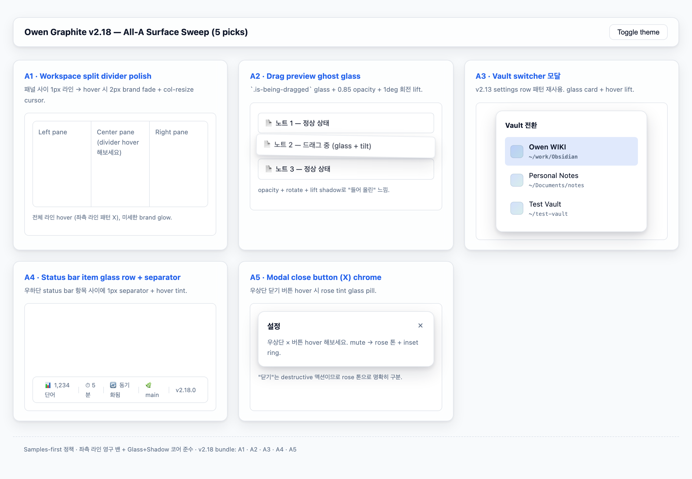

#### 다크 모드

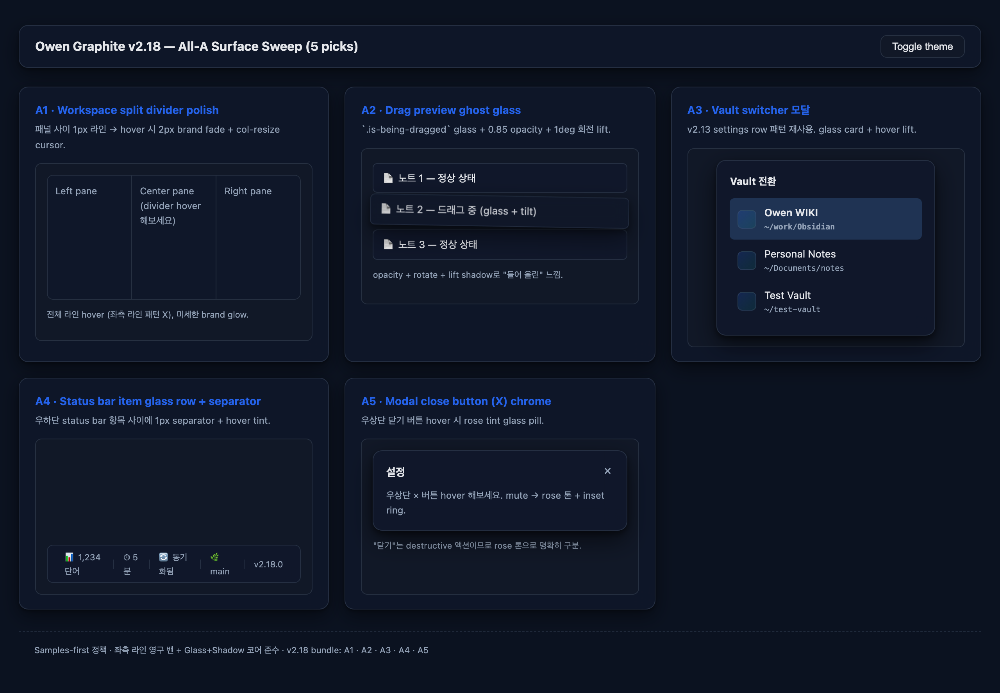

| # | 항목 | 내용 |
|---|------|------|
| 1 | Workspace split divider | hover 시 1→2px brand fade + glow + resize cursor (전체 라인) |
| 2 | Drag preview ghost glass | `.is-being-dragged` opacity 0.85 + rotate(1deg) + lift shadow + blur(10) |
| 3 | Vault switcher 모달 | glass card + row hover lift + active pill (settings row 패턴 재사용) |
| 4 | Status bar separator | item 사이 1×12px separator + hover tint (좌측 라인 정책 예외 — 구분용) |
| 5 | Modal close (×) chrome | hover 시 rose tint + inset ring (destructive 액션 구분) |

> 인터랙티브 미리보기: [docs/fixtures/v2.18-preview.html](docs/fixtures/v2.18-preview.html)

---

### ✨ v2.13.0 — Reading Polish & Surfaces (9종)

읽기/검색/그래프/모바일 표면 일괄 정리.

#### 라이트 모드

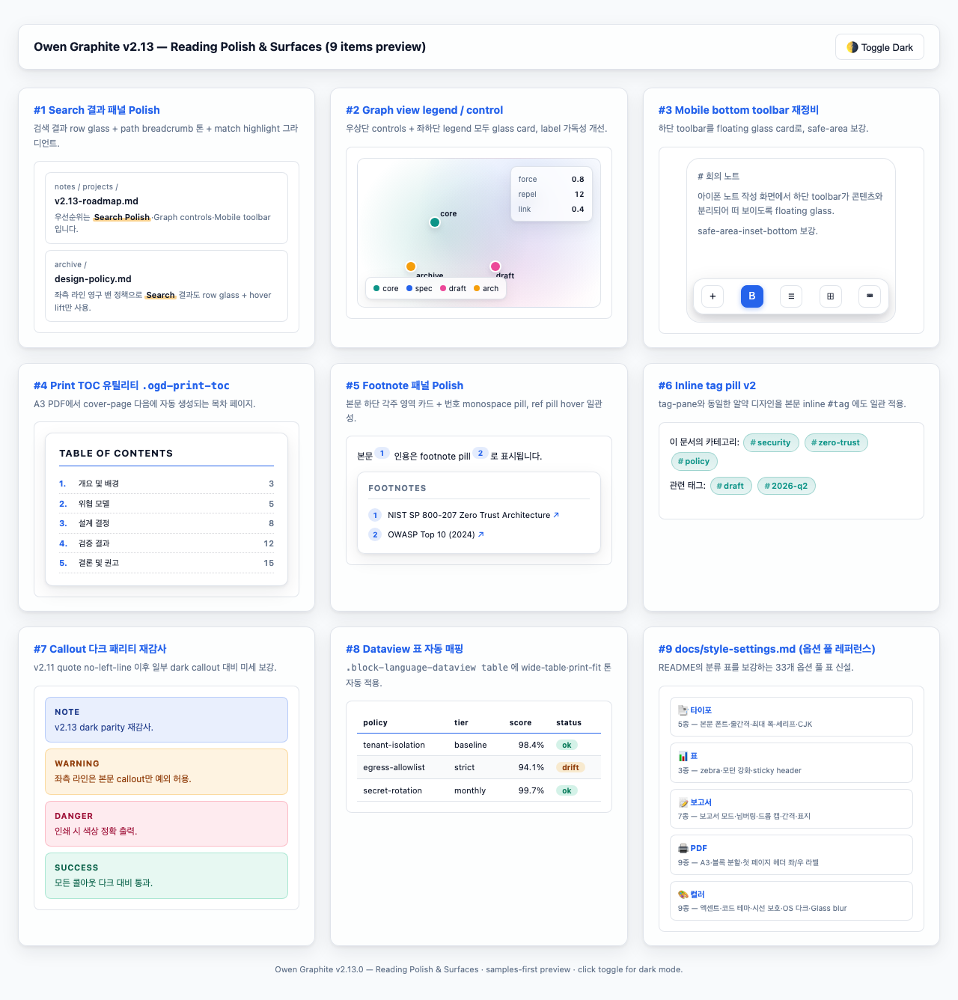

#### 다크 모드

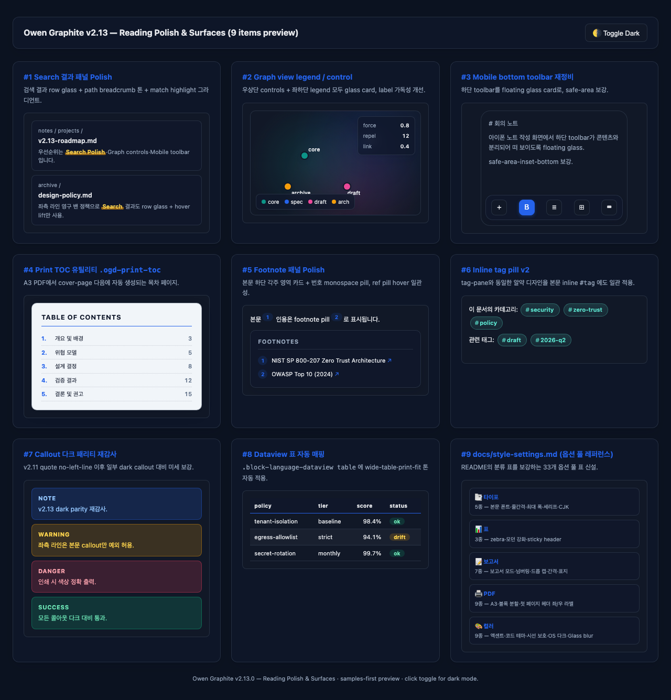

| # | 항목 | 내용 |
|---|------|------|
| 1 | Search 결과 패널 Polish | row glass + hover lift + match HL underline-gradient |
| 2 | Graph view legend / control | 우상단 controls glass card (blur·border·shadow) |
| 3 | Mobile bottom toolbar | floating glass + `safe-area-inset-bottom` 보강 |
| 4 | Print TOC 유틸리티 | `.ogd-print-toc` — A3 PDF cover 다음 자동 목차 페이지 |
| 5 | Footnote 패널 Polish | 글래스 카드 + 번호 알약(pill) + ref pill 일관 |
| 6 | Inline tag pill v2 | 본문 `#tag` 도 tag-pane 알약 디자인으로 통일 |
| 7 | Callout 다크 패리티 재감사 | note/warning/danger/success 다크 대비 보강 |
| 8 | Dataview 표 자동 매핑 | sticky header + zebra + tabular-nums (`@media print` sticky off) |
| 9 | docs/style-settings.md | 33개 옵션 풀 레퍼런스 문서 신설 |

> 인터랙티브 미리보기: [docs/fixtures/v2.13-preview.html](docs/fixtures/v2.13-preview.html)

---

### ✨ v2.12.0 — Panels & Code Polish (6종)

우측 패널 가시성 + 코드/테이블 사용성 강화.

#### 라이트 모드

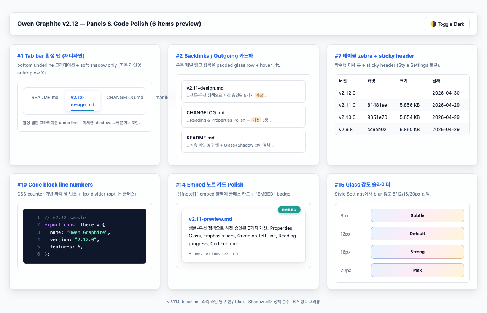

#### 다크 모드

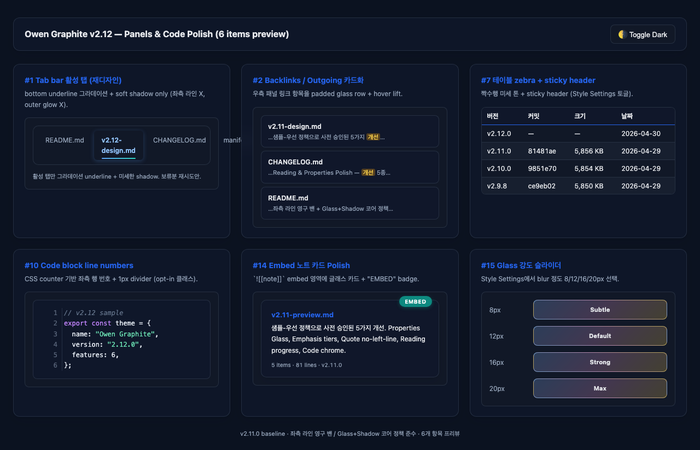

| # | 항목 | 내용 |
|---|------|------|
| 1 | Tab bar 활성 탭 underline | 그라디언트 underline + soft shadow (좌측 라인 X) |
| 2 | Backlinks / Outgoing card lift | 우측 패널 padded glass row + hover transform |
| 3 | 테이블 zebra + sticky | 짝수행 미세 톤 + sticky header (accent underline) |
| 4 | Code block line numbers (opt-in) | `pre.line-numbers` 에 CSS counter 기반 좌측 행 번호 |
| 5 | Embed 노트 카드 Polish | `.markdown-embed` 글래스 카드 + 우상단 EMBED badge |
| 6 | Glass 강도 변수 | `--og-glass-blur` CSS 변수 (8/12/16/20px override) |

> 인터랙티브 미리보기: [docs/fixtures/v2.12-preview.html](docs/fixtures/v2.12-preview.html)

---

### ✨ v2.11.0 — Reading & Properties Polish (5종)

#### 라이트 모드

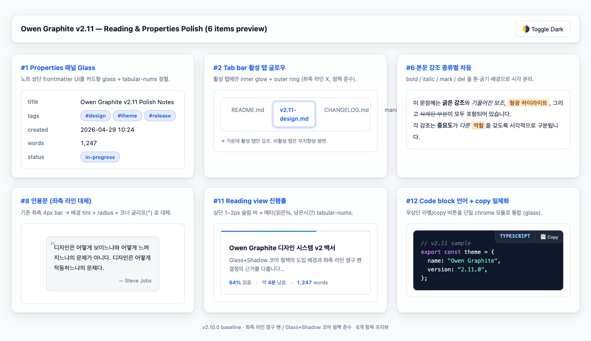

#### 다크 모드

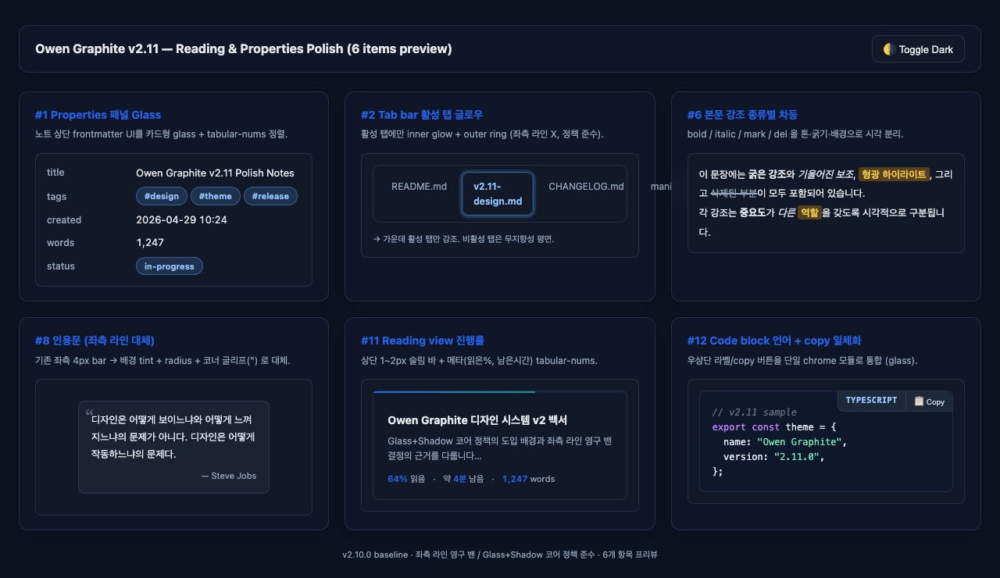

| # | 항목 | 내용 |
|---|------|------|
| 1 | Properties 패널 Glass | `.metadata-container` 카드형 glass + tabular-nums |
| 2 | 본문 강조 종류별 차등 | strong/em/mark/del 톤·굵기·배경 분리 (CM6 포함) |
| 3 | 인용문 좌측 라인 대체 | 배경 tint + radius + 코너 글리프(") |
| 4 | Reading view 진행률 | scroll-driven 2px 그라디언트 sticky 바 |
| 5 | Code block 언어 + copy 일체화 | data-lang ::before + .copy-code-button 단일 chrome |

> 인터랙티브 미리보기: [docs/fixtures/v2.11-preview.html](docs/fixtures/v2.11-preview.html)

---

### ✨ v2.10.0 — 12 Improvements Pack

#### 라이트 모드

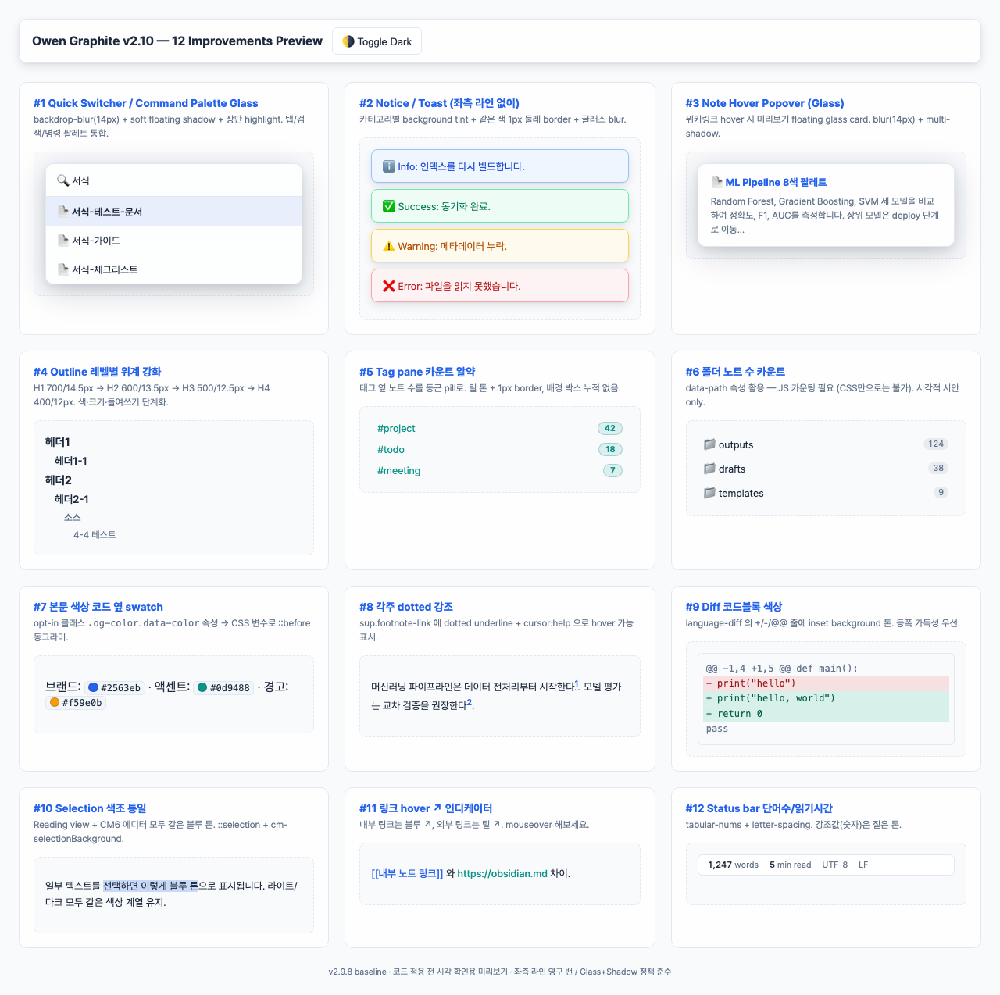

#### 다크 모드

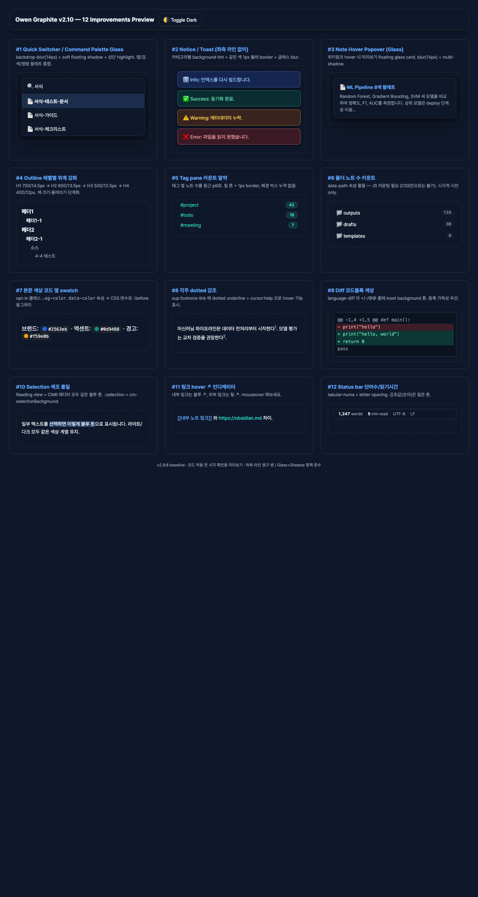

| # | 항목 | # | 항목 |
|---|------|---|------|
| 1 | Quick Switcher / Command Palette Glass | 7 | 본문 색상 swatch (opt-in) |
| 2 | Notice / Toast (좌측 라인 없이) | 8 | 각주 dotted hover hint |
| 3 | Note Hover Popover Glass | 9 | Diff 코드블록 색상 |
| 4 | Outline 레벨별 위계 강화 | 10 | Selection 색조 통일 |
| 5 | Tag pane 카운트 알약 | 11 | 링크 hover ↗ 인디케이터 |
| 6 | 폴더 노트 수 카운트 | 12 | Status bar 단어수/읽기시간 tabular-nums |

> 인터랙티브 미리보기: [docs/fixtures/v2.10-improvements-preview.html](docs/fixtures/v2.10-improvements-preview.html)

---

## 5. Change Log

현 베이스라인은 **v2.22.0**입니다. 베이스라인 이후 변경만 요약하며, 이전 이력은 [CHANGELOG.md](CHANGELOG.md)에서 확인할 수 있습니다.

| 버전 | 핵심 변경 |
|------|----------|
| **v2.22.0** | Windows/Linux chrome visibility hotfix — 타이틀바·탭바·본문 3단 hierarchy + 솔리드 활성 탭 + 사이드바 토글 보강 (macOS Glass 그대로) |
| **v2.21.0** | Canvas, Inputs & Modals — Canvas frame · minimap · slider · dropdown · number stepper · notice action · release notes modal · code copy (8종) |
| **v2.20.1** | Hotfix — search-input 이중 ring/아이콘 오버랩 수정 |
| **v2.20.0** | Inputs & System Surfaces — Toggle switch · Search input + chips · Community cards · Pane count badges · Drop snap target (5종) |
| **v2.19.0** | Editor Depth, System Cleanup & Glass Surface Sweep — Task glyph · Heading anchor copy · Templater glass · Nested tag pill · Token v2 · PDF · Media · Canvas · Floating status bar · Date/Color picker (10종) |
| **v2.18.0** | All-A Surface Sweep — Workspace split divider · Drag ghost · Vault switcher 모달 · Status bar separator · Modal close (×) |
| **v2.17.0** | Surface Gaps & Tokenization — Scrollbar polish · Empty state 일러스트 · Wiki-link unresolved 톤 · Calendar today/active · CSS 토큰화 v2 |
| **docs** (2026-04-29) | 맥OS/Linux 설치 명령 idempotent 보강 — 폴더 존재 시 자동 업데이트 · 비-Git 폴더는 백업 후 재클론 · 한 줄 버전 제공 |
| **v2.16.0** | Interaction & A11y Deep Polish — Bookmarks chrome · CM6 fold gutter · Dataview inline chip · reduced-motion 안전망 · high-contrast 대응 |
| **v2.15.0** | Surfaces & A11y Polish — Context menu glass · Ribbon active pill · Mermaid card · Tasks 플러그인 · Focus-visible 링 |
| **v2.14.0** | Chrome & Indicator Polish — Sync pill · Settings 검색 강조 · Heading anchor `#` · Popover favicon · Properties focus ring |
| **v2.13.0** | Reading Polish & Surfaces — Search row glass · Graph controls · Mobile toolbar · Print TOC · Footnote pill · Tag pill v2 · Callout dark 재감사 · Dataview 자동 · docs/style-settings.md |
| **v2.12.0** | Panels & Code Polish — Tab underline · Backlinks lift · Table zebra+sticky · Code line numbers · Embed card · Glass 강도 변수 |
| **v2.11.0** | Reading & Properties Polish — Properties Glass · 강조 차등 · 인용문 no-left-line · 진행률 바 · Code chrome |

> 전체 릴리즈 노트 → [CHANGELOG.md](CHANGELOG.md)

---

## 6. 기타

### 🤝 기여
- 이슈: [GitHub Issues](https://github.com/towishy/Owen-Graphite/issues)
- 토론: [Discussions](https://github.com/towishy/Owen-Graphite/discussions)
- 기여 가이드: [CONTRIBUTING.md](CONTRIBUTING.md)
- 모듈화 로드맵: [src/README.md](src/README.md)

### 📁 파일 구조

```
Owen Graphite/
├── theme.css         # 테마 본체 (~13,300줄)
├── manifest.json     # Obsidian 테마 메타데이터
├── README.md         # 본 문서
├── CHANGELOG.md      # 전체 릴리즈 노트
├── CONTRIBUTING.md   # 기여 가이드
├── LICENSE           # MIT
├── docs/fixtures/    # 디자인 미리보기 HTML
├── screenshots/      # README/마켓 이미지
└── scripts/          # Python 검증/릴리즈 스크립트
```

### 🅰️ 권장 폰트
- **Pretendard** / **Noto Sans KR** — 본문 (sans)
- **Noto Serif KR** / **나눔명조** — 보고서 모드 (serif)
- **JetBrains Mono** / **D2Coding** — 코드 (mono)

### 📜 라이선스
[MIT License](LICENSE) © 2026 Owen ([@towishy](https://github.com/towishy))

### 🙏 크레딧
- 글꼴: Pretendard (Kil Hyung-jin), Noto Sans/Serif KR (Google), JetBrains Mono (JetBrains), D2Coding (Naver)
- 영감: Obsidian Minimal, Things, AnuPpuccin
- 빌드: Obsidian 1.6.x / macOS · Windows · Linux
