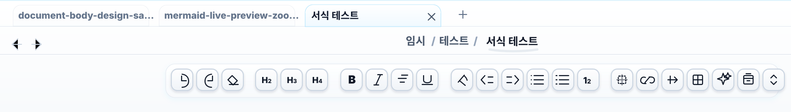
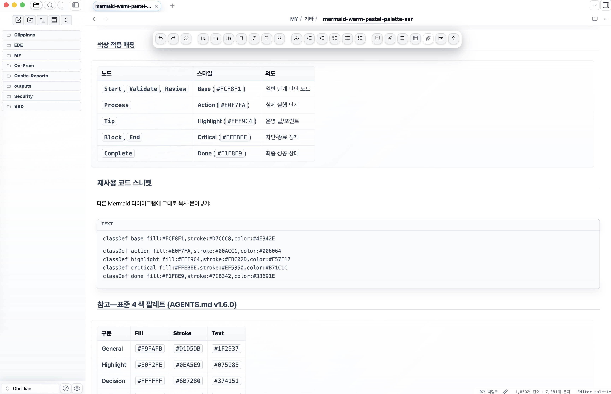
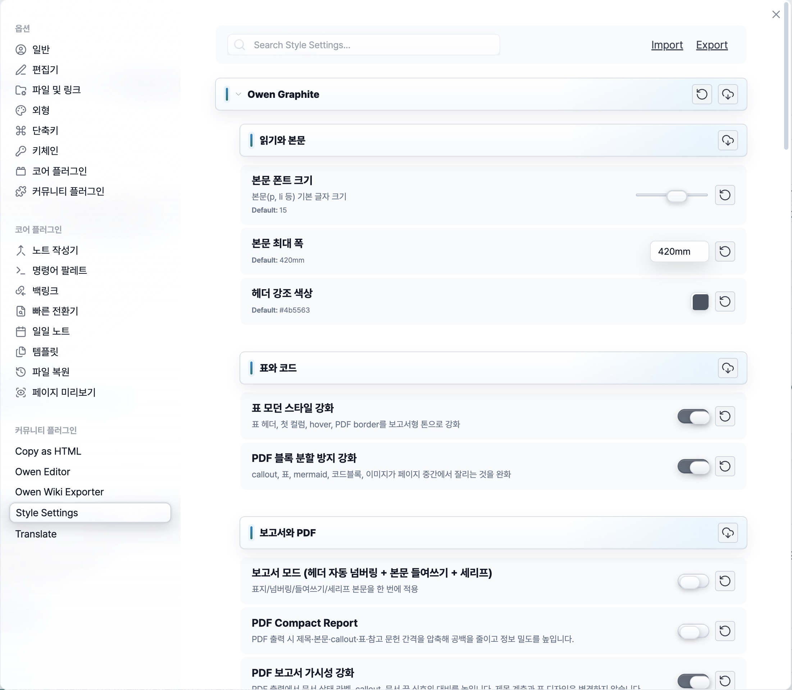
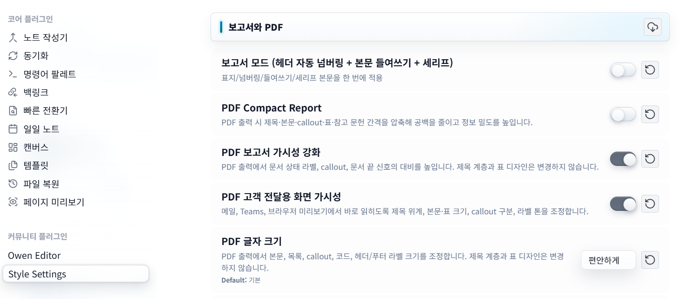
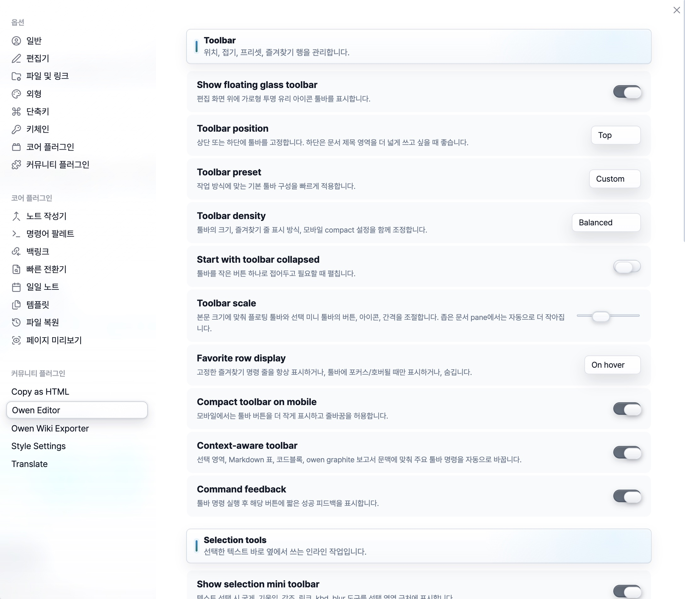

<!-- markdownlint-disable MD022 MD032 MD033 MD040 MD041 -->

[](https://github.com/towishy/Owen-Graphite/releases/latest)
[](LICENSE)
[](https://obsidian.md)
[](dev/WIKI/DOCS/v3/cascade-research.md)

[Style Settings presets](dev/WIKI/DOCS/v3/style-settings-presets.md) · [Compatibility matrix](dev/WIKI/DOCS/v3/plugin-compatibility.md) · [Changelog](CHANGELOG.md)

# Owen Graphite — Obsidian Theme

**Owen Graphite v3.1.74** is a liquid-glass Obsidian theme for technical documentation, knowledge bases, and report-ready notes, giving Korean/English typography, long tables, code blocks, workspace chrome, Style Settings controls, and PDF export layouts one calm graphite surface across Live Preview, Reading View, and print.

## Why Owen Graphite?

| Workflow | What you feel immediately |
| --- | --- |
| Long technical notes | CJK/Latin paragraphs, headings, code, and dense tables keep a stable rhythm without feeling cramped. |
| Live Preview writing | Editing, Reading View, and rendered widgets share the same quiet surfaces for tables, code blocks, callouts, and embeds. |
| Report and PDF handoff | Header/footer labels, page numbering, screen-first PDF readability, and page-break guards support recurring report delivery. |
| Daily workspace navigation | Tabs, file explorer hierarchy, search, settings, popovers, and type badges use a restrained graphite liquid-glass language. |

## Design And Function Snapshot

| Surface | Design signal | Function signal |
| --- | --- | --- |
| Workspace chrome | Frosted white/graphite panels, shallow rims, and soft lift states | Active files, parent folders, tabs, and vault controls stay scannable in large vaults. |
| Writing surface | Calm document panes with balanced body, code, table, and callout density | Long Korean/English technical pages remain readable through editing and review. |
| Settings and presets | Compact glass controls instead of loud colored panels | Style Settings exposes PDF, typography, spacing, chrome, and accessibility options without visual clutter. |
| PDF export | Report labels, customer-delivery presets, and print-safe spacing | Notes can become screen-shared PDFs or formal report output with less manual cleanup. |

## Release Confidence

| Guard | Current status | Evidence |
| --- | --- | --- |
| Bundle freshness | `theme.css` must match `dist/theme-v3.css` | [release plan](dev/WIKI/DOCS/v3/release-plan.md) |
| Zero-important cascade | declaration-level `!important` policy is enforced | [cascade research](dev/WIKI/DOCS/v3/cascade-research.md) |
| Style Settings contract | option ids/defaults are audited against the contract | [contract](dev/WIKI/DOCS/v3/style-settings-contract.md) |
| Docs/assets links | local Markdown links and README images are audited | [contributing](CONTRIBUTING.md) |
| Live Preview/PDF parity | LP hit-routing, PDF header/footer, and visual fixture checks are scripted | [release plan](dev/WIKI/DOCS/v3/release-plan.md) |

## Visual Tour

| Surface | Preview |
| --- | --- |
| Light mode |  |
| Dark mode |  |
| Top tabs and floating toolbar |  |
| Writing surface and floating toolbar |  |
| Style Settings report controls |  |
| PDF customer delivery visibility |  |
| Owen Editor toolbar controls |  |
| File explorer type badges |  |

New comparison screenshots should follow the [visual comparison guide](dev/WIKI/DOCS/v3/visual-comparison-guide.md) so default Obsidian and Owen Graphite are captured with the same note, viewport, and state.

---

## 1. Theme Profile

| Item | Value |
| --- | --- |
| **Version** | `3.1.74` |
| **Baseline / rollback target** | `v3.1.74` |
| **Mode support** | Light / Dark |
| **Platform** | Desktop & Mobile |
| **Design policy** | Liquid Glass core · token-first surfaces · zero-important cascade |

<details>
<summary>Light / Dark mode screenshots</summary>


</details>

---

## 2. Latest Highlights

Install the [Style Settings plugin](https://community.obsidian.md/plugins/obsidian-style-settings) to unlock the report, typography, spacing, PDF, and workspace polish controls referenced below.

### v3.1.73 — Document Title Pill Blue Round Glass

This release fixes bottom document title clipping with CDP-measured spacing, then aligns the title pill with the right-side status chips using a softer blue round glass treatment.

| Area | What changed |
| --- | --- |
| Title clipping | The right status reserve now matches the actual status chip footprint so long document titles keep their available width. |
| Title pill style | The document title pill uses a soft rounded glass rim, subtle blue tint, and lower shadow to match the right status icons. |
| Token budget | New blue tint uses existing rim/tint tokens instead of increasing raw aqua color usage. |
| Release guard | CDP runtime measurement, source usage map, CSS compatibility budget, core principles, release check, and Obsidian sync passed. |

### v3.1.72 — File Explorer CDP Spacing Correction

This release uses CDP runtime evidence to tighten file explorer folder indentation while keeping Obsidian's inline tree geometry intact, so child documents now sit visually behind their folder instead of drifting ahead of it.

| Area | What changed |
| --- | --- |
| Folder spacing | Top-level and nested folder title content is visually pulled left without overriding Obsidian inline `!important` geometry. |
| Child documents | Nested document rows now begin after the owning folder label, preserving a clearer tree rhythm. |
| Action menu | The file explorer action menu is aligned higher and further left so it reads as part of the pane header. |
| Release guard | CDP runtime measurement, source usage map, CSS compatibility budget, core principles, release check, and Obsidian sync passed. |

### v3.1.71 — File Explorer Codeblock Card Focus

The current stable release refines the file explorer's selected-document folder card so the direct parent folder reads like a compact codeblock container while the selected document row gains clearer glass-filled focus.

| Area | What changed |
| --- | --- |
| Direct parent card | The selected document's direct parent folder becomes the codeblock card, including top-level direct parents. |
| Click hierarchy | Folder contents follow click expansion state; hover-only child listing and flattened hierarchy rules stay out. |
| Liquid glass | Card shell, header, document-list background, and active document row now carry a stronger but still readable glass fill. |
| Release guard | Source usage map, CSS compatibility budget, core principles, release check, and Obsidian sync passed. |

### v3.1.70 — Community Theme Search Card And README Refresh

The current stable release fixes the selected `Owen Graphite` result in Obsidian's community theme browser so search focus no longer turns the card into a dark, low-contrast block, then refreshes this README into one English-first marketplace introduction.

| Area | What changed |
| --- | --- |
| Theme browser | The selected Owen Graphite card now stays on a light frosted glass surface with readable graphite text. |
| Settings polish | The fix lives in the settings-controls owner module and uses existing liquid-glass rim/tint tokens. |
| README | The first screen now presents one English description, workflow value, visual tour, and current release highlights. |
| Release guard | CDP runtime verification, source usage map, core principles, release check, and runtime evidence strict audit passed. |

### v3.1.69 — File Explorer Hierarchy Polish

The current stable release refines active child-folder spacing, file-title scale, type-badge width, and the lower file-list fade so large vaults read as a calmer graphite hierarchy instead of a flat stack of rows.

| Area | What changed |
| --- | --- |
| Active folder rhythm | The active document box and its parent folder now have a clearer pause before nested content begins. |
| Long file names | Child-file text and badge width were tuned so dense titles stay readable for longer. |
| Vault edge | A soft lower fade helps the file list end cleanly above the vault switcher. |
| Release guard | CDP runtime status, source usage map, core principles, release check, and Obsidian sync all passed. |

### v3.1.65 — Community Theme Compatibility And Accessibility

Owen Graphite now targets Obsidian `1.5.8+`, removes the bundled CSS BOM that confused community scanners, and strengthens light/dark supporting-text and code-comment contrast to meet WCAG AA expectations.

| Area | What changed |
| --- | --- |
| Compatibility | Community theme metadata and docs now align with the lower Obsidian baseline. |
| Accessibility | Secondary text and code-comment palettes were adjusted for stronger light/dark contrast. |
| Scanner hygiene | The release bundle was cleaned so community scanner warnings stay focused on real issues. |

Older feature notes are kept in [dev/WIKI/DOCS/v3/feature-history.md](dev/WIKI/DOCS/v3/feature-history.md).

---

## 3. Installation Details

### Option A — Obsidian Community Theme Browser

1. Open `Settings` → `Appearance` → `Manage` under Themes.
2. Search for `Owen Graphite`.
3. Install and enable the theme.

### Option B — Manual ZIP Install

Download **`Owen-Graphite-3.1.74.zip`** from the [latest release](https://github.com/towishy/Owen-Graphite/releases/latest), then extract it into your vault theme folder.

| Platform | Target path |
| --- | --- |
| Windows | `<YourVault>\.obsidian\themes\Owen Graphite\` |
| macOS / Linux | `<YourVault>/.obsidian/themes/Owen Graphite/` |

After extraction, open Obsidian and select `Owen Graphite` from `Settings` → `Appearance` → `Themes`.

> Release assets also include GitHub's generated `Source code (zip)`. Use `Owen-Graphite-3.1.74.zip` for the installable theme package.

### Option C — Git Install Or Update

Clone into `.obsidian/themes/Owen Graphite/`. Running the same command again updates the theme.

#### Windows (PowerShell)

```powershell
$ErrorActionPreference = "Stop"
$Vault = "D:\Path\To\YourVault"            # replace with your vault path
$Repo = "https://github.com/towishy/Owen-Graphite.git"
$ThemesDir = Join-Path $Vault ".obsidian\themes"
$ThemeDir = Join-Path $ThemesDir "Owen Graphite"

New-Item -ItemType Directory -Force -Path $ThemesDir | Out-Null

if (Test-Path -LiteralPath (Join-Path $ThemeDir ".git")) {
  git -C "$ThemeDir" fetch --quiet origin main
  git -C "$ThemeDir" reset --quiet --hard origin/main
  git -C "$ThemeDir" clean -qfd
  Write-Host "OK: Owen Graphite updated."
} elseif (Test-Path -LiteralPath $ThemeDir) {
  $Backup = "${ThemeDir}.backup-$(Get-Date -Format 'yyyyMMdd-HHmmss')"
  Move-Item -LiteralPath $ThemeDir -Destination $Backup
  git clone --quiet $Repo "$ThemeDir"
  Write-Host "OK: Owen Graphite reinstalled. Backup: $Backup"
} else {
  git clone --quiet $Repo "$ThemeDir"
  Write-Host "OK: Owen Graphite installed."
}
```

#### macOS / Linux (bash)

```bash
set -e
VAULT="/path/to/YourVault"                  # replace with your vault path
REPO="https://github.com/towishy/Owen-Graphite.git"
THEME_DIR="$VAULT/.obsidian/themes/Owen Graphite"
mkdir -p "$VAULT/.obsidian/themes"

if [ -d "$THEME_DIR/.git" ]; then
  git -C "$THEME_DIR" fetch --quiet origin main
  git -C "$THEME_DIR" reset --quiet --hard origin/main
  git -C "$THEME_DIR" clean -qfd
  echo "OK: Owen Graphite updated."
elif [ -e "$THEME_DIR" ]; then
  BACKUP="$THEME_DIR.backup-$(date +%Y%m%d-%H%M%S)"
  mv "$THEME_DIR" "$BACKUP"
  git clone --quiet "$REPO" "$THEME_DIR"
  echo "OK: Owen Graphite reinstalled. Backup: $BACKUP"
else
  git clone --quiet "$REPO" "$THEME_DIR"
  echo "OK: Owen Graphite installed."
fi
```

---

## 4. Developer Workflow

The v3 source lives in `src/` and is split into tokens, base, surfaces, chrome, features, themes, and plugins. Build and audit work should use the v3 tools in `dev/scripts/`.

| Task | Command |
| --- | --- |
| Build bundle | `python dev/scripts/bundle_v3.py` → `dist/theme-v3.css` |
| Refresh `theme.css` | `Copy-Item dist/theme-v3.css theme.css -Force` on Windows, or the equivalent copy command on macOS/Linux |
| Live Preview hit-routing audit | `python dev/scripts/audit_v3_hit_routing.py` |
| Duplicate selector audit | `python dev/scripts/v3_audit_duplicate_selectors.py` |
| Unused CSS candidate report | `python dev/scripts/build_unused_css_report.py` |
| Computed-style fingerprint capture | `python dev/scripts/capture_computed_fingerprint.py --build v3 --theme {light,dark}` |
| fingerprint diff | `python dev/scripts/fp_diff_summary.py [--theme dark]` |
| Release ZIP | `python dev/scripts/build_release.py` |
| Obsidian vault sync | `python dev/scripts/sync_obsidian_theme.py` |

See [CONTRIBUTING.md](CONTRIBUTING.md) for contribution details, [CHANGELOG.md](CHANGELOG.md) for release history, and [dev/WIKI/DOCS/v3/design-spec.md](dev/WIKI/DOCS/v3/design-spec.md) for the design and validation contract.

---

## 5. Support

<p align="center">
  <a href="https://github.com/sponsors/towishy">
    
  </a>
</p>

Owen Graphite is free and open source. If it helps your report, wiki, or documentation workflow, you can support maintenance through [GitHub Sponsors](https://github.com/sponsors/towishy).

---

## 6. License

MIT — [LICENSE](LICENSE)
