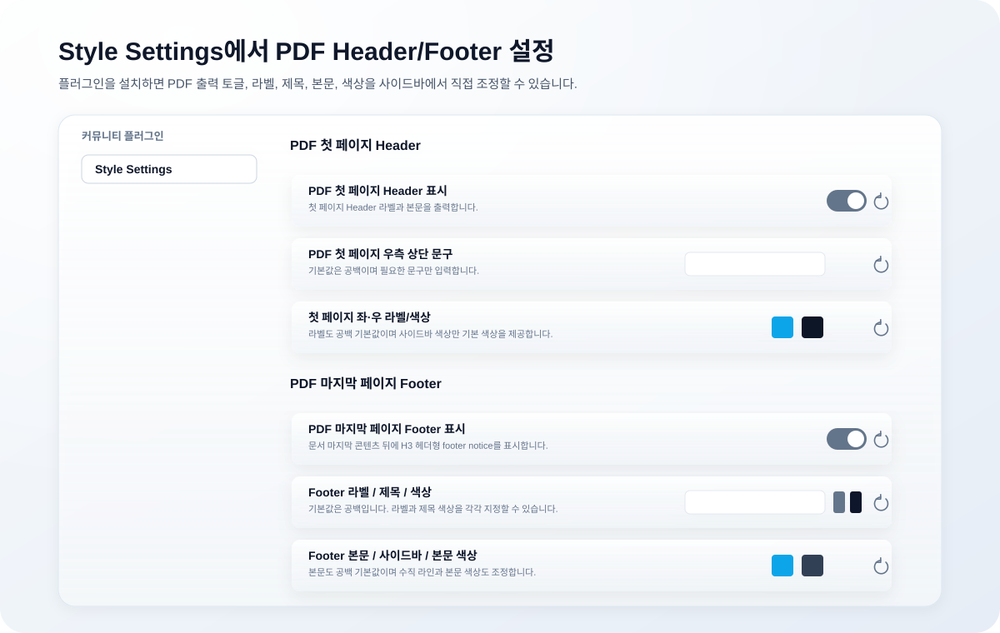

# Owen Graphite — Obsidian Theme

<!-- markdownlint-disable MD022 MD032 MD033 MD040 MD060 -->

Owen WIKI, Owen Graphite, Owen Editor는 LLM 기반 지식 정리부터 Obsidian 보고서 작성, Markdown 편집 UI까지 이어지는 Owen의 지식 작업 스택입니다.


[](https://github.com/towishy/Owen-Graphite/releases/latest)
[](LICENSE)
[](https://obsidian.md)
[](#2-테마-기능-요약)

**Owen Graphite**는 한국어 기술 문서와 보고서 작성에 맞춘 Obsidian 테마입니다. 넓은 A3/PDF 출력, Live Preview와 Reading View의 시각 패리티, 차분한 Liquid Glass workspace chrome을 한 흐름으로 묶습니다.

| 핵심 사용처 | 바로 얻는 효과 |
| --- | --- |
| 한국어 위키·기술 문서 | CJK 가독성, 긴 표·코드·callout 안정화 |
| A3/PDF 보고서 | 표지, 목차, 자동 넘버링, 페이지 분할 완화 |
| 반복 작성 워크스페이스 | 탭·사이드바·검색·설정 UI의 얕은 glass polish |

---

## 1. 테마 소개

**Owen Graphite**는 그래파이트(graphite) 톤의 라이트/다크 Obsidian 테마입니다. 한국어 보고서·기술 문서·위키 작성에 최적화되어 있으며, A3 인쇄 친화 레이아웃과 Live Preview ↔ Reading View 시각 동기화를 핵심 가치로 삼습니다.

| 분야 | 내용 |
|------|------|
| **타깃** | 보고서·기술 문서·위키 작성자 (특히 한국어) |
| **버전** | `2.30.14` |
| **기본 릴리즈** | `2.30.14` |
| **롤백 베이스라인** | `v2.30` |
| **모드 지원** | ✅ Light / Dark / Report — 모든 위젯 패리티 보장 |
| **플랫폼** | ✅ Desktop & Mobile |
| **디자인 정책** | Glass+Shadow 코어 · 샘플-우선 워크플로우 |


<details>
<summary>📷 Light / Dark / Report 모드 스크린샷</summary>


</details>

---

## 2. 테마 기능 요약

| 분류 | 주요 기능 | 요약 |
|------|----------|------|
| **디자인 코어** | Graphite 톤 · Liquid-glass chrome | 차분한 graphite 기반에 ribbon·사이드바·탭·툴바·command palette·tooltip glass surface 적용 |
| **상태 표현** | Frosted Ledger tables · Report Notice callouts | 기본 Markdown 표와 callout을 선명한 문서형 스타일로 정리하고 focus 상태는 aqua rim + soft halo로 표시 |
| **워크스페이스** | Workspace Surfaces Pack · Polish Pack | Graph view·Canvas·Folder cues·Mini TOC·Cover page·Dark parity·Mobile·Tab·Search HL 정리 |
| **보고서·인쇄** | A3 PDF Export · 자동 넘버링 | A3 가로/15mm 여백, 첫 페이지 헤더, H1 페이지 분할 |
| **분할 안정성** | 자동 분할 회피 | callout·표·Mermaid·코드·이미지가 PDF에서 중간 분할되지 않도록 보정 |
| **커스터마이징** | Style Settings 37종 · 사용자 클래스 | 폰트·간격·컬러·보고서 모드·PDF Compact Report·PDF 링크 출력 토글과 `.ogd-blur`·`.ogd-cover`·테이블/callout 유틸리티 제공 |
| **접근성·환경** | 시선 보호 · OS 다크 모드 · CJK 보정 | 시선 보호 모드, OS 다크 모드 자동 추종, CJK +0.5px 자동 보정 지원 |
| **Style Settings 분류** | 타이포 · 표 · 보고서 · PDF · 컬러/모션 | Style Settings 플러그인에서 전체 옵션을 사이드바 UI로 조정 |

---

## 3. 테마 설치 방법

### 옵션 A — Obsidian 커뮤니티 마켓 (승인 후)

1. 설정 → **외관 → 테마 관리**
2. 검색: `Owen Graphite`
3. 설치 → 사용

### 옵션 B — ZIP 수동 설치

[Releases 페이지](https://github.com/towishy/Owen-Graphite/releases/latest)에서 **`Owen-Graphite-<version>.zip`** 을 다운로드해 압축 해제합니다.

> **⚠️ 주의** Release Assets에는 GitHub 자동 생성 `Source code (zip)`도 함께 표시됩니다. 반드시 `Owen-Graphite-<version>.zip` 을 받으세요.

| 플랫폼 | 테마 대상 경로 |
| --- | --- |
| Windows | `<YourVault>\.obsidian\themes\Owen Graphite\` |
| macOS / Linux | `<YourVault>/.obsidian/themes/Owen Graphite/` |

설치 후 Obsidian → 설정 → **외관 → 테마** → `Owen Graphite` 선택.

<details>
<summary>옵션 C — Git 수동 설치 / 업데이트</summary>

#### Git 수동 설치 / 업데이트

Obsidian vault의 `.obsidian/themes/Owen Graphite/` 경로에 클론합니다. **같은 명령을 다시 실행하면 자동으로 업데이트**됩니다. 이미 클론된 폴더는 `fetch → reset --hard origin/main → clean` 순서로 최신 릴리스 상태를 맞춥니다.

| 플랫폼 | Git 설치 | 설치 / 업데이트 명령 |
| --- | --- | --- |
| Windows | `winget install --id Git.Git -e --source winget` | PowerShell 스크립트 (아래) |
| macOS | `brew install git` | bash 스크립트 (아래) |
| Linux | `sudo apt install git` (또는 `dnf install git`) | macOS와 동일 |

#### Windows (PowerShell)

```powershell
$ErrorActionPreference = "Stop"
$Vault = "D:\Path\To\YourVault"    # vault 경로로 교체
$Repo = "https://github.com/towishy/Owen-Graphite.git"
$ThemesDir = Join-Path $Vault ".obsidian\themes"
$ThemeDir = Join-Path $ThemesDir "Owen Graphite"

New-Item -ItemType Directory -Force -Path $ThemesDir | Out-Null

if (Test-Path -LiteralPath (Join-Path $ThemeDir ".git")) {
  git -C "$ThemeDir" fetch --quiet origin main
  git -C "$ThemeDir" reset --quiet --hard origin/main
  git -C "$ThemeDir" clean -qfd
  Write-Host "OK: Owen Graphite updated."
} elseif (Test-Path -LiteralPath $ThemeDir) {
  $Backup = "${ThemeDir}.backup-$(Get-Date -Format 'yyyyMMdd-HHmmss')"
  Move-Item -LiteralPath $ThemeDir -Destination $Backup
  git clone --quiet $Repo "$ThemeDir"
  Write-Host "OK: Owen Graphite reinstalled. Backup: $Backup"
} else {
  git clone --quiet $Repo "$ThemeDir"
  Write-Host "OK: Owen Graphite installed."
}
```

#### macOS / Linux (bash)

최신 버전의 macOS에서는 git이 기본 포함되어 있으며, 아래 스크립트는 **설치 / 업데이트 / 손상된 폴더 복구**를 모두 처리합니다.

```bash
set -e
VAULT="/path/to/YourVault"          # ← vault 경로로 교체
REPO="https://github.com/towishy/Owen-Graphite.git"
THEME_DIR="$VAULT/.obsidian/themes/Owen Graphite"

mkdir -p "$VAULT/.obsidian/themes"

if [ -d "$THEME_DIR/.git" ]; then
  # 이미 설치됨 → 최신화 (rebase 대신 hard reset 으로 충돌 회피)
  git -C "$THEME_DIR" fetch --quiet origin main
  git -C "$THEME_DIR" reset --quiet --hard origin/main
  git -C "$THEME_DIR" clean -qfd
  echo "OK: Owen Graphite updated to $(git -C "$THEME_DIR" describe --tags --abbrev=0 2>/dev/null || echo 'main HEAD')."
elif [ -e "$THEME_DIR" ]; then
  # 폴더는 있으나 git 저장소가 아님 (수동 ZIP 설치 등) → 백업 후 재클론
  BACKUP="$THEME_DIR.backup-$(date +%Y%m%d-%H%M%S)"
  echo "WARN: 기존 비-Git 폴더 발견 → $BACKUP 으로 백업 후 재설치"
  mv "$THEME_DIR" "$BACKUP"
  git clone --quiet "$REPO" "$THEME_DIR"
  echo "OK: Owen Graphite 재설치 완료 (이전 폴더는 $BACKUP 에 보관)."
else
  git clone --quiet "$REPO" "$THEME_DIR"
  echo "OK: Owen Graphite 설치 완료."
fi
```

**한 줄 버전** (이미 vault 경로에서 실행 중일 때):

```bash
THEME_DIR=".obsidian/themes/Owen Graphite"; REPO="https://github.com/towishy/Owen-Graphite.git"; mkdir -p "$(dirname "$THEME_DIR")"; if [ -d "$THEME_DIR/.git" ]; then git -C "$THEME_DIR" fetch -q origin main && git -C "$THEME_DIR" reset -q --hard origin/main && git -C "$THEME_DIR" clean -qfd; else if [ -e "$THEME_DIR" ]; then mv "$THEME_DIR" "$THEME_DIR.backup-$(date +%Y%m%d-%H%M%S)"; fi; git clone -q "$REPO" "$THEME_DIR"; fi && echo "OK"
```

> [Style Settings](https://github.com/mgmeyers/obsidian-style-settings) 플러그인을 함께 설치하면 37개 옵션을 사이드바 UI에서 토글하고, PDF Compact Report, PDF 링크 출력 방식, PDF Header/Footer 문구 및 색상도 입력창에서 바로 설정할 수 있습니다. Header/Footer 텍스트 기본값은 비워져 있으므로 필요한 문구만 직접 입력해 사용합니다.

</details>

---

## 4. 테마 신기능

### ✨ v2.30.2 — 코드블럭 헤더 라벨 정리

Live Preview와 PDF Export 코드블럭의 상단 헤더 라벨을 같은 구조로 정리했습니다. `PowerShell`, `KUSTO/KQL`, shell, Python, JavaScript, TypeScript, JSON, YAML, Markdown, CSS, HTML, SQL, text 코드블럭이 헤더 라인 안에 언어명을 안정적으로 표시하고, PDF에서는 divider 라인과 첫 코드 줄 사이 여백을 보강했습니다.

### ✨ v2.30.1 — Topbar 버튼 hover 정리

상단 탭바의 추가/목록 버튼 hover 상태를 전용 neutral token으로 분리해 일반 버튼 chrome에서 파란 rim이나 외곽선이 다시 나타나지 않도록 안정화했습니다. 반복 chrome은 색상보다 밝기와 얕은 그림자로 반응하고, 의미색은 선택 문서/tab 같은 명확한 상태에만 남깁니다.

### ✨ v2.30 — 전체 디자인 통일 베이스

문서 본문, 제목 계층, PDF 출력, 상단 titlebar/tab chrome, 좌우 side pane top icon slot까지 Owen Graphite의 Liquid Glass 디자인 언어를 하나의 기준으로 정리했습니다. 공유 상단 아이콘은 중립 outline-only glass로 안정화하고, 선택된 문서/tab 상태만 frosted document-selection pill과 얕은 sky rim을 사용합니다.

| 영역 | 정리 내용 |
|------|----------|
| 본문/제목 | H1-H4 계층과 PDF heading rule을 문장 길이 기준으로 정리하고, H1 number kicker는 선택적으로 숨길 수 있게 유지 |
| 상단 chrome | root tab strip/view header 배경을 문서 표면과 맞추고, active tab은 선택 문서 pill 스타일로 통일 |
| side pane icon | 좌우 side pane top slot은 중립 outline parity를 유지하고, 선택된 왼쪽 tab icon만 문서 선택 pill 스타일 적용 |
| 안정화 문서 | top chrome icon/background contract를 문서화해 다음 변경 시 SVG/color/opacity 복구 패치를 피하도록 기준화 |

### ✨ v2.22.41 — PDF 마지막 페이지 Footer

PDF export 마지막 페이지에 H3 헤더형 confidential footer를 추가했습니다. Style Settings에서 첫 페이지 Header와 마지막 페이지 Footer의 PDF 출력 여부, 라벨/제목/본문 문구, 각 색상 옵션을 조정할 수 있습니다.



### ✨ v2.22.31 — README Liquid Glass Overview

README 대표 이미지와 실제 테마 CSS를 같은 liquid glass 기준으로 맞추고, 표와 focus 상태의 최신 시각 기준을 정리했습니다.


| # | 항목 | 내용 |
|---|------|------|
| 1 | README 대표 이미지 | 실제 작업공간 chrome, 위키형 표, 보고서형 표, Frost Aqua focus를 한 장에 요약 |
| 2 | Table mode split | 위키형 표는 airy glass surface, 보고서형 표는 PDF 친화 contrast/rule 중심으로 분리 |
| 3 | Frost Aqua focus | ribbon, nav, tab, search/modal, settings focus를 aqua rim + soft halo로 통일 |
| 4 | QA guard | README SVG, liquid glass token map, table/focus smoke sample을 validator로 보호 |

---

## 5. Change Log

README에는 현재 보존된 기본 릴리즈만 간략히 요약합니다. 이전 공개 릴리즈와 태그는 정리되었으며, 전체 변경 이력과 상세 검증 내역은 [CHANGELOG.md](CHANGELOG.md)에서 확인할 수 있습니다.

| 버전 | 핵심 변경 |
|------|----------|
| **v2.30.14** | 커뮤니티 스캐너 잔여 경고 정리 — `scripts/find_safe_duplicate_selectors.py` 신규 추가로 같은 모듈·같은 selector·같은 body·같은 at-rule context를 전부 만족하는 진짜 무해 중복만 자동 탐지하고, `dev/06-feature-presets.css` 1건과 `dev/10e-html-table-live-preview-glass.css` 3건(총 4건)을 제거. `!important` 5,819 → 5,816, 렌더 결과 동일. 의도된 다른 경고(`!important`, `:has()`, partial support, 4단 계층 override)는 새 문서 `docs/community-scanner-acknowledgments.md` 로 책임 매트릭스를 명시하고, 장기 `@layer` 도입 로드맵은 `docs/layer-migration-roadmap.md` 로 분리 |
| **v2.30.13** | 커뮤니티 스캐너 hex 정규화 — `dev/06`/`dev/07` 의 print/forced-colors·high-contrast·Mermaid dark 노드 stroke 등 7곳의 3자리 hex(`#000/#555/#333/#aaa/#ccc/#888`)를 6자리로 확장해 Obsidian 커뮤니티 스캐너의 `Use the full 6-digit hex format for consistency.` 경고 7건을 해소. 색·디자인 토큰·캐스케이드·기능 표면은 변경 없음. 추가로 1200×800 커뮤니티 커버 SVG/PNG(`screenshots/readme/v2.30-cover-1200x800.*`)와 Playwright 기반 렌더 헬퍼 `scripts/render_cover_image.py` 동봉 |
| **v2.30.12** | Theme manifest `fundingUrl` 제거 — 비활성 GitHub Sponsors URL이 Obsidian 커뮤니티 테마 등록 검증에서 `fetch failed`로 격상돼 머지 차단 사유가 되던 문제를 manifest에서 해당 필드 제거로 해소 (스폰서 링크는 README에 유지) |
| **v2.30.11** | Theme manifest 스키마 정리 — 플러그인 전용 `isDesktopOnly` 필드를 `manifest.json`에서 제거해 Obsidian 커뮤니티 테마 등록 검증의 unknown-field 경고 해소 |
| **v2.30.10** | 문서/워크플로우 polish — README 첫인상 정리, Style Settings 37개 정합성, 후원 manifest URL, 플러그인 호환성 문서, PDF QA 샘플, README SVG smoke 자동화, 모바일·다크·callout·표·코드블록 late polish 모듈 추가 |
| **v2.30.9** | Live Preview HTML 테이블 패리티 정리 — 전용 `dev/10e` 모듈로 분리하고, 본문 흰 배경/파란 hover/외곽 outline/header divider/utility-class 테이블을 markdown table widget 톤에 맞게 보정. 코드블록 헤더 라벨과 첫 코드 줄 사이 여백도 확대 |
| **v2.30.8** | Settings hover 그림자 근본 원인 수정 — dev/09c의 `.setting-item:hover` `var(--ogd-glass-shadow-hover)` (10d 에서 `0 28px 64px` halo) 교체 → hairline `0 1px 2px /.04~12`. v2.30.6/30.7 변경은 09b를 다뤄다줬으나 09c 우선이어서 실제 표시 변화 없었음 |
| **v2.30.7** | Settings 모달 hover 그림자 더 연하고 좋게 축소 — left nav `0 3px 8px /.08` → `0 1px 3px /.05`, right pane row `0 2px 6px /.06` → `0 1px 2px /.04` (다크 모드 동일 비율로 축소) |
| **v2.30.6** | Settings 모달 hover 그림자 랜드 완화 — left nav `0 6px 16px /.14` → `0 3px 8px /.08`, right pane row `0 4px 12px /.10` → `0 2px 6px /.06` (다크 모드 동일 비율로 축소) |
| **v2.30.5** | 빈 코드블록 헤더 strip 에 PascalCase 라벨 매핑 추가 — Config(ini/conf/toml/env/.wslconfig 등), Server config(nginx/apache/systemd 등), Dockerfile, Makefile, XML, Data(csv/tsv), Diff, Regex |
| **v2.30.4** | 헤딩(h1-h6)·callout·blockquote·TOC의 좌측 강조 세로 바를 screen·LP·PDF 모두에서 전수 제거 (border-left + ::before 가짜 막대 차단), PDF 테이블 zebra 강제 transparent 보강 |
| **v2.30.2** | Live Preview와 PDF Export 코드블럭 헤더 라벨을 통일하고, KUSTO/KQL 등 언어별 라벨 mapping과 PDF 첫 줄 여백을 보정 |
| **v2.30.1** | 상단 탭바 추가/목록 버튼 hover를 전용 neutral token으로 분리하고, hover 외곽선/rim 없이 밝기와 그림자만 남도록 정리 |
| **v2.30** | 전체 디자인 통일 베이스: 본문/제목/PDF heading, root tab, titlebar icon slot, side pane top icon을 하나의 Liquid Glass 기준으로 정리. 공유 아이콘은 중립 outline glass를 유지하고 선택된 문서/tab만 frosted sky-rim pill을 사용 |

> 전체 릴리즈 노트와 상세 변경 내역 → [CHANGELOG.md](CHANGELOG.md)

---

## 6. 기타

### 🤝 기여
- 이슈: [GitHub Issues](https://github.com/towishy/Owen-Graphite/issues)
- 토론: [Discussions](https://github.com/towishy/Owen-Graphite/discussions)
- 기여 가이드: [CONTRIBUTING.md](CONTRIBUTING.md)
- 개발 모듈 워크플로우: [dev/README.md](dev/README.md)

### 📁 파일 구조

```
Owen Graphite/
├── theme.css         # 테마 본체 (~10,600줄)
├── manifest.json     # Obsidian 테마 메타데이터
├── README.md         # 본 문서
├── CHANGELOG.md      # 전체 릴리즈 노트
├── CONTRIBUTING.md   # 기여 가이드
├── LICENSE           # MIT
├── dev/test-samples/ # 개발/검증용 샘플 문서
├── docs/             # 디자인 기준, QA, 토큰 매핑 문서
├── dev/MAP/          # dev CSS 기준 theme.css risk map 산출물
├── dev/temp/         # 임시 요청 산출물 보관소 (내용물은 커밋 제외)
├── screenshots/      # README/마켓 이미지
└── scripts/          # Python 검증/릴리즈 스크립트
```

### 🅰️ 권장 폰트
- **Pretendard** / **Noto Sans KR** — 본문 (sans)
- **Noto Serif KR** / **나눔명조** — 보고서 모드 (serif)
- **JetBrains Mono** / **D2Coding** — 코드 (mono)

### 🔌 플러그인 호환성
- 기본 점검 대상: Style Settings, Dataview, Tasks, Canvas, Graph view, Search, Bookmarks, Outline
- 자세한 호환성 표와 회귀 점검 포인트는 [docs/plugin-compatibility.md](docs/plugin-compatibility.md)를 확인하세요.

### ☕ 후원

<p align="center">
  <a href="https://github.com/sponsors/towishy">
    
  </a>
</p>

### 📜 라이선스
[MIT License](LICENSE) © 2026 Owen ([@towishy](https://github.com/towishy))

### 🙏 크레딧
- 글꼴: Pretendard (Kil Hyung-jin), Noto Sans/Serif KR (Google), JetBrains Mono (JetBrains), D2Coding (Naver)
- 영감: Obsidian Minimal, Things, AnuPpuccin
- 빌드: Obsidian 1.6.x / macOS · Windows · Linux
