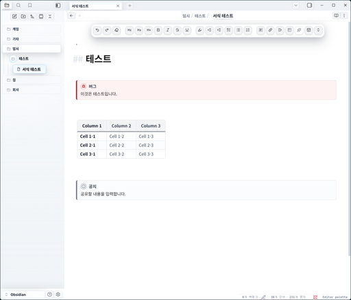
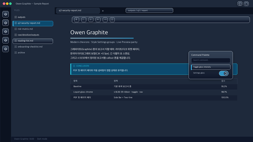
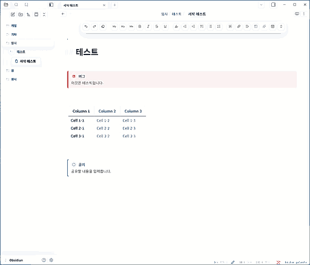
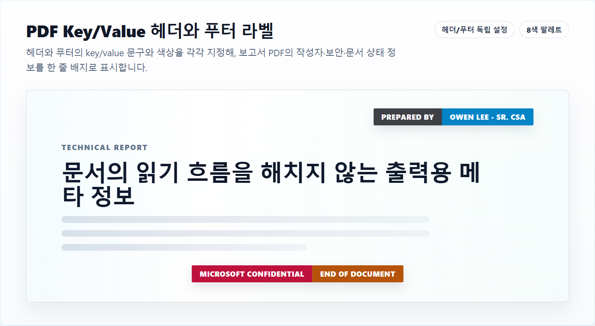

# Owen Graphite — Obsidian Theme

<!-- markdownlint-disable MD022 MD032 MD033 MD040 -->

**Owen Graphite v3.1.36** — 한국어 기술 문서·보고서·위키 작성을 위한 Obsidian 테마. 16,000+ 줄 CSS를 src/ 폴더에 처음부터 다시 작성한 v3 코드베이스의 최신 안정 릴리즈입니다.

[](https://github.com/towishy/Owen-Graphite/releases/latest)
[](LICENSE)
[](https://obsidian.md)
[](docs/v3/cascade-research.md)

| 핵심 사용처 | 바로 얻는 효과 |
| --- | --- |
| 한국어 위키·기술 문서 | CJK 가독성, 긴 표·코드·callout 안정화 |
| A3/PDF 보고서 | 표지·자동 넘버링·페이지 분할 완화 |
| 반복 작성 워크스페이스 | 탭·사이드바·검색·설정 UI의 얕은 liquid-glass polish |

---

## 1. 테마 소개

| 항목 | 내용 |
| --- | --- |
| **버전** | `3.1.36` |
| **베이스라인 / 롤백 기준** | `v3.1.36` |
| **모드 지원** | ✅ Light / Dark / Report |
| **플랫폼** | ✅ Desktop & Mobile |
| **디자인 정책** | Liquid Glass core · 토큰 우선 · zero-important cascade |

<details>
<summary>📷 Light / Dark / Report 모드 스크린샷</summary>





</details>

---

## 2. PDF Key/Value 라벨

PDF 출력 전용 헤더와 푸터 라벨을 단일 문구 또는 Key/Value 2-segment 배지로 표시할 수 있습니다. Style Settings에서 헤더와 푸터를 각각 켜고, key/value 문구와 색상을 독립적으로 지정해 작성자, 기밀 등급, 문서 상태를 본문 흐름 밖에 작게 배치합니다.



| 설정 영역 | 가능한 조정 |
| --- | --- |
| 헤더 설정 | Key 색상, Value 색상, Key 문구, Value 문구, 위치 |
| 푸터 설정 | Key 색상, Value 색상, Key 문구, Value 문구 |
| 공통 구성 | 단일/Key-Value 구성, 라벨 스타일, 라벨 크기, 빠른 문구 |

---

## 3. 테마 설치

### 옵션 A — Obsidian 커뮤니티 마켓 (승인 후)

1. 설정 → **외관 → 테마 관리**
2. 검색: `Owen Graphite`
3. 설치 → 사용

### 옵션 B — ZIP 수동 설치

[Releases 페이지](https://github.com/towishy/Owen-Graphite/releases/latest)에서 **`Owen-Graphite-3.1.36.zip`** 을 받아 압축 해제합니다.

| 플랫폼 | 대상 경로 |
| --- | --- |
| Windows | `<YourVault>\.obsidian\themes\Owen Graphite\` |
| macOS / Linux | `<YourVault>/.obsidian/themes/Owen Graphite/` |

설치 후 Obsidian → 설정 → **외관 → 테마** → `Owen Graphite` 선택.

> ⚠️ Release Assets에는 GitHub 자동 생성 `Source code (zip)`도 함께 표시됩니다. 반드시 `Owen-Graphite-3.1.36.zip` 을 받으세요.

### 옵션 C — Git 수동 설치 / 업데이트

`.obsidian/themes/Owen Graphite/` 경로에 클론합니다. **같은 명령을 다시 실행하면 자동 업데이트**됩니다.

#### Windows (PowerShell)

```powershell
$ErrorActionPreference = "Stop"
$Vault = "D:\Path\To\YourVault"            # vault 경로로 교체
$Repo = "https://github.com/towishy/Owen-Graphite.git"
$ThemesDir = Join-Path $Vault ".obsidian\themes"
$ThemeDir = Join-Path $ThemesDir "Owen Graphite"

New-Item -ItemType Directory -Force -Path $ThemesDir | Out-Null

if (Test-Path -LiteralPath (Join-Path $ThemeDir ".git")) {
  git -C "$ThemeDir" fetch --quiet origin main
  git -C "$ThemeDir" reset --quiet --hard origin/main
  git -C "$ThemeDir" clean -qfd
  Write-Host "OK: Owen Graphite updated."
} elseif (Test-Path -LiteralPath $ThemeDir) {
  $Backup = "${ThemeDir}.backup-$(Get-Date -Format 'yyyyMMdd-HHmmss')"
  Move-Item -LiteralPath $ThemeDir -Destination $Backup
  git clone --quiet $Repo "$ThemeDir"
  Write-Host "OK: Owen Graphite reinstalled. Backup: $Backup"
} else {
  git clone --quiet $Repo "$ThemeDir"
  Write-Host "OK: Owen Graphite installed."
}
```

#### macOS / Linux (bash)

```bash
set -e
VAULT="/path/to/YourVault"                  # vault 경로로 교체
REPO="https://github.com/towishy/Owen-Graphite.git"
THEME_DIR="$VAULT/.obsidian/themes/Owen Graphite"
mkdir -p "$VAULT/.obsidian/themes"

if [ -d "$THEME_DIR/.git" ]; then
  git -C "$THEME_DIR" fetch --quiet origin main
  git -C "$THEME_DIR" reset --quiet --hard origin/main
  git -C "$THEME_DIR" clean -qfd
  echo "OK: Owen Graphite updated."
elif [ -e "$THEME_DIR" ]; then
  BACKUP="$THEME_DIR.backup-$(date +%Y%m%d-%H%M%S)"
  mv "$THEME_DIR" "$BACKUP"
  git clone --quiet "$REPO" "$THEME_DIR"
  echo "OK: Owen Graphite reinstalled. Backup: $BACKUP"
else
  git clone --quiet "$REPO" "$THEME_DIR"
  echo "OK: Owen Graphite installed."
fi
```

> [Style Settings](https://github.com/mgmeyers/obsidian-style-settings) 플러그인을 함께 설치하면 옵션을 사이드바 UI에서 토글하고, PDF Compact Report, PDF 링크 출력 방식, PDF Header/Footer 문구·색상을 입력창에서 설정할 수 있습니다.

---

## 4. 개발자 워크플로우

v3 소스는 `src/` 폴더에 토큰 → base → surfaces → chrome → features → themes → plugins → polish 순서로 분리되어 있습니다. 빌드/감사는 `dev/scripts/` 의 v3 도구만 사용합니다.

| 작업 | 명령 |
| --- | --- |
| 번들 빌드 | `python dev/scripts/bundle_v3.py` → `dist/theme-v3.css` |
| `theme.css` 갱신 | `Copy-Item dist/theme-v3.css theme.css -Force` (Windows) 또는 동등 명령 |
| Live Preview hit-routing 감사 | `python dev/scripts/audit_v3_hit_routing.py` |
| 중복 selector 감사(참고용) | `python dev/scripts/v3_audit_duplicate_selectors.py` |
| computed-style fingerprint 캡처 | `python dev/scripts/capture_computed_fingerprint.py --build v3 --theme {light,dark}` |
| fingerprint diff | `python dev/scripts/fp_diff_summary.py [--theme dark]` |
| Release ZIP | `python dev/scripts/build_release.py` |
| Obsidian vault 동기화 | `python dev/scripts/sync_obsidian_theme.py` |

자세한 기여 가이드는 [CONTRIBUTING.md](CONTRIBUTING.md), 변경 이력은 [CHANGELOG.md](CHANGELOG.md), 보존·검증 계약은 [docs/v3/design-spec.md](docs/v3/design-spec.md) 참조.

---

## 5. 후원

<p align="center">
  <a href="https://github.com/sponsors/towishy">
    
  </a>
</p>

Owen Graphite는 무료/오픈소스입니다. 한국어 보고서·위키 작성 환경 유지에 도움이 되셨다면 [GitHub Sponsors](https://github.com/sponsors/towishy)에서 커피 한 잔으로 응원해 주세요.

---

## 6. 라이선스

MIT — [LICENSE](LICENSE)
