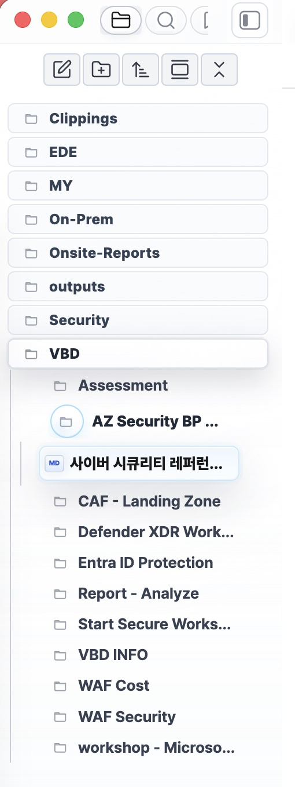

# Owen Graphite — Obsidian Theme

<!-- markdownlint-disable MD022 MD032 MD033 MD040 -->

**Owen Graphite v3.1.51** — 한국어 기술 문서·보고서·위키 작성을 위한 Obsidian 테마. 17,000+ 줄 CSS를 src/ 폴더에 처음부터 다시 작성한 v3 코드베이스의 최신 안정 릴리즈입니다.

**English summary** — Owen Graphite is an Obsidian theme for technical documentation, knowledge bases, and report writing. It focuses on readable Korean and English notes, stable long tables and code blocks, polished workspace chrome, Live Preview / PDF export parity, and report-friendly layouts for recurring documentation work.

[](https://github.com/towishy/Owen-Graphite/releases/latest)
[](LICENSE)
[](https://obsidian.md)
[](docs/v3/cascade-research.md)

[English README](README.en.md) · [Style Settings presets](docs/v3/style-settings-presets.md) · [Compatibility matrix](docs/plugin-compatibility.md)

## Why Owen Graphite?

| 작업 흐름 | 바로 좋아지는 지점 |
| --- | --- |
| 긴 한글·영문 기술 문서 | CJK/Latin 혼합 문단, 제목, 코드, 표의 밀도와 리듬을 안정화 |
| Live Preview 중심 작성 | 편집 화면과 Reading View의 표·코드·callout 표면 차이를 줄임 |
| PDF 보고서 제출 | 첫 페이지 헤더, 마지막 페이지 푸터, 자동 넘버링, 페이지 분할 완화 지원 |
| 반복 작성 워크스페이스 | 탭, 탐색기, 검색, 설정, 팝오버를 조용한 liquid-glass 톤으로 정리 |

## Release Confidence

| Guard | Current status | Evidence |
| --- | --- | --- |
| Bundle freshness | `theme.css` must match `dist/theme-v3.css` | [release plan](docs/v3/release-plan.md) |
| Zero-important cascade | declaration-level `!important` policy is enforced | [cascade research](docs/v3/cascade-research.md) |
| Style Settings contract | option ids/defaults are audited against the contract | [contract](docs/v3/style-settings-contract.md) |
| Docs/assets links | local Markdown links and README images are audited | [contributing](CONTRIBUTING.md) |
| Live Preview/PDF parity | LP hit-routing, PDF header/footer, and visual fixture checks are scripted | [release plan](docs/v3/release-plan.md) |

## Visual Tour

| Surface | Preview |
| --- | --- |
| Light mode |  |
| Dark mode |  |
| Report mode |  |
| Top tabs and floating toolbar |  |
| Writing surface and floating toolbar |  |
| Style Settings report controls |  |
| File explorer glass navigation |  |
| Owen Editor toolbar controls |  |
| File explorer type badges |  |

비교 스크린샷을 새로 캡처할 때는 [visual comparison guide](docs/v3/visual-comparison-guide.md)를 기준으로 기본 Obsidian과 Owen Graphite를 같은 문서·같은 뷰포트에서 촬영합니다.

## English Overview

Owen Graphite is designed for people who write long-form notes, technical documents, knowledge-base pages, and printable reports in Obsidian. It keeps dense Markdown content readable, makes workspace chrome quieter, and preserves a consistent visual language across editing, reading, and PDF export.

### Features

| Area | What it improves |
| --- | --- |
| Korean and English notes | Balanced typography for CJK and Latin text, with stable spacing for long documents |
| Technical writing | Clear code blocks, long tables, callouts, embeds, and document-style layouts |
| Workspace navigation | Polished tabs, file explorer, search panels, sidebars, and type badges for common file formats |
| Report workflows | Report mode, print-friendly surfaces, PDF header options, and reduced page-break issues |
| Maintenance | Modular v3 CSS source, release audits, and zero-important cascade policy |

### Installation

1. Open Obsidian and go to `Settings` → `Appearance` → `Themes`.
2. Search for `Owen Graphite` in the community theme browser.
3. Install and enable the theme.
4. Optional: install the Style Settings plugin to adjust report mode, PDF header fields, and workspace polish options.

| 핵심 사용처 | 바로 얻는 효과 |
| --- | --- |
| 한국어 위키·기술 문서 | CJK 가독성, 긴 표·코드·callout 안정화 |
| A3/PDF 보고서 | 표지·자동 넘버링·페이지 분할 완화 |
| 반복 작성 워크스페이스 | 탭·사이드바·검색·설정 UI의 얕은 liquid-glass polish |

---

## 1. 테마 소개 / Theme Profile

| 항목 | 내용 |
| --- | --- |
| **버전** | `3.1.51` |
| **베이스라인 / 롤백 기준** | `v3.1.51` |
| **모드 지원** | ✅ Light / Dark / Report |
| **플랫폼** | ✅ Desktop & Mobile |
| **디자인 정책** | Liquid Glass core · 토큰 우선 · zero-important cascade |

<details>
<summary>📷 Light / Dark / Report 모드 스크린샷</summary>


</details>

---

## 2. 신기능 소개 / Latest Highlights

> [ 정보 ]
> [Style Settings 플러그인](https://community.obsidian.md/plugins/obsidian-style-settings)을 설치하면, 신기능 관련 옵션과 설정을 진행할 수 있습니다.

Recent updates are listed here so English-speaking users and reviewers can quickly see what changed in the latest stable releases.

### v3.1.51 — 상단 탭 Liquid Glass / Top Tab Liquid Glass

상단 workspace tab을 첨부 화면 기준의 붙은 탭 형태로 다듬었습니다. 활성 탭은 위·좌·우 rim이 같은 sky 톤으로 이어지고, 비활성 탭은 분리선 대신 보일듯 말듯한 graphite outline으로 경계를 남깁니다. 플로팅 툴바와 같은 frosted glass 톤 안에서 탭 상태가 더 조용하고 명확하게 읽히도록 정리했습니다.

This release refines the top workspace tabs into an attached liquid-glass shape. The active tab uses one consistent sky rim across the top and sides, while inactive tabs keep a barely visible graphite outline instead of hard divider lines.


| 구분 | 개선 내용 |
| --- | --- |
| 활성 탭 | sky rim을 위/좌/우 동일 톤으로 맞추고 두 겹처럼 보이던 top highlight 제거 |
| 비활성 탭 | 매우 낮은 alpha의 graphite outline으로 경계를 보일듯 말듯하게 유지 |
| 분리선 | Obsidian 기본 tab separator와 pseudo-element 라인을 숨겨 `|`처럼 보이는 선 제거 |
| 문서 자산 | 첨부 화면 구도의 README 신기능 이미지를 `screenshots/readme/`에 추가 |

### v3.1.50 — README 화면 투어 / README Visual Tour Refresh

README 상단 Visual Tour에 실제 작업 화면과 설정 화면 스크린샷을 보강했습니다. 문서 작성 surface, 플로팅 툴바, Style Settings의 보고서 옵션, 파일 탐색기 glass navigation, Owen Editor 툴바 설정을 첫 화면에서 바로 확인할 수 있습니다.

This release expands the README Visual Tour with real workspace screenshots for the writing surface, floating toolbar, report-oriented Style Settings controls, file explorer glass navigation, and Owen Editor toolbar options.


| 구분 | 개선 내용 |
| --- | --- |
| 작업 화면 | 문서 표면, floating glass toolbar, 사이드바 톤을 한 화면에서 확인 |
| 설정 화면 | Style Settings의 본문/보고서 옵션과 Owen Editor 툴바 설정 이미지 추가 |
| 탐색기 | glass navigation, active row, 타입 배지 상태를 README 투어에 노출 |
| 문서 자산 | 새 JPG 4장을 `screenshots/readme/` 인벤토리에 등록 |

### v3.1.49 — 설정 제목과 검색 Focus Rim / Settings Headings and Search Focus Rim

Style Settings의 그룹 제목과 Obsidian 설정 본문 섹션 제목을 같은 liquid header bar 언어로 정리했습니다. 단축키 검색·검색 패널 입력창의 강한 파란 focus rim은 추천안 B `Liquid Aqua`로 낮춰, 입력 상태는 분명하게 보이되 설정 화면 전체의 회색·흰색 glass 톤을 해치지 않도록 조정했습니다.

This release aligns Style Settings group titles and core settings section headings with the same liquid header treatment. Search and hotkey filter inputs now use the selected `Liquid Aqua` focus rim, reducing the stronger blue glow while keeping keyboard focus clear.


| 구분 | 개선 내용 |
| --- | --- |
| 설정 제목 | 그룹/섹션 제목에 liquid glass bar와 좌측 gradient rail 적용 |
| 검색 focus | 강한 cyan outline을 낮은 채도 aqua rim, 내부 highlight, 얕은 halo로 교체 |
| 적용 범위 | 단축키 검색, 검색 패널, 설정 modal의 검색 입력 컨테이너 |
| 다크 모드 | 어두운 배경에서는 약한 cyan rim과 절제된 shadow로 별도 조정 |

이전 신기능 소개는 [docs/v3/feature-history.md](docs/v3/feature-history.md)에 보관합니다.

---

## 3. 테마 설치 / Installation Details

### 옵션 A — Obsidian 커뮤니티 마켓 (승인 후) / Community Theme Browser

1. 설정 → **외관 → 테마 관리**
2. 검색: `Owen Graphite`
3. 설치 → 사용

### 옵션 B — ZIP 수동 설치 / Manual ZIP Install

[Releases 페이지](https://github.com/towishy/Owen-Graphite/releases/latest)에서 **`Owen-Graphite-3.1.51.zip`** 을 받아 압축 해제합니다.

| 플랫폼 | 대상 경로 |
| --- | --- |
| Windows | `<YourVault>\.obsidian\themes\Owen Graphite\` |
| macOS / Linux | `<YourVault>/.obsidian/themes/Owen Graphite/` |

설치 후 Obsidian → 설정 → **외관 → 테마** → `Owen Graphite` 선택.

> ⚠️ Release Assets에는 GitHub 자동 생성 `Source code (zip)`도 함께 표시됩니다. 반드시 `Owen-Graphite-3.1.51.zip` 을 받으세요.

### 옵션 C — Git 수동 설치 / 업데이트 / Git Install or Update

`.obsidian/themes/Owen Graphite/` 경로에 클론합니다. **같은 명령을 다시 실행하면 자동 업데이트**됩니다.

#### Windows (PowerShell)

```powershell
$ErrorActionPreference = "Stop"
$Vault = "D:\Path\To\YourVault"            # vault 경로로 교체
$Repo = "https://github.com/towishy/Owen-Graphite.git"
$ThemesDir = Join-Path $Vault ".obsidian\themes"
$ThemeDir = Join-Path $ThemesDir "Owen Graphite"

New-Item -ItemType Directory -Force -Path $ThemesDir | Out-Null

if (Test-Path -LiteralPath (Join-Path $ThemeDir ".git")) {
  git -C "$ThemeDir" fetch --quiet origin main
  git -C "$ThemeDir" reset --quiet --hard origin/main
  git -C "$ThemeDir" clean -qfd
  Write-Host "OK: Owen Graphite updated."
} elseif (Test-Path -LiteralPath $ThemeDir) {
  $Backup = "${ThemeDir}.backup-$(Get-Date -Format 'yyyyMMdd-HHmmss')"
  Move-Item -LiteralPath $ThemeDir -Destination $Backup
  git clone --quiet $Repo "$ThemeDir"
  Write-Host "OK: Owen Graphite reinstalled. Backup: $Backup"
} else {
  git clone --quiet $Repo "$ThemeDir"
  Write-Host "OK: Owen Graphite installed."
}
```

#### macOS / Linux (bash)

```bash
set -e
VAULT="/path/to/YourVault"                  # vault 경로로 교체
REPO="https://github.com/towishy/Owen-Graphite.git"
THEME_DIR="$VAULT/.obsidian/themes/Owen Graphite"
mkdir -p "$VAULT/.obsidian/themes"

if [ -d "$THEME_DIR/.git" ]; then
  git -C "$THEME_DIR" fetch --quiet origin main
  git -C "$THEME_DIR" reset --quiet --hard origin/main
  git -C "$THEME_DIR" clean -qfd
  echo "OK: Owen Graphite updated."
elif [ -e "$THEME_DIR" ]; then
  BACKUP="$THEME_DIR.backup-$(date +%Y%m%d-%H%M%S)"
  mv "$THEME_DIR" "$BACKUP"
  git clone --quiet "$REPO" "$THEME_DIR"
  echo "OK: Owen Graphite reinstalled. Backup: $BACKUP"
else
  git clone --quiet "$REPO" "$THEME_DIR"
  echo "OK: Owen Graphite installed."
fi
```

---

## 4. 개발자 워크플로우

v3 소스는 `src/` 폴더에 토큰 → base → surfaces → chrome → features → themes → plugins → polish 순서로 분리되어 있습니다. 빌드/감사는 `dev/scripts/` 의 v3 도구만 사용합니다.

| 작업 | 명령 |
| --- | --- |
| 번들 빌드 | `python dev/scripts/bundle_v3.py` → `dist/theme-v3.css` |
| `theme.css` 갱신 | `Copy-Item dist/theme-v3.css theme.css -Force` (Windows) 또는 동등 명령 |
| Live Preview hit-routing 감사 | `python dev/scripts/audit_v3_hit_routing.py` |
| 중복 selector 감사(참고용) | `python dev/scripts/v3_audit_duplicate_selectors.py` |
| unused CSS 후보 리포트 | `python dev/scripts/build_unused_css_report.py` |
| computed-style fingerprint 캡처 | `python dev/scripts/capture_computed_fingerprint.py --build v3 --theme {light,dark}` |
| fingerprint diff | `python dev/scripts/fp_diff_summary.py [--theme dark]` |
| Release ZIP | `python dev/scripts/build_release.py` |
| Obsidian vault 동기화 | `python dev/scripts/sync_obsidian_theme.py` |

자세한 기여 가이드는 [CONTRIBUTING.md](CONTRIBUTING.md), 변경 이력은 [CHANGELOG.md](CHANGELOG.md), 보존·검증 계약은 [docs/v3/design-spec.md](docs/v3/design-spec.md) 참조.

---

## 5. 후원

<p align="center">
  <a href="https://github.com/sponsors/towishy">
    
  </a>
</p>

Owen Graphite는 무료/오픈소스입니다. 한국어 보고서·위키 작성 환경 유지에 도움이 되셨다면 [GitHub Sponsors](https://github.com/sponsors/towishy)에서 커피 한 잔으로 응원해 주세요.

---

## 6. 라이선스

MIT — [LICENSE](LICENSE)
