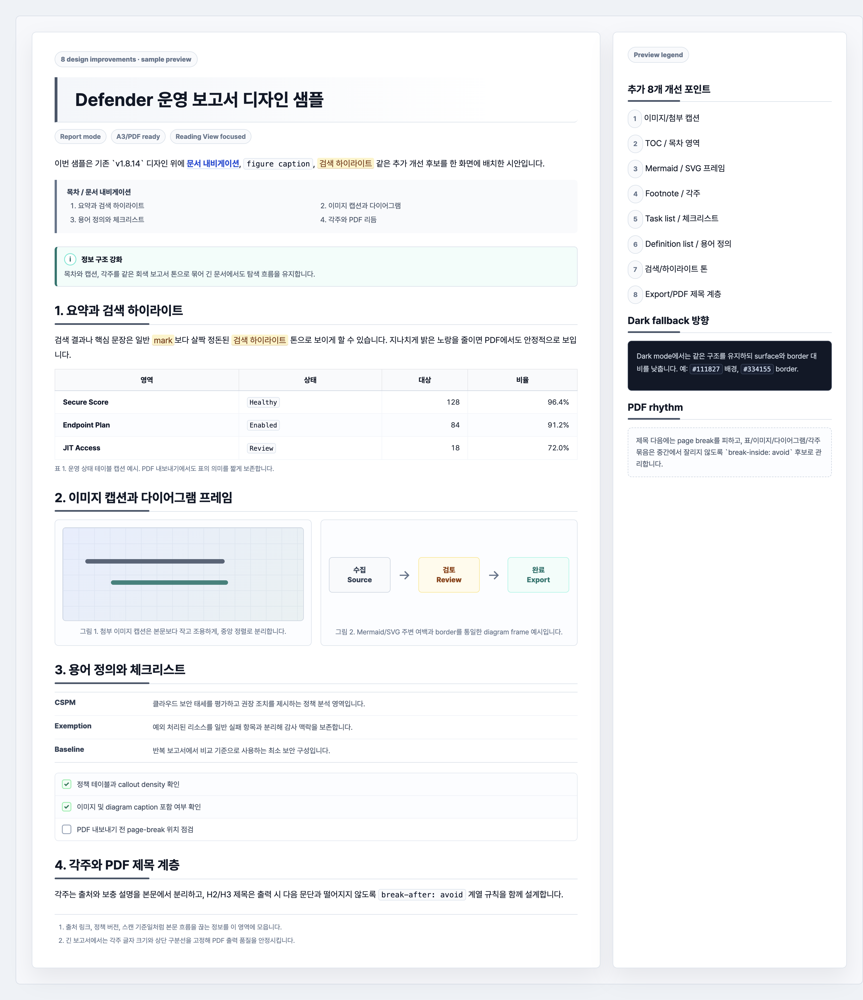
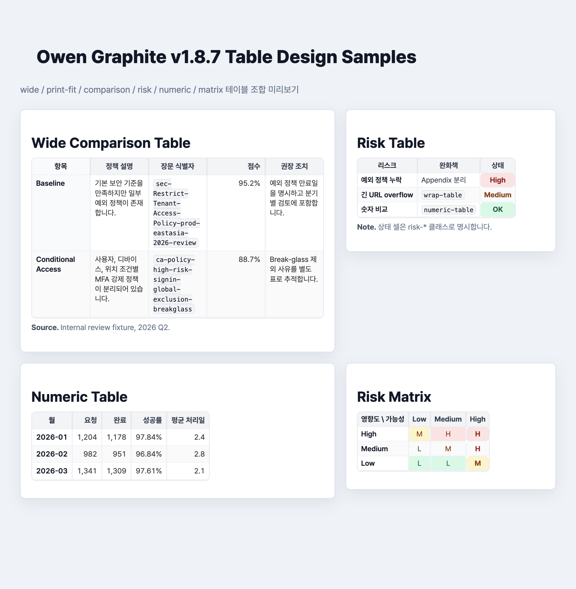

# Owen Graphite - Obsidian Theme

[](https://github.com/towishy/Owen-Graphite/releases/latest)
[](LICENSE)
[](https://obsidian.md)
[](#style-settings-항목)

> **Obsidian 보고서 지향 라이트/다크 테마.**
> 그래파이트(graphite) 기반의 차분한 색감, **A3 인쇄 친화 레이아웃**,
> **Live Preview ↔ Reading View 시각 동기**, **한국어 보고서 작성 최적화**.


<details>
<summary>📷 Dark Mode / Report Mode 스크린샷</summary>


</details>

---

## ✨ 한 줄 요약

| 분야 | 내용 |
|------|------|
| **타깃** | 보고서·기술 문서·위키 작성자 (특히 한국어) |
| **차별점** | A3 인쇄 + 헤더 자동 넘버링 + 표지 + **PDF 첫 페이지 모던 헤더 (Side Bar + Two-line)** + Style Settings 26종 + Live Preview/Reading parity |
| **Light & Dark** | ✅ 양쪽 모두 모든 위젯 패리티 보장 |
| **모바일** | ✅ Desktop & Mobile |
| **버전** | `1.8.39` (Obsidian 1.6.0+) |

---

## 📦 설치

### 옵션 A — Obsidian 커뮤니티 마켓 (승인 후)

1. 설정 → **외관 → 테마 관리**
2. 검색: `Owen Graphite`
3. 설치 → 사용

### 옵션 B — 수동 설치

```bash
cd <YourVault>/.obsidian/themes
git clone https://github.com/towishy/Owen-Graphite.git "Owen Graphite"
```

또는 [Releases 페이지](https://github.com/towishy/Owen-Graphite/releases/latest)에서
`theme.css`, `manifest.json`, `README.md`, `CHANGELOG.md`, `LICENSE`를 다운로드 → `<YourVault>/.obsidian/themes/Owen Graphite/`에 배치.
선택 CSS snippet을 함께 쓰는 경우 `snippets/zz-obsidian-gray-force-override-v2.css`를 `<YourVault>/.obsidian/snippets/`에 배치한 뒤 Obsidian 설정 → 외관 → CSS snippets에서 활성화하세요.

이후 Obsidian → 설정 → **외관 → 테마** → `Owen Graphite` 선택.

> Obsidian 테마 관리 화면에서 README가 비어 보이면 테마 폴더에 `README.md`가 같이 들어 있는지 확인한 뒤, **업데이트 확인** 또는 Obsidian 재시작을 실행하세요.

### 옵션 C — Style Settings 통합 (권장)

[Style Settings](https://github.com/mgmeyers/obsidian-style-settings) 플러그인 설치 시
사이드바에서 26개 옵션으로 즉시 모드 전환 가능.
주요 사용 흐름은 아래 [빠른 사용법](#-빠른-사용법)과 [고급 설정 요약](#-고급-설정-요약)을 참고하세요.

---

## 🚀 빠른 사용법

1. Obsidian → 설정 → 외관 → 테마에서 **Owen Graphite**를 선택합니다.
2. [Style Settings](https://github.com/mgmeyers/obsidian-style-settings) 플러그인을 설치하면 26개 옵션을 UI에서 조정할 수 있습니다.
3. 보고서 PDF가 필요하면 **보고서 모드**를 켜고, PDF Export에서 `A3` / `가로` / `15mm` 여백을 선택합니다.
4. 첫 페이지 헤더가 필요하면 Style Settings에서 좌·우 라벨/본문/사이드바 색을 채웁니다. 비워둔 쪽은 출력되지 않습니다.

## 🔧 고급 설정 요약

| 영역 | 대표 옵션 | 용도 |
|------|-----------|------|
| 문서 밀도 | 본문 폰트 크기, 줄간격, 최대 폭, 간격 프리셋 | 화면/인쇄 가독성 조정 |
| 보고서 출력 | 보고서 모드, A3 페이지, 세리프 본문, 첫 줄 들여쓰기, 자동 넘버링 | PDF 보고서 레이아웃 구성 |
| 색상/표현 | 액센트 컬러, 코드블록 테마, 시선 보호 모드, OS 다크 모드 | 개인 작업 환경 튜닝 |
| PDF 첫 페이지 | 좌·우 라벨/본문/사이드바 색, 라벨 색 | 표지 상단 메타 정보 출력 |
| 안정성 | 표 zebra, 표 모던 스타일, PDF 블록 분할 방지 | 긴 표·callout·이미지 출력 안정화 |

Style Settings 없이도 테마는 정상 동작하지만 모든 값이 기본값으로 고정됩니다. PDF 헤더, 보고서 모드, 액센트 컬러 변경을 자주 쓴다면 플러그인 사용을 권장합니다.

---

## 🧩 선택 CSS snippet — Gray Report Force Override

릴리즈 자산에 포함된 `snippets/zz-obsidian-gray-force-override-v2.css`는 Owen Graphite를 기반으로 **더 엄격한 회색 보고서 톤**을 강제하고 싶을 때 쓰는 선택 snippet입니다. 테마 본체보다 강한 우선순위로 적용되므로, 팀 보고서나 고객 제출 문서처럼 화면·PDF·공유 환경에서 색상 편차를 줄이고 싶을 때 적합합니다.

### 디자인 의도

| 초점 | 내용 |
|------|------|
| Graphite-first | 헤더, blockquote, callout, 코드 색상을 회색 중심으로 고정 |
| 보고서 구조 | H1/H2/H3, TOC, 캡션, diagram frame, footnote, task list를 같은 톤으로 정리 |
| 표/PDF 안정성 | 비교표·매트릭스·고객 보고서 표가 화면과 PDF에서 균일하게 보이도록 보강 |
| 링크 구분 | 외부 URL은 Muted Teal 점선 밑줄로 내부 링크와 분리 |
| Live Preview 안전성 | Reading View 장식을 CM6 편집 라인에 과도하게 강제하지 않음 |



### 적용 방법

1. 릴리즈에서 `zz-obsidian-gray-force-override-v2.css`를 다운로드합니다.
2. `<YourVault>/.obsidian/snippets/`에 배치합니다.
3. Obsidian → 설정 → 외관 → **CSS snippets**에서 `zz-obsidian-gray-force-override-v2`를 활성화합니다.

> 이 snippet은 선택 사항입니다. Owen Graphite 기본 테마만으로도 정상 동작하며, snippet은 더 단단한 회색 보고서 톤이 필요할 때 추가로 켜는 보강 레이어입니다.

---

## 🎨 주요 특징

| 영역 | 특징 |
|------|------|
| 시각 디자인 | Graphite 기반 팔레트, 5종 액센트, heading rhythm, 표/코드/callout 톤 통일 |
| Live Preview | Reading View와 위키링크·태그·코드·callout·표 스타일을 최대한 맞추되 클릭 편집성과 커서 좌표 안정성을 우선 |
| 보고서 출력 | A3 가로, 헤더/푸터, 자동 넘버링, 표지 페이지, 세리프 본문, PDF page-break 보강 |
| PDF 첫 페이지 | 좌·우 라벨/본문 2줄 구조, 3px side bar, 빈 값 자동 생략 |
| 콘텐츠 강조 | `<kbd>`, `secret` blur, Mermaid frame, 이미지 hover, footnote/popover 톤 정리 |
| 워크스페이스 | 사이드바, 탭, 검색, Properties, Bases, Canvas, Graph, Backlink, Tag pane 톤 통일 |
| 접근성 | `:focus-visible`, high contrast, reduced motion, CJK 가독성 보정, OS dark mode 옵션 |

Live Preview 클릭 회귀 확인용 문서는 [docs/fixtures/live-preview-editing.md](docs/fixtures/live-preview-editing.md)에 있습니다.

### 보고서형 callout 팔레트 (v1.8.0+)

```markdown
> [!conclusion] 권장 결론
> 최종 판단이나 제안 텍스트를 강조합니다.

> [!recommendation] 권장 조치
> 실행 가능한 권장안을 정리합니다.

> [!risk] 주의
> 정책 충돌, 우회 가능성, 운영 위험을 표시합니다.

> [!action] 다음 단계
> 담당자나 후속 작업을 나열합니다.

> [!decision] 결정 사항
> 회의 또는 설계 결정의 확정 내용을 기록합니다.
```

### 워크스페이스 폴리시
- 사이드바 폴더 path-based 색상
- 활성 파일 4px accent bar, 활성 탭 상단 액센트 보더
- File Explorer hover/active 상태 강화, active folder hierarchy 강조
- 탭 아이콘 타입별 색상 (md/canvas/pdf/image)
- 검색/제안 결과 카드 hover

### 작업 상태 체크박스 (v1.8.2+)

```markdown
- [ ] 대기
- [x] 완료
- [/] 진행 중
- [>] 위임/전달
- [!] 중요/위험
- [?] 확인 필요
- [-] 취소/제외
- [*] 핵심/즐겨찾기
```

### 플러그인 통합 (라이트/다크 모두)
- **Dataview** 표 → 본 테마 표 스타일 통일
- **Properties** (Obsidian 1.4+) — 박스 + grid layout
- **Bases** (Obsidian 1.7+) — 카드 + 표 보더
- **Excalidraw**, **Kanban**, **Calendar**
- Command Palette / Modal / Menu / Hover Preview overlay 톤 통일
- Settings / Style Settings controls — input, dropdown, toggle, slider, color picker 톤 통일
- Canvas / Graph / Backlink / Tag pane — 지식 그래프 탐색 UI 톤 통일

### 접근성
- `:focus-visible` 두꺼운 outline + glow
- `prefers-contrast: high` — 보더·하이라이트 강화
- `prefers-reduced-motion` — 트랜지션 제거
- CJK 자동 +0.5px 보정 (한글 가독성)
- OS 다크 모드 자동 추종 옵션

---

## 📋 Style Settings 전체 옵션 목록

플러그인 설치 후 사이드바에서 토글로 즉시 적용:

| 항목 | 종류 | 기본값 | 설명 |
|------|------|--------|------|
| 본문 폰트 크기 | 슬라이더 | 15px | 13–18px |
| 본문 줄간격 | 셀렉트 | 1.5 | 1.35 / 1.45 / 1.5 / 1.6 / 1.7 |
| 본문 최대 폭 | 셀렉트 | 420mm | 210/297/360/420mm / 100% |
| 헤더 강조 색상 | 색상 | `#4b5563` | 자유 색상 |
| 표 zebra 줄무늬 | 토글 | ON | 짝수 행 옅은 배경 |
| 표 모던 스타일 강화 | 토글 | ON | 헤더/첫 컬럼/hover/PDF border 강화 |
| PDF 블록 분할 방지 강화 | 토글 | ON | callout/표/Mermaid/코드/이미지 분할 완화 |
| **보고서 모드** | 토글 | OFF | 표지+넘버링+들여쓰기+세리프 한 번에 |
| 본문 세리프 글꼴 | 토글 | OFF | Noto Serif KR |
| 첫 줄 들여쓰기 | 토글 | OFF | 1em |
| 헤더 자동 넘버링 | 토글 | OFF | 1. / 1.1 / 1.1.1 |
| 드롭 캡 | 토글 | OFF | 첫 문단 첫 글자 크게 |
| 간격 프리셋 | 셀렉트 | 표준 | 컴팩트 / 표준 / 여유 |
| PDF 페이지 크기 | 셀렉트 | A3 가로 | A4 세로 / A4 가로 / A3 가로 |
| 액센트 컬러 프리셋 | 셀렉트 | Graphite | Graphite / Blue / Teal / Violet / Amber |
| 코드블록 테마 | 셀렉트 | Light | Light / Solarized / Nord / Dracula |
| 시선 보호 모드 | 토글 | OFF | 베이지 배경 |
| OS 다크 모드 자동 추종 | 토글 | OFF | 시스템 설정 따라감 |
| 한글/CJK +0.5px 보정 | 토글 | ON | 가독성 |
| **PDF 첫 페이지 우측 본문** | 텍스트 | (빈 값) | 예: `회사명`, `2026 Q2 보고서` |
| **PDF 첫 페이지 우측 라벨** | 텍스트 | (빈 값) | 예: `PREPARED BY`, `AUTHOR` |
| **PDF 첫 페이지 우측 사이드바 색** | 색상 | `#111827` | 우측 수직 막대 색 |
| **PDF 첫 페이지 좌측 본문** | 텍스트 | (빈 값) | 예: `Q2 Security Review` |
| **PDF 첫 페이지 좌측 라벨** | 텍스트 | (빈 값) | 예: `CONFIDENTIAL` |
| **PDF 첫 페이지 좌측 사이드바 색** | 색상 | `#0ea5e9` | 좌측 수직 막대 색 |
| **PDF 첫 페이지 라벨 색** | 색상 | `#6b7280` | 좌/우 라벨 공통 색 |

---

## 🏷️ 사용자 클래스 (수동 부여)

| 클래스 | 위치 | 효과 |
|--------|------|------|
| `.ogd-blur` | inline element | 텍스트 blur, hover 시 해제 |
| `.ogd-cover` | h1 | 표지 페이지 강제 |
| `sticky-first-col` | `<table>` | 첫 컬럼 sticky scroll |
| `.num` | th/td | 숫자 우측정렬 + tabular-nums |
| `wide-table` | `<table>` | 열이 많은 표의 폰트/간격 압축 |
| `compact-table` | `<table>` | 로그/체크리스트용 조밀한 표 |
| `numeric-table` | `<table>` | 숫자 중심 표 우측 정렬 |
| `comparison-table` | `<table>` | 비교표 첫 컬럼/헤더 강조 |
| `risk-table` | `<table>` | 위험도/상태 badge 스타일 (`.risk-high`, `.risk-medium`, `.risk-low`, `.risk-ok`) |
| `matrix-table` | `<table>` | 매트릭스형 표 중앙 정렬 |
| `print-fit-table` | `<table>` | PDF 출력 시 폰트/패딩 축소 |
| `wrap-table` | `<table>` | 긴 URL/식별자 줄바꿈 강화 |

```html
<span class="ogd-blur">민감한 정보</span>
```

### 보고서형 테이블 클래스

Markdown 표 바로 아래에 HTML 표를 쓰거나, Dataview/HTML 출력에서 class를 줄 수 있을 때 다음 클래스를 사용합니다.



전체 미리보기 HTML은 [docs/fixtures/table-preview.html](docs/fixtures/table-preview.html), PDF/모바일 회귀 확인용 Markdown 샘플은 [docs/fixtures/table-report.md](docs/fixtures/table-report.md)에 있습니다.

```html
<table class="wide-table print-fit-table comparison-table">
    <thead>
        <tr><th>항목</th><th>정책</th><th class="num">점수</th></tr>
    </thead>
    <tbody>
        <tr><td>Baseline</td><td>장문 정책 설명</td><td class="num">95.2%</td></tr>
    </tbody>
</table>
<p class="table-note">출처: 내부 검토 샘플</p>
```

- `wide-table print-fit-table`: 열이 많은 A3/PDF 표
- `numeric-table`: 수치·금액·점수 중심 표
- `comparison-table`: 제품/정책/옵션 비교표
- `risk-table`: `High`, `Medium`, `Low`, `OK`, `Fail` 같은 상태값 강조
- `wrap-table`: 긴 URL, 정책명, 리소스 ID 줄바꿈

---

## 💬 Callout 종류

| 데이터-콜아웃 | 색상 | 용도 |
|--------------|------|------|
| `note` / `info` | 블루 | 일반 정보 |
| `tip` / `hint` / `important` | 시안 | 팁, 중요 |
| `abstract` / `summary` / `tldr` | 보라 | 요약 |
| `example` | 앰버 | 예시 |
| `quote` / `cite` | 그레이 (italic) | 인용 |
| `question` / `help` / `faq` | 옐로 | 질문 |
| `warning` / `danger` / `error` / `bug` | 오렌지 | 경고 |
| `success` / `check` / `done` | 그린 | 완료 |
| `secret` / `hidden` | 그레이 + blur | 가려진 내용 |

---

## 🖨️ A3 인쇄 가이드

### Obsidian PDF Export
1. **보고서 모드 ON** (선택)
2. 메뉴 → **PDF로 내보내기**
3. 페이지 크기: **A3** / 방향: **가로** / 여백: 15mm
4. 모든 callout/표/이미지가 페이지 경계에서 자동 분할 회피

### 인쇄 시 자동 적용
- H1마다 새 페이지 시작
- 외부 링크 옆에 URL 자동 표시
- UI 영역(사이드바·탭·상태바·copy 버튼) 자동 숨김
- 색상 정확 출력 (`-webkit-print-color-adjust: exact`)

---

## 🅰️ 권장 폰트

미리 설치하면 더 깔끔합니다 (없어도 fallback 적용):

- **Pretendard** / **Pretendard Variable** — 본문 (sans)
- **Noto Sans KR** / **Apple SD Gothic Neo** — fallback
- **Noto Serif KR** / **나눔명조** — 보고서 모드 (serif)
- **JetBrains Mono** / **D2Coding** — 코드 (mono)

---

## 📁 파일 구조

```
Owen Graphite/
├── theme.css          # 테마 본체
├── manifest.json      # Obsidian 테마 메타데이터
├── README.md          # 빠른 사용법과 설정 요약
├── CHANGELOG.md       # 전체 릴리즈 노트
├── snippets/          # 선택 CSS snippet
├── docs/fixtures/     # 검증·디자인 preview fixture
├── screenshots/       # README/마켓플레이스 이미지
└── scripts/           # 로컬 검증 스크립트
```

### 로컬 검증

```bash
ruby scripts/validate_theme.rb
```

---

## 📝 변경 이력

전체 이력은 [CHANGELOG.md](CHANGELOG.md) 참고.

- **v1.8.39** — Settings 모달 nav/setting row hover에 liquid-glass 톤 적용
- **v1.8.38** — macOS 사이드바 토글 hover를 liquid-glass 톤으로 정리
- **v1.8.37** — macOS 사이드바 토글 버튼이 두꺼운 프레임처럼 보이던 회귀 수정
- **v1.8.19** — PDF 보고서 간격, 표 가독성, 상태 badge, action/summary callout, 반복 table header 안정화 및 10개 개선 preview 추가
- **v1.8.18** — PDF export 첫 H1/H2 title rule 출력 안정화, 첫 페이지 헤더-제목 사이 옅은 구분선 추가, README preview 이미지 노출 정리
- **v1.8.17** — H1 제목 길이에 맞춘 Teal-to-Sky 하단 라인과 첫 페이지 제목 간격 개선, preview 이미지 추가
- **v1.8.16** — 외부 링크 Muted Teal 점선 밑줄 적용, 색상 후보 preview 이미지 추가
- **v1.8.15** — Gray override snippet TOC/caption/diagram/footnote/task/definition/search/PDF rhythm 구조 개선, preview 이미지 추가
- **v1.8.14** — Gray override snippet compact callout/table/inline/print/dark-mode 디자인 개선, preview fixture 추가

이전 버전의 세부 변경은 [CHANGELOG.md](CHANGELOG.md)에만 유지해 README를 짧게 관리합니다.

---

## 🤝 기여

이슈, 기능 제안, PR을 환영합니다:
- 이슈: [GitHub Issues](https://github.com/towishy/Owen-Graphite/issues)
- 토론: [Discussions](https://github.com/towishy/Owen-Graphite/discussions)

---

## 📜 라이선스

[MIT License](LICENSE) © 2026 Owen ([@towishy](https://github.com/towishy))

---

## 🙏 크레딧

- 글꼴: Pretendard (Kil Hyung-jin), Noto Sans/Serif KR (Google), JetBrains Mono (JetBrains), D2Coding (Naver)
- 영감: Obsidian Minimal, Things, AnuPpuccin
- 빌드 환경: Obsidian 1.6.x / macOS · Windows · Linux
