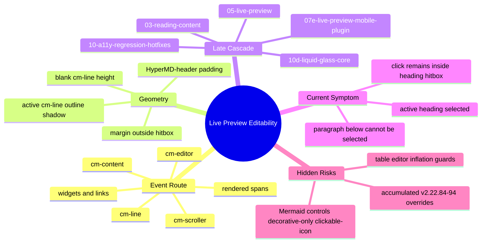

# Live Preview Editability CSS Map

<!-- markdownlint-disable MD060 -->

Generated: 2026-05-10  
Applied fix: v2.22.97  
Scope: Obsidian CM6 Live Preview click-to-edit, text selection, active-line geometry, and hidden structural risks.

## Purpose

This map tracks CSS that can make rendered Live Preview text impossible to select or click into edit mode. The existing `theme-css-risk-map` focuses on core Obsidian chrome such as tabs, titlebar, ribbon, and clickable icons. It does not model CodeMirror line hitboxes, rendered Markdown spans, heading padding, or active-line geometry, so this document fills that gap.

## Mindmap

## Cascade Ownership

| Order | Module | Editability Role | Risk Level | Notes |
|---:|---|---|---|---|
| 03 | `dev/03-reading-content.css` | Empty Live Preview line height and heading-adjacent blank spacing | High | `.cm-line:empty` and `br:only-child` rules change line hitboxes. |
| 05 | `dev/05-live-preview.css` | Base CM6 heading typography and padding | High | Header spacing is currently created with `padding-bottom`, which expands the clickable heading box. |
| 07e | `dev/07e-live-preview-mobile-plugin.css` | Mermaid and embed control layout | Medium/High | Existing risk analyzer flags Mermaid `.clickable-icon` controls as HIGH because structural properties are applied. |
| 10d | `dev/10d-liquid-glass-core.css` | Active-line Frost Aqua focus styling | Medium | Active non-header lines receive background/outline/shadow unless reset later. |
| 10-a11y | `dev/10-a11y-regression-hotfixes.css` | Final override layer | Critical | v2.22.84-v2.22.94 contains multiple contradictory pointer and geometry experiments. This is the decisive cascade owner. |

## Current Symptom Map

| Observation | CSS Mechanism | Evidence | Impact |
|---|---|---|---|
| Heading can be selected, but paragraph below cannot be selected or edited | Active heading line box extends downward through padding; click coordinate lands in heading hitbox rather than paragraph line | `dev/05-live-preview.css` gives H1-H6 `padding-bottom`; `dev/10-a11y-regression-hotfixes.css` v2.22.92/94 reasserted heading padding | Paragraph below active heading is visually present but not the mouse target. |
| Repeated pointer-event fixes did not solve it | Pointer route was alternately forced to spans and line boxes, but geometry overlap remained | v2.22.87, v2.22.89, v2.22.90, v2.22.93, v2.22.94 all touch `.cm-line span` or `.cm-line *` | The cascade became contradictory and hard to reason about. |
| Blank-line click earlier caused below lines to become unreachable | Heading-adjacent blank rows were collapsed/restored repeatedly; pointer target changed between `none` and `auto` | v2.22.91 collapsed height to `0`; v2.22.92 restored `0.35em` with `pointer-events:auto` | Blank-row behavior is another symptom of line geometry, not the sole cause. |

## Root Cause

The root cause is **hitbox geometry**, not text color or normal selection styling.

1. Live Preview headings are CodeMirror `.cm-line.HyperMD-header-*` rows.
2. The theme creates heading rhythm with `padding-bottom` on the heading line itself.
3. Padding is part of the clickable box.
4. When the heading is active, the editable heading row can occupy the vertical area where the next paragraph appears close underneath.
5. Pointer-event overrides cannot reliably fix a click that is geometrically inside the wrong row.

The safe model is:

| Need | Safe Placement | Unsafe Placement |
|---|---|---|
| Visual gap below heading | `margin-bottom` on heading line, or margin/top spacing on the following line | `padding-bottom` on active heading line |
| Text selection | Native CM6 pointer route unless a widget explicitly needs special handling | Broad `.cm-line span { pointer-events: none }` or broad `.cm-line *` churn |
| Active-line focus | Visual-only, no outline/shadow expansion over adjacent rows | Full-width outline/shadow on `.cm-active.cm-line` near rendered text |

## Risk Register

| ID | Risk | Location | Status | Recommendation |
|---|---|---|---|---|
| LP-01 | Header padding expands active heading hitbox over paragraph below | `dev/05-live-preview.css`, reinforced by `dev/10-a11y-regression-hotfixes.css` | Active bug | Move heading bottom rhythm out of padding and into margin. |
| LP-02 | Contradictory span pointer-events across v2.22.87-v2.22.94 | `dev/10-a11y-regression-hotfixes.css` | Active risk | Stop adding broad span click-through rules; keep native pointer route unless verified by DOM test. |
| LP-03 | Blank heading-adjacent rows alternate between `0`, `0.35em`, `1.05em`, and pointer `none/auto` | `dev/03-reading-content.css`, `dev/10-a11y-regression-hotfixes.css` | Active risk | Use one compact value and avoid making blank rows the primary heading spacing mechanism. |
| LP-04 | Active-line glass focus can visually mask row boundaries | `dev/10d-liquid-glass-core.css` | Mitigated | Keep v2.22.88+ reset, but do not rely on it to fix geometry. |
| LP-05 | Mermaid Live Preview controls previously touched `.clickable-icon` with structural properties | `dev/07e-live-preview-mobile-plugin.css` | Resolved in v2.22.130 | Structural sizing/visibility/pointer/z-index/active transform rules now avoid the shared `.clickable-icon`; only decorative glass styling remains on that selector. |
| LP-06 | Table editor inflation guards use structural resets on nested CM6 editors | `dev/10-a11y-regression-hotfixes.css` | Necessary risk | Preserve; validator depends on table inflation guards. |

## Existing Risk Map Delta

After running `scripts/analyze_theme_css.py` on v2.22.94-era CSS:

| Severity | Count | Interpretation |
|---|---:|---|
| critical | 0 | No core chrome blocker detected. |
| high | 0 | Mermaid Live Preview `.clickable-icon` structural rule resolved in v2.22.130. |
| medium | 0 | No medium core chrome finding. |
| low | 0 | Mermaid `.clickable-icon` active transform finding resolved in v2.22.130. |
| info | 103 | Mostly decorative chrome findings. |

This means the general risk map sees one hidden high-risk scoped control issue, but it still does not detect LP-01 because LP-01 is about editor row hitboxes rather than core chrome selector families.

## Fix Strategy

1. Add a final source-of-truth block that changes Live Preview heading spacing from padding-bottom to margin-bottom.
2. Keep native pointer events on `.cm-line` and `.cm-line *` in the final cascade.
3. Do not add new broad `pointer-events:none` rules for rendered text spans.
4. Leave table inflation guards untouched.
5. Track Mermaid control HIGH separately; do not mix it into the heading paragraph bug fix.

## Applied v2.22.95 Fix

The v2.22.95 patch applies the map recommendation directly in the final cascade:

- H1-H6 Live Preview headings keep top padding and line-height for visual alignment.
- H1-H6 heading `padding-bottom` is reset to `0`.
- Equivalent visual rhythm is moved to `margin-bottom`, which is outside the clickable heading hitbox.
- Heading-adjacent blank CM6 rows are reduced to `0.25em` and made non-interactive, so they cannot intercept paragraph selection below.

## Applied v2.22.96 Correction

User screenshots after v2.22.95 showed a broader bidirectional failure: selecting a heading blocked the following heading/paragraph, and selecting the paragraph blocked the heading above. This means `margin-bottom` on heading `.cm-line` rows was still unsafe for CM6 coordinate mapping.

The v2.22.96 correction changes the safe model:

- Live Preview heading `.cm-line` rows must be geometry-neutral: no vertical margin, no vertical padding.
- Heading rhythm inside Live Preview must not be created on `.cm-line` rows until DOM-level hit testing proves it is safe.
- Native pointer events are restored on `.cm-line` children; broad rendered-span click-through rules are treated as failed experiments.
- Heading-adjacent blank rows remain text-interactive instead of becoming non-interactive collapsed gaps.

## Applied v2.22.97 Baseline Restore

The v2.22.96 correction still failed in user testing. A reverse comparison against the historical `v2.22.76` snapshot showed that those older styles already had heading padding and `1.05em` heading-adjacent blank rows. Therefore those values were not the primary regression source.

The v2.22.97 patch treats the accumulated `v2.22.84-v2.22.96` Live Preview experiment layer as the regression source and restores the historical v2.22.76 row model in the final cascade. The current retained release and rollback baseline is now `v2.22.120`:

- ordinary blank rows: `0.45em`, interactive;
- heading-adjacent blank rows: `1.05em`, interactive;
- H1-H6 heading line-height and padding: restored to the historical v2.22.76 values;
- rendered spans: native `pointer-events:auto`;
- table inflation guards: preserved.

Detailed relationship trace: `dev/MAP/live-preview-editability-relation-map.md`.

## Verification Checklist

- In Live Preview, select a heading, then click the paragraph immediately below.
- Drag-select text in the paragraph immediately below H1-H6 headings.
- Repeat with a blank line between heading and paragraph.
- Repeat without a blank line between heading and paragraph.
- Confirm table editing and table focus sample still pass.
- Run `scripts/validate_theme.py --ci`.
- Run `scripts/analyze_theme_css.py` and review hidden HIGH/LOW deltas.
