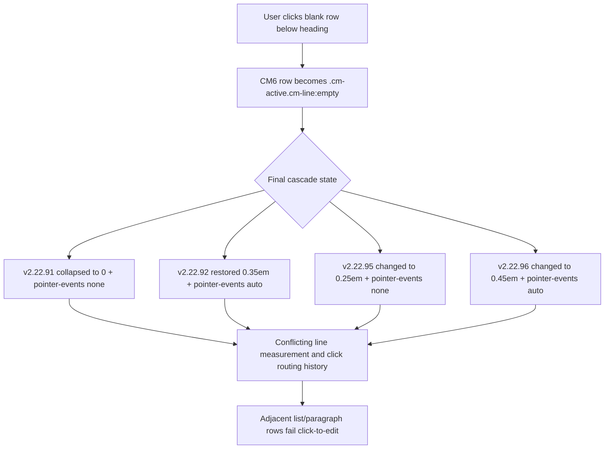

# Live Preview Editability Relation Map

Generated: 2026-05-10  
Baseline: `v2.22.120`  
Rollback baseline: `v2.22.120`  
Historical comparison point: `v2.22.76`

## Why This Map Exists

The repeated heading and paragraph editability failures were not solved by final `pointer-events` or heading spacing overrides. User screenshots showed three related symptoms:

| Symptom | Trigger | Broken Target |
|---|---|---|
| Header selected | Click paragraph below | Paragraph does not enter edit mode |
| Paragraph selected | Click header above | Header does not enter edit mode |
| Blank row below header selected | Click list items below | List rows do not enter edit mode |

This means the problem is not a single visible heading style. It is a relationship failure between CM6 line rows, active empty rows, rendered spans, and late hotfix overrides.

## Load Order Map

| Order | Module | Relationship To Bug |
|---:|---|---|
| 03 | `dev/03-reading-content.css` | Defines baseline Live Preview empty-row rhythm: `.cm-line:empty` and `.HyperMD-header + .cm-line:empty`. |
| 05 | `dev/05-live-preview.css` | Defines baseline Live Preview heading line-height and padding. Also includes relaxed spacing variants. |
| 10d | `dev/10d-liquid-glass-core.css` | Owns Liquid Glass active-row visuals; older notes compare against the historical v2.22.76 snapshot. |
| 10-a11y | `dev/10-a11y-regression-hotfixes.css` | Final cascade owner. v2.22.84-v2.22.96 added repeated Live Preview experiments that did not exist in v2.22.76. |

## Historical Comparison Relationship

`v2.22.76` is now a historical comparison point. The current retained baseline is `v2.22.120`, but the older snapshot already had these Live Preview defaults:

| Owner | Selector | Baseline Behavior |
|---|---|---|
| 03 | `.cm-line:empty` | `0.45em` compact blank line, no pointer override |
| 03 | `.HyperMD-header + .cm-line:empty` | `1.05em` safe blank gap below headings, no pointer override |
| 05 | `.cm-line.HyperMD-header-1` | `line-height: 1.2`, top/bottom padding |
| 05 | `.cm-line.HyperMD-header-2` | `line-height: 1.25`, top/bottom padding |
| 05 | `.cm-line.HyperMD-header-3..6` | static stacking, top/bottom padding |

Important correction: heading padding and the 1.05em heading-adjacent blank row are not sufficient by themselves to explain the regression, because they existed in the historical v2.22.76 comparison point.

## Regression Layer Map

All rows below were introduced after `v2.22.76` in `dev/10-a11y-regression-hotfixes.css`.

| Version | Touched Relationship | Risk |
|---|---|---|
| v2.22.84 | `.cm-active.cm-line:empty`, `:has(br:only-child)` active empty rows | Changes active blank row visuals after click. |
| v2.22.87 | `.cm-line:not(... ) span { pointer-events: none }` | Makes rendered text spans click-through. Failed experiment. |
| v2.22.88 | `.cm-active.cm-line` global visual reset | Removes active-row plate broadly. |
| v2.22.89 | broad rendered/CM6 `pointer-events:auto`; pseudo-elements none; CM6 layers none | Mixes Reading View and Live Preview text targeting in one broad rule. |
| v2.22.90 | active empty row reset plus non-active span `pointer-events:none` | Reintroduces span click-through and active empty row changes. |
| v2.22.91 | header-adjacent blank row collapsed to `0` and `pointer-events:none` | Directly targets the row user clicked in the latest screenshot. |
| v2.22.92 | heading padding/margin and blank row `0.35em pointer-events:auto` | Partially reverses v2.22.91 with different geometry. |
| v2.22.93 | broad span click-through source of truth | Reintroduces `pointer-events:none` for ordinary rendered spans. |
| v2.22.94 | native span restore, but reasserts heading padding | Contradicts v2.22.93 and changes heading geometry. |
| v2.22.95 | moves heading spacing to margin and makes blank rows non-interactive | Failed: user still reported adjacent row lock. |
| v2.22.96 | removes heading vertical spacing and makes blank rows interactive | Failed: user still reported blank-row-triggered lock. |

## Reverse Trace

## Root Cause Update

The current root cause is the accumulated `v2.22.84-v2.22.96` Live Preview experiment layer, not one isolated heading selector.

The most suspicious direct path is:

1. `dev/03-reading-content.css` defines stable baseline blank rows.
2. `dev/10-a11y-regression-hotfixes.css` repeatedly overrides the same active blank-row selectors.
3. The user clicks the exact row controlled by those selectors: `.HyperMD-header + .cm-line:empty` / `.HyperMD-header + .cm-active.cm-line:empty`.
4. After the row becomes active, subsequent rows below stop accepting click-to-edit.

## Patch Direction

The least speculative fix is to restore the v2.22.76 Live Preview row model in the final cascade:

- Restore heading-adjacent blank rows to `1.05em`.
- Restore ordinary blank rows to `0.45em`.
- Keep those blank rows interactive; do not use `pointer-events:none` on them.
- Restore baseline heading line-height and padding.
- Restore native pointer-events for `.cm-line` and children.
- Stop adding new span click-through rules.

This did not delete the older experiment blocks yet, but made the final cascade explicitly return to the last known stable row model from that historical comparison point.

## v2.22.98 Correction

Field testing showed v2.22.97 did not fix the issue. The map found a cascade placement error: the v2.22.97 restore block was inserted after v2.22.89, but before v2.22.90-v2.22.96. Therefore the failed geometry-neutral v2.22.96 rules still won at EOF.

v2.22.98 re-applied the historical v2.22.76 row model at the true EOF position. The current retained release and rollback baseline is now `v2.22.120`.

## v2.22.99 Correction

Field testing showed the true EOF v2.22.98 row-model restore still did not change the symptom. The map therefore updates the root-cause branch:

- row geometry restoration alone is insufficient;
- the active heading remains editable, but the inactive rendered paragraph below does not enter edit mode;
- the remaining likely failure path is rendered inline hit-testing, where the click lands on non-active rendered spans instead of being routed to the CM6 line activation path.

v2.22.99 physically removes the obsolete v2.22.84-v2.22.98 experiment chain and leaves one final isolation rule:

- `.cm-editor`, `.cm-scroller`, `.cm-content`, and `.cm-line` remain interactive text targets;
- non-active rendered text spans pass hit-testing through to their `.cm-line`;
- active rows, links, widgets, fold placeholders, callout controls, and form controls remain interactive;
- CM6 selection/cursor/measure layers and line pseudo-elements remain non-interactive.
## v2.22.100 Update

- Header-adjacent blank `.cm-line:empty` and `:has(br:only-child)` mirror reduced to `0.45em` to remove the wide hitbox that overlapped the next heading's click target.
- v2.22.99 EOF isolation simplified to a single native-pointer guard. The earlier inactive-span `pointer-events:none` rule was removed because it added a second hit-test variable on top of CM6 native routing.
- Declared CSS-only structural limit: if this geometry+native-routing combination still does not edit the next heading, the cause is on the CM6/Obsidian hit-test side, not the theme. No further row geometry or pointer-events calibration will be added.
