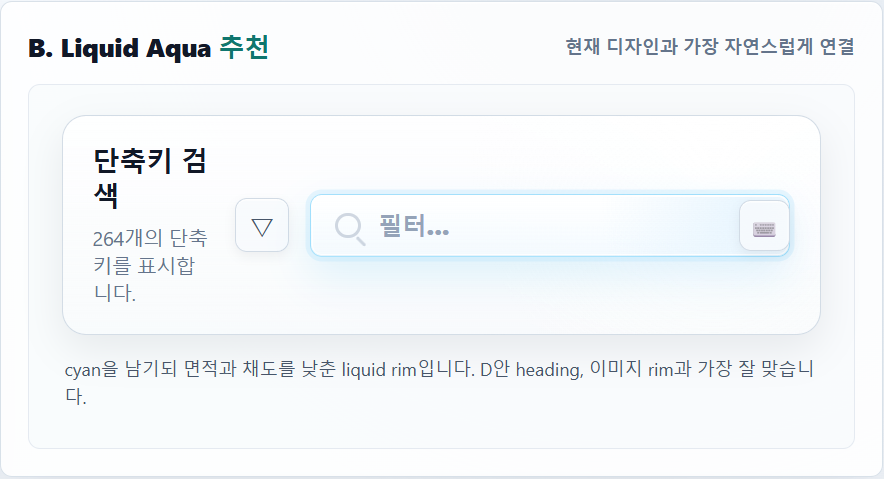
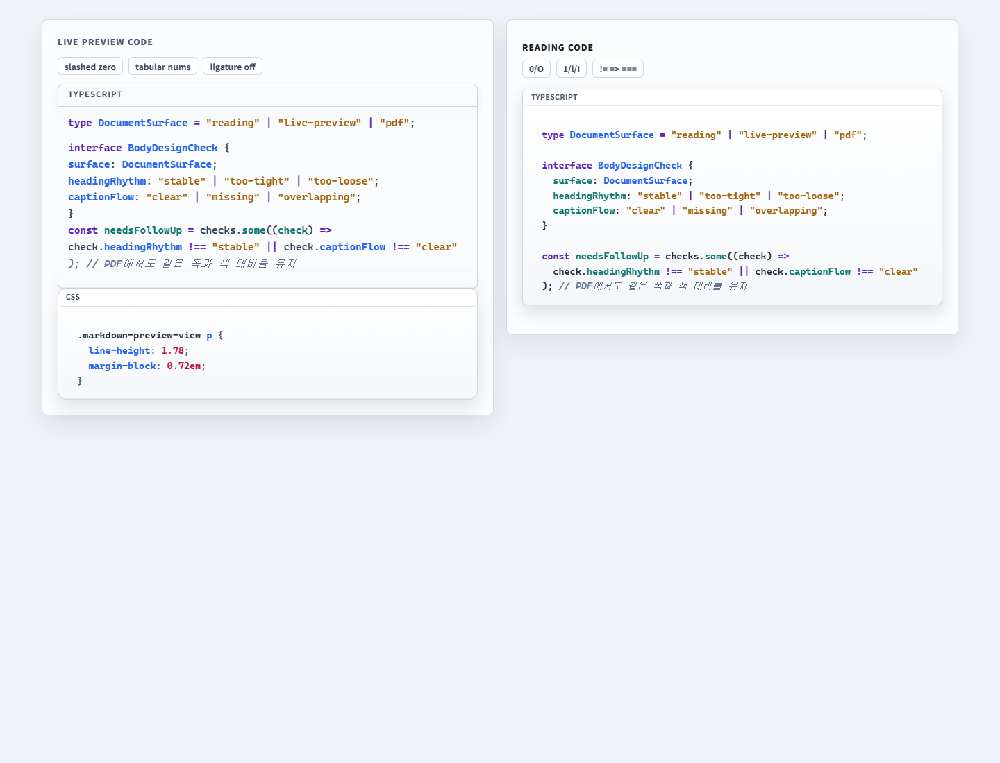
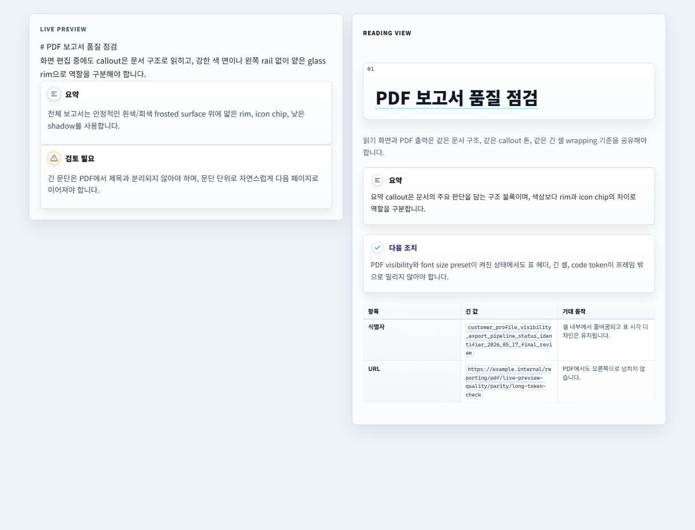

# Owen Graphite Feature History

README의 신기능 소개에는 최신 3개 기능만 유지합니다. 그보다 오래된 신기능 소개는 이 문서로 옮겨 보관합니다.

## v3.1.85 — Heading Template Expansion

Double Rule Classic, Tag Ribbon, Number Stamp, Grid Index 4개 report heading template을 추가하고 Reading View, Live Preview, PDF, dark mode에서 H1-H4 위계와 template exclusion guard를 맞췄습니다.

## v3.1.84 — Community Theme Search Focus Rim

Community theme browser 검색 필드를 generic liquid-glass focus selector에서 제외해 남아 있던 cyan rim과 halo를 제거했습니다. Community theme/plugin modal의 row와 검색 container는 중립 graphite focus를 유지하며 CDP computed style로 확인했습니다.

## v3.1.83 — Font Controls Preview And Neutral Theme Search

README에 Style Settings 폰트 직접 입력 화면을 추가하고, community theme 검색 입력의 focus 상태를 강한 cyan 대신 중립 graphite rim으로 낮췄습니다. 관련 이미지가 manual ZIP, Obsidian sync, ZIP audit 및 GitHub Release asset 경로에 포함되도록 계약을 갱신했습니다.

## v3.1.77 — Notice Popup Blue Glass

Obsidian Notice 팝업의 export/save 확인 상태를 밝은 작업 공간에서도 읽기 쉬운 blue-tint liquid glass로 정리했습니다. 배경 drop shadow를 덜어내고 light/dark 모드에서 메시지 대비를 유지했습니다.

## v3.1.73 — Document Title Pill Blue Round Glass

CDP 측정값을 바탕으로 긴 문서 제목의 하단 clipping을 수정하고, 문서 제목 pill을 우측 상태 chip과 어울리는 부드러운 blue round glass 표면으로 맞췄습니다.

## v3.1.72 — File Explorer CDP Spacing Correction

Obsidian inline tree geometry를 덮지 않으면서 폴더 들여쓰기와 하위 문서 시작점을 조정해 파일 탐색기의 계층을 명확하게 만들었습니다. 상단 action menu도 pane header와 더 자연스럽게 연결했습니다.

## v3.1.71 — File Explorer Codeblock Card Focus

선택된 문서의 직접 상위 폴더를 compact codeblock card처럼 표시하고, 활성 문서 row에는 더 분명한 glass-filled focus를 적용했습니다.

## v3.1.70 — Community Theme Search Card And README Refresh

Obsidian community theme 검색에서 선택된 Owen Graphite 카드가 어두운 저대비 블록으로 변하지 않도록 수정하고, README를 영어 중심의 marketplace 소개 구조로 정리했습니다.

## v3.1.69 — File Explorer Hierarchy Polish

활성 하위 폴더 간격, 파일 제목 크기, 타입 배지 폭, 파일 목록 하단 fade를 조정해 큰 vault에서도 문서 계층을 차분하게 탐색할 수 있도록 개선했습니다.

## v3.1.65 — Community Theme Compatibility And Accessibility

Obsidian `1.5.8+` 호환 메타데이터를 정리하고 번들 BOM을 제거했으며, light/dark 보조 텍스트와 코드 주석 대비를 강화했습니다.

## v3.1.56 — Style Settings Import / Export Glass Polish

Style Settings의 `Import`, `Export`, `Copy to clipboard`, `Download`, `Import from file` 링크 문자열을 Owen Graphite의 설정 화면 톤에 맞는 작은 glass pill 버튼으로 정리했습니다. Export/Import 모달 안에서도 같은 버튼 언어를 적용해 링크 텍스트가 설정 화면에서 따로 떠 보이지 않도록 맞췄습니다.

This release polishes the Style Settings import/export links into compact glass pill controls, including the export and import modals, so plugin utility actions align with the rest of the Owen Graphite settings surface.

## v3.1.55 — Customer Delivery PDF Visibility

고객에게 PDF 파일로 전달하는 문서를 위해 `PDF 고객 전달용 화면 가시성` 옵션을 추가했습니다. 인쇄물보다 메일, Teams, 브라우저 미리보기에서 바로 읽히는 화면 PDF를 기준으로 제목 위계, 본문·표 크기, callout 역할 구분, 헤더/푸터 라벨 톤을 조정합니다.

This release adds a customer-delivery PDF visibility option for screen-first PDFs shared through mail, Teams, and browser previews. It strengthens heading hierarchy, body/table readability, callout role separation, and PDF label tone without replacing the existing print-stability presets.

## v3.1.54 — File Explorer Actions & Transparent Top Chrome

파일 탐색기 상단 5개 액션 버튼을 Owen Graphite 전용 아이콘과 liquid-glass 표면으로 맞추고, hover/focus 시 teal/cyan 림과 살짝 떠오르는 리프트를 추가했습니다. 문서 상단 root view header는 더 투명한 cyan-tint glass로 낮췄고, 활성 탭 뒤에 보이던 둥근 backline/connector 레이어를 숨겼습니다.

## v3.1.53 — Live Preview Codeblock Header Editability

Live Preview 코드블럭 헤더의 `TEXT`, `SHELL` 같은 언어 라벨이 클릭 후에도 사라지지 않도록 정리했습니다. 헤더 오른쪽에는 향후 copy icon 같은 액션을 넣을 수 있는 슬롯 토큰을 예약했고, 언어 라벨은 해당 영역과 겹치지 않도록 폭을 제한했습니다.

## v3.1.52 — Workspace Chrome Connected Glass

상단 활성 탭, 하단 문서 프레임, vault switcher를 같은 sky-rim liquid glass 언어로 맞췄습니다. 활성 탭은 문서 표면과 이어지는 bridge를 갖고, 비활성 탭은 별도 pill처럼 분리되며, 하단 문서 제목과 `Owen-WIKI` vault switcher는 활성 파일 pill 계열의 frosted glass 표면으로 정리했습니다.

This release aligns the active workspace tab, bottom document frame, and vault switcher with one connected sky-rim liquid-glass language. Active tabs now read as attached to the document surface, while inactive tabs stay separated and quiet.

## v3.1.51 — Top Tab Liquid Glass

상단 workspace tab을 첨부 화면 기준의 붙은 탭 형태로 다듬었습니다. 활성 탭은 위·좌·우 rim이 같은 sky 톤으로 이어지고, 비활성 탭은 분리선 대신 보일듯 말듯한 graphite outline으로 경계를 남깁니다. 플로팅 툴바와 같은 frosted glass 톤 안에서 탭 상태가 더 조용하고 명확하게 읽히도록 정리했습니다.

This release refines the top workspace tabs into an attached liquid-glass shape. The active tab uses one consistent sky rim across the top and sides, while inactive tabs keep a barely visible graphite outline instead of hard divider lines.

## v3.1.50 — README Visual Tour Refresh

README 상단 Visual Tour에 실제 작업 화면과 설정 화면 스크린샷을 보강했습니다. 문서 작성 surface, 플로팅 툴바, Style Settings의 보고서 옵션, Owen Editor 툴바 설정을 첫 화면에서 바로 확인할 수 있습니다.

This release expands the README Visual Tour with real workspace screenshots for the writing surface, floating toolbar, report-oriented Style Settings controls, and Owen Editor toolbar options.

## v3.1.63 — Client-Delivery PDF Preset

The `PDF client-delivery recommended preset` combines screen-first PDF readability, reference-first link output, header/footer labels, and report spacing into one Style Settings preset for customer-facing handoff documents.

| Area | What changed |
| --- | --- |
| Style Settings | A single preset applies the recommended customer-delivery PDF combination. |
| Screen PDFs | Body, table, callout, and label tone are tuned for mail, Teams, and browser preview reading. |
| Link output | Long URLs prefer reference-first output so the body does not become noisy. |

## v3.1.49 — 설정 제목과 검색 Focus Rim / Settings Headings and Search Focus Rim

Style Settings의 그룹 제목과 Obsidian 설정 본문 섹션 제목을 같은 liquid header bar 언어로 정리했습니다. 단축키 검색·검색 패널 입력창의 강한 파란 focus rim은 추천안 B `Liquid Aqua`로 낮춰, 입력 상태는 분명하게 보이되 설정 화면 전체의 회색·흰색 glass 톤을 해치지 않도록 조정했습니다.

This release aligns Style Settings group titles and core settings section headings with the same liquid header treatment. Search and hotkey filter inputs now use the selected `Liquid Aqua` focus rim, reducing the stronger blue glow while keeping keyboard focus clear.

| 구분 | 개선 내용 |
| --- | --- |
| 설정 제목 | 그룹/섹션 제목에 liquid glass bar와 좌측 gradient rail 적용 |
| 검색 focus | 강한 cyan outline을 낮은 채도 aqua rim, 내부 highlight, 얕은 halo로 교체 |
| 적용 범위 | 단축키 검색, 검색 패널, 설정 modal의 검색 입력 컨테이너 |
| 다크 모드 | 어두운 배경에서는 약한 cyan rim과 절제된 shadow로 별도 조정 |

## v3.1.44 — 파일 탐색기 확장자 배지 / File Explorer Type Badges

파일 탐색기의 오른쪽 확장자 텍스트를 숨기고, 앞쪽 문서 아이콘 자리에 `MD`, `HTML`, `SVG`, `PDF`, `CFG` 같은 타입 배지를 표시합니다. 오른쪽 배지가 차지하던 폭을 파일명 표시 영역으로 돌려 긴 문서 제목이 더 늦게 말줄임되며, 문서·이미지·코드·설정·오피스·미디어·Obsidian 특화 파일을 한눈에 구분할 수 있습니다.

This update hides the right-side extension label and replaces the leading document icon with compact type badges such as `MD`, `HTML`, `SVG`, `PDF`, and `CFG`. The file name receives more horizontal space, so long document titles stay readable for longer in the file explorer.

| 구분 | 개선 내용 |
| --- | --- |
| 제목 표시 | 파일 row가 사용 가능한 폭을 끝까지 쓰도록 조정 |
| 확장자 표시 | 오른쪽 `HTML` 같은 확장자 배지를 숨기고 앞쪽 타입 배지로 통합 |
| 대응 범위 | Markdown, HTML/SVG/PDF, 코드, 설정, 오피스, 이미지, 오디오/비디오, Obsidian canvas/excalidraw |
| 가독성 | 타입 배지와 파일명 사이 간격을 확보해 목록 스캔성을 개선 |

## v3.1.38 — 코드블럭 Live Preview / PDF 패리티

Live Preview, Reading View, PDF Export의 코드블럭 헤더·폰트·syntax 색상을 같은 토큰 기준으로 맞췄습니다. Obsidian Live Preview의 source line, rendered code widget, PDF export의 Prism `.token.*`/CodeMirror `.cm-*` 경로를 모두 검증 fixture에 포함해 앞으로 코드블럭 개선 시 누락되는 경로를 줄였습니다.

| 검증 영역 | 개선 내용 |
| --- | --- |
| Live Preview | 코드 fence 헤더를 한 줄 라벨로 정리하고 rendered widget 경로까지 동일한 codeblock surface 적용 |
| PDF Export | `.token.*`와 `.cm-*` syntax class를 같은 `--ogd-code-*` 색상·폰트 토큰으로 매핑 |
| 유지보수 | `dev/WIKI/MAP/live-preview-pdf-css-map/`에 selector 매핑, cascade ownership, parity guideline 추가 |

## v3.1.37 — Live Preview / PDF 품질 패리티

Live Preview, Reading View, PDF Export에서 callout과 긴 표 셀이 같은 품질 기준으로 보이도록 검증 fixture와 출력 안정화 guard를 추가했습니다. PDF callout은 흰색/회색 frosted surface, 얇은 rim, icon chip 중심으로 정리하고 긴 코드 토큰은 표 디자인을 유지한 채 셀 안에서 줄바꿈됩니다.

| 검증 영역 | 개선 내용 |
| --- | --- |
| Live Preview / Reading | callout rim, icon chip, 얕은 glass surface 기준 정렬 |
| PDF Export | callout 제목/본문 분리 완화, 긴 셀·코드 토큰 wrapping 안정화 |
| 릴리즈 검증 | fresh bundle, `theme.css` freshness, visual smoke fixture 추가 |

## v3.1.36 — PDF Key/Value 헤더와 푸터 라벨

PDF 출력 전용 헤더와 푸터 라벨을 단일 문구 또는 Key/Value 1쌍 배지로 표시할 수 있습니다. Style Settings에서 헤더와 푸터를 각각 켜고, key/value 문구와 색상을 독립적으로 지정해 작성자, 기밀 등급, 문서 상태를 본문 흐름 밖에 작게 배치합니다.

| 설정 영역 | 가능한 조정 |
| --- | --- |
| 헤더 설정 | Key 색상, Value 색상, Key 문구, Value 문구, 위치 |
| 푸터 설정 | Key 색상, Value 색상, Key 문구, Value 문구 |
| 공통 구성 | 단일/Key-Value 구성, 라벨 스타일, 라벨 크기, 빠른 문구 |
