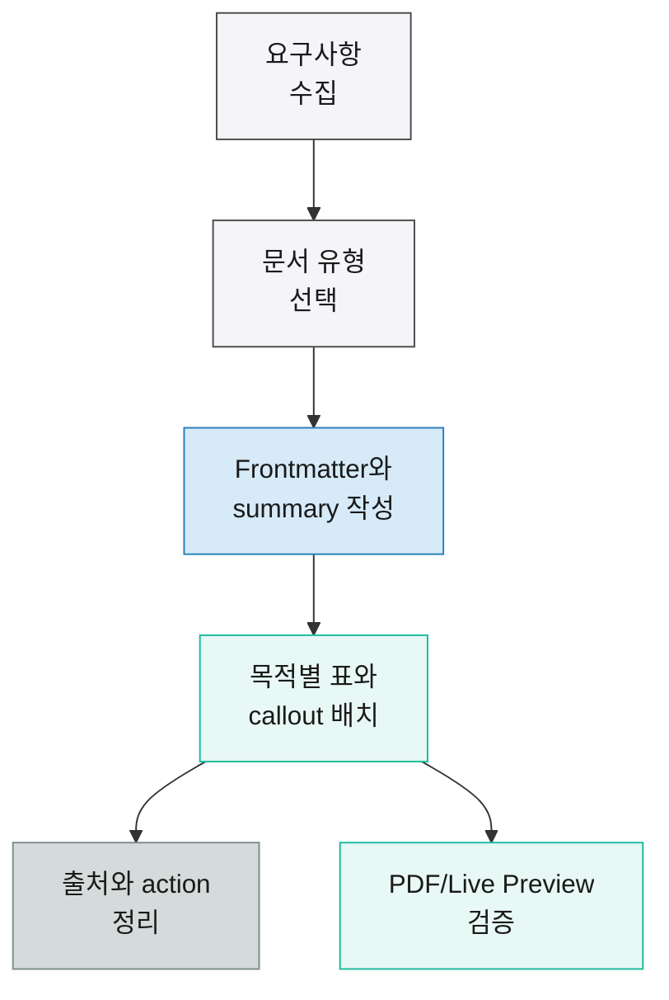

# Owen Editor AI Guide 적용 샘플 보고서

> [!summary] 핵심 결론
> 이 샘플은 Owen Editor AI Guide의 작성 규칙을 실제 LLM-wiki 보고서 산출물에 적용한 기준 문서다. 순수 Markdown 구조를 먼저 세우고, 필요한 지점에만 Owen Graphite HTML snippet과 table class를 사용한다. Live Preview, Reading View, PDF export에서 모두 안정적으로 읽히는 보고서형 문서를 목표로 한다.

<div class="ogd-metric-row">
  <div class="ogd-metric-card"><strong>4</strong><span>문서 블록</span></div>
  <div class="ogd-metric-card"><strong>5</strong><span>표 패턴</span></div>
  <div class="ogd-metric-card"><strong>8</strong><span>Editor snippets</span></div>
</div>

## Key Findings

- 보고서형 문서는 `cssclasses`에 `ogd-report-mode`, `ogd-modern-tables`, `ogd-print-avoid-breaks`를 기본으로 넣고, A3 PDF가 예상되면 `ogd-page-a3-land`를 함께 사용한다.
- 문서 상단에는 독자가 먼저 판단할 수 있도록 `> [!summary]` callout과 metric row를 배치한다.
- 비교, 리스크, 숫자, 의사결정 표는 서로 다른 table class를 사용해야 한다.
- 긴 URL, 정책 ID, 코드 토큰은 `wrap-table` 또는 표 밖 본문으로 분리한다.
- 민감 정보는 실제 값을 넣지 않고 <span class="ogd-blur">제한 공개 자리표시자</span>처럼 표시한다.

> [!info] 사용 맥락
> 이 문서는 기능 목록을 나열하는 카탈로그가 아니라, 실제 산출물에서 Owen Editor 기능을 어떻게 섞어 쓰는지 보여주는 적용 샘플이다. 고객 보고서, 내부 의사결정 메모, 리스크 검토 문서의 출발점으로 사용할 수 있다.

## Analysis

LLM-wiki 문서는 원문 Markdown도 읽기 쉬워야 하므로 기본 흐름은 단순하게 유지한다. 복잡한 시각 요소는 판단, 비교, 수치, 리스크처럼 스캔 가치가 높은 영역에만 사용한다.

문서 작성 중 자주 쓰는 키 입력은 <kbd>Cmd+K</kbd>처럼 표시하고, 명령이나 class 이름은 `insert-graphite-wide-table`, `ogd-status-badge`, `wide-table print-fit-table comparison-table wrap-table`처럼 inline code로 둔다. Obsidian 내부 연결은 [[Owen Graphite 문서 작성 규칙]]처럼 wiki link를 사용하고, 외부 근거는 [Owen Editor AI Guide](https://github.com/towishy/owen-editor/blob/main/docs/llm-wiki-owen-editor-ai-guide.md)처럼 Markdown link로 연결한다.[^guide]

강조가 필요한 문장은 목적별로 나눈다. <mark style="background-color: #fef3c7; color: #1f2937;">중요 판단</mark>, <mark style="background-color: #dbeafe; color: #1e3a8a;">참고 정보</mark>, <mark style="background-color: #ffe4e6; color: #9f1239;">위험 신호</mark>, <mark style="background-color: #d1fae5; color: #064e3b;">완료 상태</mark>처럼 같은 문서 안에서 의미가 흔들리지 않게 쓴다.

## Feature Intent Map

<table class="wide-table print-fit-table comparison-table wrap-table">
  <thead>
    <tr>
      <th>문서 목적</th>
      <th>권장 기능</th>
      <th>직접 생성 문법</th>
      <th>적용 예시</th>
      <th>검토 기준</th>
    </tr>
  </thead>
  <tbody>
    <tr>
      <td>핵심 판단 선공개</td>
      <td>Summary callout</td>
      <td><code>&gt; [!summary]</code></td>
      <td>문서 첫 화면 안에 결론과 근거를 배치</td>
      <td>3문장 안에 결론, 근거, 다음 행동이 보이는가</td>
    </tr>
    <tr>
      <td>성과 지표 요약</td>
      <td>Metric row</td>
      <td><code>&lt;div class="ogd-metric-row"&gt;</code></td>
      <td>Coverage, risks, next actions를 카드로 표시</td>
      <td>숫자와 라벨이 PDF에서도 줄바꿈 없이 읽히는가</td>
    </tr>
    <tr>
      <td>대안 비교</td>
      <td>Wide comparison table</td>
      <td><code>wide-table print-fit-table comparison-table wrap-table</code></td>
      <td>옵션별 Fit, Risk, Cost, Decision 비교</td>
      <td>긴 식별자가 표 폭을 밀지 않는가</td>
    </tr>
    <tr>
      <td>지원 상태 표시</td>
      <td>Status badge</td>
      <td><code>&lt;span class="ogd-status-badge is-e5"&gt;E5&lt;/span&gt;</code></td>
      <td><span class="ogd-status-badge is-e5">E5</span> <span class="ogd-status-badge is-payg">PAYG</span> <span class="ogd-status-badge is-addon">Add-on</span></td>
      <td>짧은 범주 태그로 충분한가</td>
    </tr>
    <tr>
      <td>출처 정리</td>
      <td>Source note, reference list</td>
      <td><code>table-source</code>, <code>ogd-reference-list</code></td>
      <td>표 하단에는 source note, 문서 끝에는 reference list</td>
      <td>근거가 표와 본문 모두에서 추적 가능한가</td>
    </tr>
  </tbody>
</table>

<p class="table-source">Source: Owen Editor AI Guide for LLM-wiki, 2026.</p>

## Decision Matrix

<table class="matrix-table compact-table print-fit-table">
  <thead>
    <tr>
      <th>Option</th>
      <th>Fit</th>
      <th>Risk</th>
      <th>Cost</th>
      <th>Decision</th>
    </tr>
  </thead>
  <tbody>
    <tr>
      <td>Markdown only</td>
      <td>Medium</td>
      <td class="risk-low">Low</td>
      <td class="num">1.0x</td>
      <td>간단한 연구 노트에 사용</td>
    </tr>
    <tr>
      <td>Graphite report</td>
      <td>High</td>
      <td class="risk-low">Low</td>
      <td class="num">1.2x</td>
      <td>기본 보고서 템플릿으로 채택</td>
    </tr>
    <tr>
      <td>Full HTML layout</td>
      <td>Medium</td>
      <td class="risk-medium">Medium</td>
      <td class="num">1.8x</td>
      <td>PDF 안정성이 꼭 필요한 표에만 제한</td>
    </tr>
  </tbody>
</table>

## Risk Review

<table class="risk-table compact-table">
  <thead>
    <tr>
      <th>리스크</th>
      <th>영향</th>
      <th>완화책</th>
      <th>상태</th>
    </tr>
  </thead>
  <tbody>
    <tr>
      <td>HTML snippet 과다 사용</td>
      <td>원문 Markdown 가독성이 떨어질 수 있음</td>
      <td>본문은 Markdown, 표와 badge만 HTML로 제한</td>
      <td class="risk-medium">Medium</td>
    </tr>
    <tr>
      <td>긴 URL overflow</td>
      <td>모바일과 PDF에서 표 폭이 밀릴 수 있음</td>
      <td><code>wrap-table</code> 적용 또는 본문으로 분리</td>
      <td class="risk-low">Low</td>
    </tr>
    <tr>
      <td>출처 누락</td>
      <td>판단 근거 추적성이 낮아짐</td>
      <td><code>table-source</code>와 reference list를 함께 사용</td>
      <td class="risk-high">High</td>
    </tr>
  </tbody>
</table>

> [!warning] 작성 주의
> 표 안에 긴 문장, URL, 코드 토큰을 모두 넣으면 PDF export에서 행 높이가 급격히 커질 수 있다. 긴 설명은 표 아래 문단이나 reference list로 분리한다.

> [!danger] 금지 패턴
> 실제 고객명, 계정 ID, 보안 토큰을 샘플 문서에 직접 넣지 않는다. 필요한 경우 <span class="ogd-blur">redacted-value</span>처럼 비식별 자리표시자를 사용한다.

## Numeric Snapshot

<table class="numeric-table print-fit-table">
  <thead>
    <tr>
      <th>항목</th>
      <th>기준값</th>
      <th>목표값</th>
      <th>상태</th>
    </tr>
  </thead>
  <tbody>
    <tr><td>요약 callout 포함률</td><td class="num">70%</td><td class="num">100%</td><td><span class="ogd-status-badge is-e5">Required</span></td></tr>
    <tr><td>표 class 적합도</td><td class="num">82%</td><td class="num">95%</td><td><span class="ogd-status-badge is-payg">Review</span></td></tr>
    <tr><td>출처 추적성</td><td class="num">60%</td><td class="num">90%</td><td><span class="ogd-status-badge is-addon">Improve</span></td></tr>
  </tbody>
</table>

## Workflow Diagram



## Implementation Snippet

```markdown
> [!action] Action items
> - Owner: Documentation lead
> - Due date: 2026-05-14
> - Next step: 실제 보고서 템플릿에 summary, metric row, risk table을 기본 블록으로 적용
```

> [!action] Action items
> - Owner: Documentation lead
> - Due date: 2026-05-14
> - Next step: 실제 보고서 템플릿에 summary, metric row, risk table을 기본 블록으로 적용

## Sources

<p class="ogd-reference-summary">이 샘플은 Owen Editor AI Guide와 Owen Graphite 문서 작성 규칙을 함께 반영한다.</p>

<ol class="ogd-reference-list">
  <li>
    <span class="ogd-reference-source">Guide</span>
    <div class="ogd-reference-main">
      <a class="ogd-reference-title" href="https://github.com/towishy/owen-editor/blob/main/docs/llm-wiki-owen-editor-ai-guide.md">Owen Editor AI Guide for LLM-wiki</a>
      <p>LLM-wiki 문서에서 Owen Editor 명령 결과 문법, callout, table class, source note, status badge를 직접 생성하는 기준 문서.</p>
    </div>
  </li>
  <li>
    <span class="ogd-reference-source">Theme</span>
    <div class="ogd-reference-main">
      <a class="ogd-reference-title" href="https://github.com/towishy/Owen-Graphite">Owen Graphite</a>
      <p>보고서형 Obsidian 문서를 위한 table, callout, PDF export, Liquid Glass 스타일 기준.</p>
    </div>
  </li>
</ol>

[^guide]: Owen Editor AI Guide for LLM-wiki, 2026-04-30.