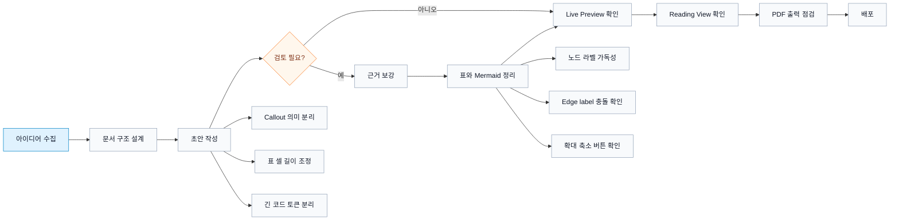
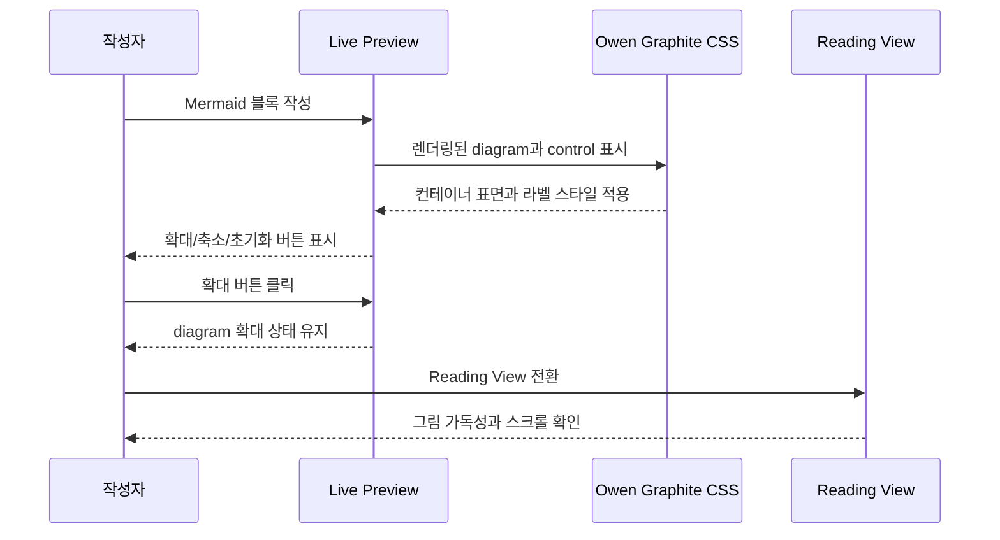
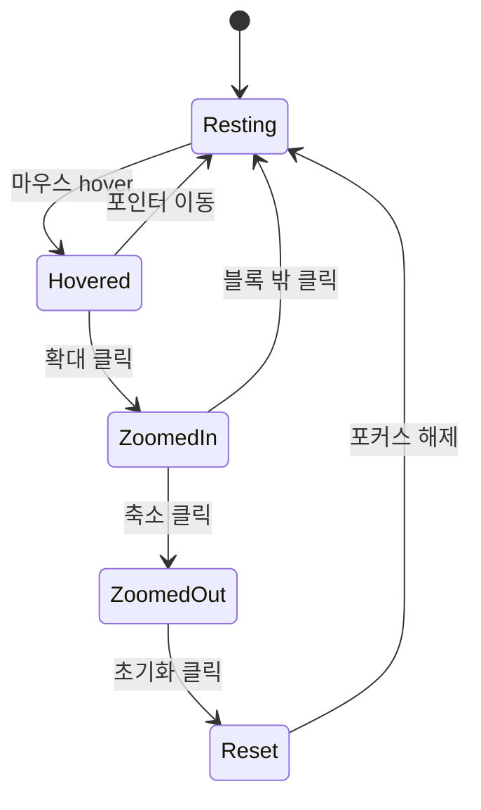

# Mermaid Live Preview 확대 축소 샘플

> [!summary] 확인 목적
> 이 문서는 Obsidian Live Preview에서 Mermaid 그림의 확대, 축소, 초기화 버튼이 표시되고 클릭 가능한지 확인하기 위한 샘플이다. 각 Mermaid 블록을 Live Preview와 Reading View에서 모두 열어 버튼 노출, hover, 클릭 동작, 가로 스크롤 여부를 확인한다.

## 1. 넓은 Flowchart

아래 그림은 일부러 가로 폭을 넓게 구성했다. Live Preview에서 Mermaid 블록의 왼쪽 상단 안쪽 컨트롤이 잘리지 않아야 한다.

### Control DOM Fixture

아래 블록은 실제 Mermaid 기능과 연결되지 않은 테스트용 DOM이다. 버튼이 보이면 테마 CSS가 컨트롤 DOM을 화면에 표시할 수 있다는 뜻이고, 실제 Mermaid 블록에서 안 보이면 Obsidian 또는 플러그인이 컨트롤 DOM을 생성하지 않는 상태로 판단한다.

  

    <svg viewBox="0 0 640 220" role="img" aria-label="Fake Mermaid diagram fixture">
      <rect x="1" y="1" width="638" height="218" rx="8" fill="#f8fafc" stroke="#e5e7eb" />
      <rect x="48" y="88" width="120" height="44" rx="4" fill="#e0f2fe" stroke="#0284c7" />
      <text x="108" y="115" text-anchor="middle" font-size="13" fill="#0f172a">Start</text>
      <path d="M168 110 H270" stroke="#64748b" stroke-width="2" fill="none" marker-end="url(#fixture-arrow)" />
      <rect x="270" y="88" width="120" height="44" rx="4" fill="#f8fafc" stroke="#94a3b8" />
      <text x="330" y="115" text-anchor="middle" font-size="13" fill="#111827">Review</text>
      <path d="M390 110 H492" stroke="#64748b" stroke-width="2" fill="none" marker-end="url(#fixture-arrow)" />
      <rect x="492" y="88" width="100" height="44" rx="4" fill="#ecfdf5" stroke="#10b981" />
      <text x="542" y="115" text-anchor="middle" font-size="13" fill="#064e3b">Done</text>
      <defs>
        <marker id="fixture-arrow" markerWidth="8" markerHeight="8" refX="7" refY="4" orient="auto">
          <path d="M0,0 L8,4 L0,8 Z" fill="#64748b" />
        </marker>
      </defs>
    </svg>
  

  

    <button class="mermaid-button clickable-icon" type="button" aria-label="확대">+</button>
    <button class="mermaid-button clickable-icon" type="button" aria-label="축소">-</button>
    <button class="mermaid-button clickable-icon" type="button" aria-label="초기화">1:1</button>
  

## 2. Sequence Diagram

Live Preview에서 diagram control이 그림 테두리 안쪽 왼쪽 상단에 배치될 때, 테마의 `overflow` 규칙 때문에 사라지지 않아야 한다.

## 3. State Diagram

버튼이 보이더라도 클릭 hitbox가 죽으면 회귀다. Live Preview에서 확대, 축소, 초기화를 차례로 눌러본다.

## 4. Manual Check

| 보기 | 확인 항목 | 기대 결과 |
|------|-----------|-----------|
| Live Preview | Mermaid 확대 버튼 | 버튼이 보이고 클릭된다 |
| Live Preview | Mermaid 축소 버튼 | 버튼이 보이고 클릭된다 |
| Live Preview | Mermaid 초기화 버튼 | 버튼이 보이고 클릭된다 |
| Live Preview | 넓은 flowchart | 버튼이 그림 테두리 안쪽 왼쪽 상단에서 잘리지 않는다 |
| Reading View | 넓은 flowchart | 그림이 가로로 넘칠 때 레이아웃을 밀지 않는다 |
| PDF | print avoid breaks | 가능한 경우 Mermaid 블록이 중간 분할되지 않는다 |
