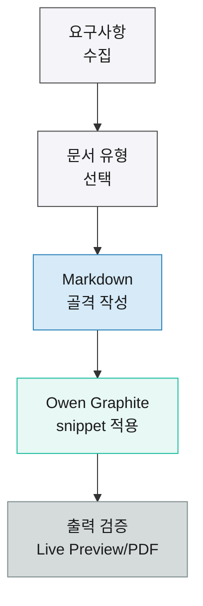

# Owen Editor 풀기능 샘플 구현 문서

> [!summary] 핵심 결론
> 이 문서는 Owen Editor가 제공하는 주요 문서 디자인 기능을 LLM-wiki 산출물에서 직접 생성할 수 있도록 한 장짜리 구현 샘플로 정리한다. 기본 Markdown은 유지하되, 보고서형 문서에 필요한 Owen Graphite 전용 HTML snippet과 table class를 목적별로 사용한다. PDF/print, Obsidian Live Preview, 원문 Markdown 가독성을 동시에 확인하는 기준 문서로 활용한다.

<div class="ogd-metric-row">
  <div class="ogd-metric-card"><strong>16</strong><span>Feature groups</span></div>
  <div class="ogd-metric-card"><strong>5</strong><span>Table presets</span></div>
  <div class="ogd-metric-card"><strong>12</strong><span>Callouts</span></div>
</div>

## Key Findings

- Owen Editor 기능은 실제 버튼을 누르지 못하는 상황에서도 동일한 Markdown/HTML 결과 문법으로 재현할 수 있다.
- 보고서형 문서는 `ogd-report-mode`, `ogd-modern-tables`, `ogd-print-avoid-breaks`를 기본으로 두고, 넓은 표에는 `ogd-page-a3-land`와 `print-fit-table`을 함께 사용한다.
- 표는 목적별 class를 분리해야 한다. 비교는 `wide-table comparison-table wrap-table`, 위험은 `risk-table compact-table`, 숫자는 `numeric-table print-fit-table`, 의사결정은 `matrix-table compact-table`을 사용한다.
- 긴 URL, 정책 ID, 토큰은 표 레이아웃을 깨지 않도록 `wrap-table`을 쓰거나 본문 문단으로 분리한다.

## Feature Coverage Snapshot

<table class="wide-table print-fit-table comparison-table wrap-table">
  <thead>
    <tr>
      <th>목적</th>
      <th>Owen Editor 기능</th>
      <th>직접 생성 문법</th>
      <th>샘플 적용</th>
      <th>사용 기준</th>
    </tr>
  </thead>
  <tbody>
    <tr>
      <td>굵게</td>
      <td>Bold selection</td>
      <td><code>**중요 문장**</code></td>
      <td><strong>최종 판단</strong></td>
      <td>핵심 단어 또는 짧은 판단 강조</td>
    </tr>
    <tr>
      <td>기울임</td>
      <td>Italic selection</td>
      <td><code>*보조 설명*</code></td>
      <td><em>검토 메모</em></td>
      <td>뉘앙스, 용어, 보조 설명</td>
    </tr>
    <tr>
      <td>취소선</td>
      <td>Strikethrough selection</td>
      <td><code>~~폐기된 선택지~~</code></td>
      <td><del>구버전 템플릿</del></td>
      <td>대안 비교에서 제외된 항목</td>
    </tr>
    <tr>
      <td>밑줄</td>
      <td>Underline selection</td>
      <td><code>&lt;u&gt;확인 필요&lt;/u&gt;</code></td>
      <td><u>PDF 출력 확인 필요</u></td>
      <td>강한 확인 표시가 필요할 때</td>
    </tr>
    <tr>
      <td>인라인 코드</td>
      <td>Inline code selection</td>
      <td><code>`policy-id`</code></td>
      <td><code>insert-graphite-wide-table</code></td>
      <td>명령어, 클래스명, 식별자</td>
    </tr>
    <tr>
      <td>기본 하이라이트</td>
      <td>Highlight selection</td>
      <td><code>==중요 문장==</code></td>
      <td>==Obsidian 호환 강조==</td>
      <td>순수 Markdown 호환성이 중요할 때</td>
    </tr>
    <tr>
      <td>색상 하이라이트</td>
      <td>Highlight color picker</td>
      <td><code>&lt;mark style="..."&gt;정보&lt;/mark&gt;</code></td>
      <td><mark style="background-color: #dbeafe; color: #1e3a8a;">참고</mark></td>
      <td>상태나 의미를 색으로 구분할 때</td>
    </tr>
    <tr>
      <td>링크</td>
      <td>Insert markdown link</td>
      <td><code>[문서명](https://example.com/)</code></td>
      <td><a href="https://github.com/towishy/owen-editor/blob/main/docs/llm-wiki-owen-editor-ai-guide.md">Owen Editor AI Guide</a></td>
      <td>외부 자료 연결</td>
    </tr>
    <tr>
      <td>Wiki 링크</td>
      <td>Insert wiki link</td>
      <td><code>[[Page]]</code></td>
      <td>[[llm-wiki-pattern]]</td>
      <td>Vault 내부 지식 연결</td>
    </tr>
    <tr>
      <td>첨부 임베드</td>
      <td>Insert attachment embed</td>
      <td><code>![[attachment.png]]</code></td>
      <td><code>![[owen-editor-feature-sample-flow.svg]]</code></td>
      <td>Vault 첨부 파일을 직접 임베드할 때</td>
    </tr>
    <tr>
      <td>이미지 임베드</td>
      <td>Insert image embed</td>
      <td><code></code></td>
      <td><code></code></td>
      <td>상대경로 또는 외부 이미지 삽입</td>
    </tr>
    <tr>
      <td>각주</td>
      <td>Insert footnote reference</td>
      <td><code>문장[^1]</code></td>
      <td>가이드 원문 기준으로 구성했다.[^guide]</td>
      <td>본문 흐름을 깨지 않고 근거를 달 때</td>
    </tr>
    <tr>
      <td>키보드 키</td>
      <td>Wrap selection with owen graphite keyboard tag</td>
      <td><code>&lt;kbd&gt;Cmd+K&lt;/kbd&gt;</code></td>
      <td><kbd>Cmd+K</kbd></td>
      <td>단축키와 키 입력 설명</td>
    </tr>
    <tr>
      <td>비공개/흐림 텍스트</td>
      <td>Wrap selection with owen graphite blur</td>
      <td><code>&lt;span class="ogd-blur"&gt;비공개 내용&lt;/span&gt;</code></td>
      <td><span class="ogd-blur">제한 공개 메모</span></td>
      <td>민감 정보나 선택적 공개 문구</td>
    </tr>
  </tbody>
</table>

<p class="table-source">Source: Owen Editor AI Guide for LLM-wiki, 2026.</p>

## Markdown Basics

문서는 순수 Markdown 원문으로도 읽히도록 기본 구조를 먼저 만든다. Owen Graphite 전용 snippet은 시각적 의미가 분명할 때만 추가한다.

- Bullet list: 기능 그룹을 빠르게 스캔한다.
- Numbered list: 절차나 우선순위를 기록한다.
- Task list: 실행 상태를 점검한다.

1. 요구사항을 요약한다.
2. 적합한 문서 유형을 고른다.
3. callout, 표, 출처, action item 순서로 작성한다.

- [x] Report frontmatter 적용
- [x] Summary callout 배치
- [x] 목적별 table class 적용
- [ ] Obsidian Live Preview와 PDF 출력 최종 확인

---

## Callout Gallery

> [!note] 공지
> 이 샘플은 Owen Editor 기능별 결과 문법을 한 문서에서 확인하기 위한 기준 문서다.

> [!info] 정보
> HTML snippet은 필요한 영역에만 사용하고, 본문 설명은 가능한 한 Markdown으로 유지한다.

> [!tip] 팁
> 넓은 비교표에는 `wrap-table`을 함께 넣으면 긴 식별자와 URL이 더 안정적으로 표시된다.

> [!important] 중요
> action item에는 담당자, 기한, 다음 단계를 반드시 포함한다.

> [!success] 성공
> 표, callout, metric, reference list, Mermaid, 코드블록이 모두 포함됐다.

> [!question] 질문
> 이 문서가 고객 보고서인지, 내부 검토 문서인지에 따라 frontmatter와 출처 표현을 조정해야 하는가?

> [!warning] 주의
> 긴 토큰을 일반 Markdown 표에 넣으면 모바일과 PDF에서 폭이 밀릴 수 있다.

> [!danger] 위험
> 닫는 HTML 태그가 누락되면 Live Preview와 PDF 출력이 동시에 깨질 수 있다.

> [!failure] 실패
> 표 목적과 class가 맞지 않으면 가독성과 출력 안정성이 떨어진다.

> [!bug] 버그
> Mermaid 노드 라벨이 너무 길면 텍스트가 박스 밖으로 잘릴 수 있다.

> [!example] 예시
> `numeric-table`의 숫자 셀에는 `class="num"`을 넣어 오른쪽 정렬을 유지한다.

> [!quote] 인용
> “출력 문서는 Markdown 원문으로도 읽기 쉬워야 하고, Live Preview와 PDF/print에서도 무너지지 않아야 한다.”

> [!abstract] 요약
> 기본 골격은 Markdown, 고급 레이아웃은 Owen Graphite class, 판단 구조는 callout으로 분리한다.

> [!todo] 할 일
> - 담당자: 문서 작성자
> - 기한: 2026-05-03
> - 다음 단계: 실제 고객 보고서 템플릿에 적용

> [!action] Action items
> - Owner: LLM-wiki
> - Due date: 2026-05-03
> - Next step: 보고서 산출물 생성 시 이 샘플을 기준 문서로 참조

> [!secret] Restricted
> hover 시 표시할 제한 공개 메모를 이곳에 둔다.

## Status Badges

제품 플랜, 지원 상태, 문서 범주처럼 짧은 상태는 badge로 표현한다.

<span class="ogd-status-badge is-e5">E5</span>
<span class="ogd-status-badge is-payg">PAYG</span>
<span class="ogd-status-badge is-addon">Add-on</span>

## Visual Example

아래 이미지는 상대경로 이미지 임베드 샘플이다.


## Risk Register

<table class="risk-table compact-table">
  <thead>
    <tr>
      <th>리스크</th>
      <th>영향</th>
      <th>완화책</th>
      <th>상태</th>
    </tr>
  </thead>
  <tbody>
    <tr>
      <td>표 class 오용</td>
      <td>문서 목적과 출력 형태가 어긋날 수 있음</td>
      <td>표 작성 전 비교, 리스크, 숫자, 매트릭스 중 목적을 먼저 결정</td>
      <td class="risk-medium">Medium</td>
    </tr>
    <tr>
      <td>긴 URL overflow</td>
      <td>모바일과 PDF에서 폭이 밀릴 수 있음</td>
      <td><code>wrap-table</code> 적용 또는 본문 문단으로 분리</td>
      <td class="risk-high">High</td>
    </tr>
    <tr>
      <td>출처 누락</td>
      <td>근거 추적성이 낮아짐</td>
      <td><code>table-source</code> 또는 reference list 사용</td>
      <td class="risk-medium">Medium</td>
    </tr>
    <tr>
      <td>HTML 태그 누락</td>
      <td>Live Preview와 PDF 출력이 깨질 수 있음</td>
      <td>닫는 태그와 중첩 구조를 점검</td>
      <td class="risk-ok">OK</td>
    </tr>
  </tbody>
</table>

## Risk Matrix

| 영향도 \ 가능성 | Low | Medium | High |
|---|---:|---:|---:|
| High | M | H | H |
| Medium | L | M | H |
| Low | L | L | M |

## Numeric Metrics

| 월 | 생성 문서 | 검증 완료 | 성공률 | 평균 수정 횟수 |
|---|---:|---:|---:|---:|
| 2026-01 | 42 | 39 | 92.86% | 1.8 |
| 2026-02 | 58 | 56 | 96.55% | 1.4 |
| 2026-03 | 61 | 60 | 98.36% | 1.2 |

## Decision Matrix

<table class="matrix-table compact-table print-fit-table">
  <thead>
    <tr>
      <th>Option</th>
      <th>Fit</th>
      <th>Risk</th>
      <th>Cost</th>
      <th>Decision</th>
    </tr>
  </thead>
  <tbody>
    <tr><td>Markdown only</td><td>Medium</td><td class="risk-low">Low</td><td class="num">1x</td><td>간단한 노트에 사용</td></tr>
    <tr><td>Owen Graphite report</td><td>High</td><td class="risk-medium">Medium</td><td class="num">1.2x</td><td>보고서 기본값</td></tr>
    <tr><td>Custom HTML layout</td><td>Medium</td><td class="risk-high">High</td><td class="num">1.8x</td><td>특수 문서에만 제한 사용</td></tr>
  </tbody>
</table>

## Highlight Palette

<table class="compact-table">
  <thead>
    <tr>
      <th>상황</th>
      <th>배경</th>
      <th>글자색</th>
      <th>예시</th>
    </tr>
  </thead>
  <tbody>
    <tr><td>중요</td><td><code>#fef3c7</code></td><td><code>#1f2937</code></td><td><mark style="background-color: #fef3c7; color: #1f2937;">중요 문장</mark></td></tr>
    <tr><td>완료/긍정</td><td><code>#d1fae5</code></td><td><code>#064e3b</code></td><td><mark style="background-color: #d1fae5; color: #064e3b;">완료</mark></td></tr>
    <tr><td>정보/참고</td><td><code>#dbeafe</code></td><td><code>#1e3a8a</code></td><td><mark style="background-color: #dbeafe; color: #1e3a8a;">참고</mark></td></tr>
    <tr><td>위험/주의</td><td><code>#ffe4e6</code></td><td><code>#9f1239</code></td><td><mark style="background-color: #ffe4e6; color: #9f1239;">주의</mark></td></tr>
    <tr><td>아이디어</td><td><code>#ede9fe</code></td><td><code>#4c1d95</code></td><td><mark style="background-color: #ede9fe; color: #4c1d95;">아이디어</mark></td></tr>
    <tr><td>중립</td><td><code>#e5e7eb</code></td><td><code>#111827</code></td><td><mark style="background-color: #e5e7eb; color: #111827;">중립 강조</mark></td></tr>
  </tbody>
</table>

## Mermaid Block



## Code Block

코드 예시는 언어명을 붙여 삽입한다.

```typescript
const reportClasses = [
  "ogd-report-mode",
  "ogd-modern-tables",
  "ogd-print-avoid-breaks",
];
```

## Command ID Reference

<table class="compact-table wrap-table">
  <thead>
    <tr>
      <th>그룹</th>
      <th>Command IDs</th>
    </tr>
  </thead>
  <tbody>
    <tr>
      <td>기본 편집</td>
      <td><code>undo-edit</code>, <code>redo-edit</code>, <code>clear-formatting-selection</code>, <code>heading-2</code>, <code>heading-3</code>, <code>heading-4</code>, <code>toggle-task</code>, <code>insert-bulleted-list</code>, <code>insert-numbered-list</code>, <code>indent-lines</code>, <code>outdent-lines</code></td>
    </tr>
    <tr>
      <td>선택 영역</td>
      <td><code>bold-selection</code>, <code>italic-selection</code>, <code>strikethrough-selection</code>, <code>underline-selection</code>, <code>inline-code-selection</code>, <code>mark-selection</code>, <code>blockquote-selection</code>, <code>code-block-selection</code>, <code>comment-selection</code></td>
    </tr>
    <tr>
      <td>링크/참조</td>
      <td><code>insert-link</code>, <code>insert-wikilink</code>, <code>insert-attachment-link</code>, <code>insert-image-embed</code>, <code>insert-footnote-reference</code></td>
    </tr>
    <tr>
      <td>블록</td>
      <td><code>insert-horizontal-rule</code>, <code>insert-frontmatter-block</code>, <code>insert-mermaid-block</code>, <code>insert-align-center-html</code>, <code>insert-align-right-html</code></td>
    </tr>
    <tr>
      <td>표</td>
      <td><code>insert-markdown-table</code>, <code>open-table-builder</code>, <code>convert-selection-to-markdown-table</code>, <code>convert-selection-to-graphite-table</code>, <code>insert-graphite-wide-table</code>, <code>insert-graphite-risk-table</code>, <code>insert-graphite-numeric-table</code>, <code>insert-graphite-matrix-table</code></td>
    </tr>
    <tr>
      <td>Owen Graphite</td>
      <td><code>open-graphite-report-starter</code>, <code>insert-template-executive-summary</code>, <code>insert-template-comparison-report</code>, <code>insert-template-risk-review</code>, <code>insert-template-meeting-review</code>, <code>insert-graphite-report-frontmatter</code>, <code>wrap-graphite-kbd</code>, <code>wrap-graphite-blur</code>, <code>insert-graphite-secret-callout</code>, <code>insert-graphite-summary-callout</code>, <code>insert-graphite-action-callout</code>, <code>insert-graphite-status-badge</code>, <code>insert-graphite-reference-list</code>, <code>insert-graphite-source-note</code>, <code>insert-graphite-metric-row</code>, <code>insert-graphite-decision-matrix</code></td>
    </tr>
  </tbody>
</table>

## Recommendation

> [!action] 권장 조치
> - Owner: LLM-wiki 문서 작성 프로세스
> - Due date: 다음 보고서 생성 시점
> - Next step: 보고서 산출물을 만들 때 이 문서의 frontmatter, summary callout, 목적별 table class, reference list 구조를 기본값으로 사용한다.

## Sources

<p class="ogd-reference-summary">주요 참고 자료를 출처, 문서명, 설명으로 분리한다.</p>
<ol class="ogd-reference-list">
  <li>
    <span class="ogd-reference-source">GitHub</span>
    <div class="ogd-reference-main">
      <a class="ogd-reference-title" href="https://github.com/towishy/owen-editor/blob/main/docs/llm-wiki-owen-editor-ai-guide.md">Owen Editor AI Guide for LLM-wiki</a>
      <p>Owen Editor와 Owen Graphite 조합으로 LLM-wiki 산출물을 작성할 때 필요한 Markdown, callout, table class, report snippet, command ID 기준을 제공한다.</p>
    </div>
  </li>
</ol>

[^guide]: https://github.com/towishy/owen-editor/blob/main/docs/llm-wiki-owen-editor-ai-guide.md
