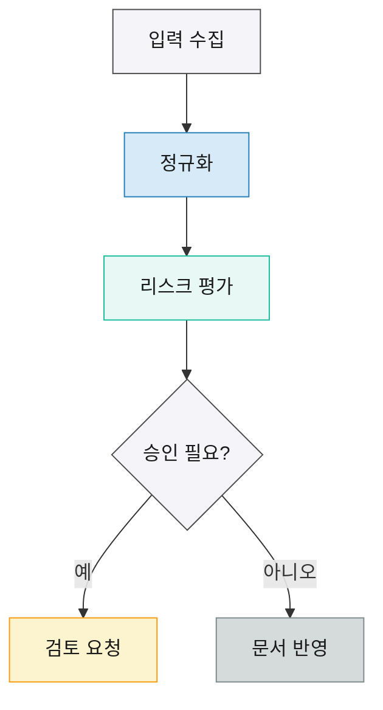

<div class="cover-page">

# Owen Graphite Sample

<div class="cover-rule"></div>

<div class="cover-meta">
작성일: 2026-04-30 · 버전: v1.0 · 작성: Owen WIKI
</div>

</div>

<div class="ogd-print-toc"></div>

## Executive Summary

> [!summary] 요약
> 이 문서는 Owen Graphite 테마의 AI 문서 작성 가이드 기능을 한 번씩 확인하기 위한 샘플이다. 보고서 모드, 표지, 목차, callout, 표 유틸리티, Mermaid, 코드블록, PDF 친화 옵션을 한 문서에 배치했다. 실제 운영 문서에서는 필요한 기능만 선택해 사용한다.

> [!decision] 판단
> 넓은 비교표와 위험도 표는 HTML table을 사용하고, 짧고 단순한 상태표는 Markdown table을 유지한다. 긴 URL, 정책 ID, 리소스명, 코드 토큰은 일반 표 셀에 직접 밀어 넣지 않고 전용 table utility를 적용한다.

## Context

Owen Graphite는 Obsidian Live Preview, Reading View, PDF 출력에서 안정적인 문서 경험을 만들기 위한 CSS 클래스와 컴포넌트 스타일을 제공한다.

이 샘플은 문서 작성자가 어떤 상황에 어떤 스타일을 적용할지 빠르게 눈으로 확인할 수 있도록 구성했다.

> [!note] 사용 범위
> 이 파일은 기능 확인용 샘플이다. 고객 보고서나 위키 페이지를 작성할 때는 이 문서의 구조를 그대로 복사하기보다, 필요한 섹션과 표 유형만 선택한다.

## Report Skeleton

보고서형 문서에는 YAML `cssclasses`에 `ogd-report-mode`, `ogd-auto-number-headings`, `ogd-print-avoid-breaks`를 우선 적용한다. 표지가 필요하면 `cover-page`, `cover-rule`, `cover-meta`를 사용하고, PDF 목차가 필요하면 표지 뒤에 `ogd-print-toc`를 배치한다.

```yaml
cssclasses:
  - ogd-report-mode
  - ogd-auto-number-headings
  - ogd-print-avoid-breaks
  - ogd-spacing-standard
```

공유 목적과 문서 길이에 따라 spacing class를 선택한다.

<table class="compact-table">
  <thead>
    <tr>
      <th>클래스</th>
      <th>사용 상황</th>
      <th>효과</th>
    </tr>
  </thead>
  <tbody>
    <tr>
      <td><code>ogd-spacing-compact</code></td>
      <td>짧은 내부 보고서</td>
      <td>밀도 높은 화면</td>
    </tr>
    <tr>
      <td><code>ogd-spacing-standard</code></td>
      <td>기본 보고서</td>
      <td>균형 잡힌 간격</td>
    </tr>
    <tr>
      <td><code>ogd-spacing-relaxed</code></td>
      <td>외부 공유 문서</td>
      <td>넉넉한 읽기 흐름</td>
    </tr>
  </tbody>
</table>

## Callout Gallery

> [!tldr] 빠른 요약
> Owen Graphite 샘플은 문서 구조, callout, 표, Mermaid, 코드블록을 한 문서에서 확인하도록 설계했다.

> [!recommendation] 권장 조치
> 요약 직후에는 최종 판단과 실행 방향을 짧게 둔다. 독자가 문서 전체를 읽기 전에 방향성을 잡을 수 있다.

> [!risk] 주요 위험
> 표 안에 긴 문장과 식별자를 과도하게 넣으면 Reading View와 PDF 출력에서 행 높이가 급격히 커진다.

> [!warning] 주의
> 모든 섹션을 callout으로 감싸면 정보 위계가 흐려진다. callout은 의미 구분이 필요한 핵심 블록에만 사용한다.

> [!danger] 금지 패턴
> 긴 URL, 리소스 ID, 로그 값을 일반 Markdown table 셀에 그대로 넣지 않는다.

> [!info] 참고 정보
> 짧은 설명과 보조 근거는 `note` 또는 `info` callout으로 분리하면 본문 흐름을 해치지 않는다.

> [!example] 예시
> 비교 판단, 위험 요약, 액션 아이템처럼 문서의 의사결정에 직접 관여하는 영역은 callout과 표를 함께 쓰면 좋다.

> [!success] 완료 기준
> 제목, 요약, 판단, 표, 근거, 권장 조치, 액션 항목이 한 화면 흐름 안에서 자연스럽게 이어지면 문서 구조가 안정적이다.

> [!check] 확인
> Reading View에서 표 폭, Mermaid 렌더링, 코드블록 언어 배지가 의도대로 보이는지 확인한다.

> [!done] 완료
> 샘플 문서는 기능 확인이 끝난 뒤에도 템플릿 참고용으로 보관할 수 있다.

> [!conclusion] 결론
> 운영 문서에는 이 샘플의 모든 요소를 넣기보다 문서 목적에 맞는 요소만 선택한다.

> [!secret] 민감 정보 자리표시자
> 실제 민감 정보는 샘플 문서에 넣지 않는다. 필요한 경우 별도 접근 제어가 있는 문서로 분리한다.

> [!hidden] 숨김 정보 자리표시자
> Obsidian에서 숨김 정보 스타일을 확인하기 위한 비민감 샘플 문장이다.

## Table Utility Samples

### Markdown Table

아래 표는 짧은 텍스트만 포함하는 기본 Markdown table 예시다. 긴 설명은 표 밖 본문으로 분리한다.

| 항목 | 상태 | 메모 |
|------|------|------|
| 문서 구조 | 완료 | 표지와 목차 포함 |
| callout | 완료 | 요약, 판단, 위험, 액션 포함 |
| 표 유틸리티 | 완료 | HTML table 샘플 포함 |

### Comparison Table

열이 많은 비교표는 `wide-table comparison-table`을 사용하고, PDF 출력이 필요하면 `print-fit-table`을 함께 적용한다.

<table class="wide-table comparison-table print-fit-table">
  <thead>
    <tr>
      <th>항목</th>
      <th>Markdown table</th>
      <th>HTML table</th>
      <th>권장 사용</th>
      <th>판단</th>
    </tr>
  </thead>
  <tbody>
    <tr>
      <td>짧은 상태표</td>
      <td>적합</td>
      <td>가능</td>
      <td>Markdown</td>
      <td>단순한 표는 가볍게 유지</td>
    </tr>
    <tr>
      <td>제품 비교</td>
      <td>제한적</td>
      <td>적합</td>
      <td>HTML + comparison-table</td>
      <td>열 폭과 헤더 강조 필요</td>
    </tr>
    <tr>
      <td>PDF 보고서</td>
      <td>가능</td>
      <td>적합</td>
      <td>print-fit-table 추가</td>
      <td>인쇄 시 패딩과 폰트 축소 유리</td>
    </tr>
  </tbody>
</table>

### Compact Table

로그와 체크리스트는 `compact-table`로 행 간격을 줄인다.

<table class="compact-table">
  <thead>
    <tr>
      <th>순서</th>
      <th>점검 항목</th>
      <th>상태</th>
    </tr>
  </thead>
  <tbody>
    <tr>
      <td>1</td>
      <td>프론트매터 cssclasses 확인</td>
      <td>완료</td>
    </tr>
    <tr>
      <td>2</td>
      <td>PDF 목차 위치 확인</td>
      <td>완료</td>
    </tr>
    <tr>
      <td>3</td>
      <td>긴 토큰 표 분리</td>
      <td>완료</td>
    </tr>
  </tbody>
</table>

### Numeric Table

숫자 중심 표는 `numeric-table`과 `.num`을 사용해 숫자 정렬과 tabular nums 효과를 확인한다.

<table class="numeric-table print-fit-table">
  <thead>
    <tr>
      <th>분류</th>
      <th>문서 수</th>
      <th>비율</th>
      <th>변화량</th>
    </tr>
  </thead>
  <tbody>
    <tr>
      <td>보고서</td>
      <td class="num">128</td>
      <td class="num">42.7%</td>
      <td class="num">+12</td>
    </tr>
    <tr>
      <td>위키</td>
      <td class="num">663</td>
      <td class="num">51.8%</td>
      <td class="num">+34</td>
    </tr>
    <tr>
      <td>초안</td>
      <td class="num">17</td>
      <td class="num">5.5%</td>
      <td class="num">-3</td>
    </tr>
  </tbody>
</table>

### Risk Table

위험도 표는 `risk-table`과 `.risk-high`, `.risk-medium`, `.risk-low`, `.risk-ok`를 함께 사용한다.

<table class="risk-table print-fit-table">
  <thead>
    <tr>
      <th>리스크</th>
      <th>등급</th>
      <th>영향</th>
      <th>권장 조치</th>
    </tr>
  </thead>
  <tbody>
    <tr class="risk-high">
      <td>긴 토큰을 일반 표에 삽입</td>
      <td>High</td>
      <td>PDF 행 높이 급증</td>
      <td>scroll-token-table 사용</td>
    </tr>
    <tr class="risk-medium">
      <td>넓은 비교표를 기본 Markdown으로 작성</td>
      <td>Medium</td>
      <td>가로폭 초과</td>
      <td>wide-table 적용</td>
    </tr>
    <tr class="risk-low">
      <td>짧은 상태표에 HTML table 사용</td>
      <td>Low</td>
      <td>문서 소스가 길어짐</td>
      <td>Markdown table 유지</td>
    </tr>
    <tr class="risk-ok">
      <td>용도별 table utility 적용</td>
      <td>OK</td>
      <td>Reading View와 PDF 안정화</td>
      <td>현재 방식 유지</td>
    </tr>
  </tbody>
</table>

### Wrap Table

긴 URL, 정책 ID, 리소스명은 `wrap-table`을 사용해 줄바꿈을 강화한다.

<table class="wrap-table print-fit-table">
  <thead>
    <tr>
      <th>유형</th>
      <th>값</th>
      <th>메모</th>
    </tr>
  </thead>
  <tbody>
    <tr>
      <td>URL</td>
      <td>https://github.com/towishy/Owen-Graphite/blob/main/docs/ai-document-guide.md</td>
      <td>문서 작성 가이드 원문</td>
    </tr>
    <tr>
      <td>정책 ID</td>
      <td>sec-Restrict-Tenant-Access-Policy-Example-Long-Identifier-2026-04</td>
      <td>긴 식별자 줄바꿈 확인</td>
    </tr>
  </tbody>
</table>

### Token Table

긴 코드 토큰은 `nowrap-code-table` 또는 `scroll-token-table`로 처리한다.

<table class="nowrap-code-table scroll-token-table">
  <thead>
    <tr>
      <th>항목</th>
      <th>토큰</th>
      <th>용도</th>
    </tr>
  </thead>
  <tbody>
    <tr>
      <td>Resource ID</td>
      <td><code>/subscriptions/00000000-0000-0000-0000-000000000000/resourceGroups/rg-owen-graphite-sample/providers/Microsoft.Security/securityConnectors/very-long-sample-resource-name</code></td>
      <td>가로 스크롤 확인</td>
    </tr>
    <tr>
      <td>KQL Field</td>
      <td><code>AdditionalFields.ExtremelyLongNestedPropertyName.For.DocumentRendering.Validation.Sample</code></td>
      <td>nowrap 확인</td>
    </tr>
  </tbody>
</table>

### Scroll Table

열이 매우 많은 표는 `scroll-table`로 화면 가로 스크롤을 허용한다.

<table class="scroll-table wide-table print-fit-table">
  <thead>
    <tr>
      <th>영역</th>
      <th>문서 구조</th>
      <th>Callout</th>
      <th>Markdown 표</th>
      <th>HTML 표</th>
      <th>Mermaid</th>
      <th>코드블록</th>
      <th>PDF</th>
      <th>상태</th>
    </tr>
  </thead>
  <tbody>
    <tr>
      <td>샘플</td>
      <td>포함</td>
      <td>포함</td>
      <td>포함</td>
      <td>포함</td>
      <td>포함</td>
      <td>포함</td>
      <td>포함</td>
      <td>완료</td>
    </tr>
  </tbody>
</table>

## Mermaid Sample

Mermaid는 구조와 흐름을 빠르게 이해시키는 보조 도식으로 사용한다. 노드 라벨은 짧게 유지하고, 긴 라벨에는 `<br/>` 줄바꿈을 명시한다.



## Code Blocks

코드블록에는 언어명을 붙인다. 변경 전후를 보여줄 때는 `diff` 코드블록을 사용한다.

```kql
DeviceEvents
| where Timestamp > ago(7d)
| summarize Events=count() by ActionType
| order by Events desc
```

```diff
- usePlainTable = true
+ useGraphiteTableUtility = true
```

## Recommendations

> [!recommendation] 적용 기준
> 새 보고서 문서는 먼저 구조를 잡고, 표가 필요한 곳에서 용도별 table utility를 선택한다. 표 안에 긴 설명을 넣어야 한다면 표를 둘로 나누거나 본문 단락으로 이동한다.

## Action Items

<table class="compact-table">
  <thead>
    <tr>
      <th>우선순위</th>
      <th>작업</th>
      <th>담당</th>
      <th>상태</th>
    </tr>
  </thead>
  <tbody>
    <tr>
      <td>P0</td>
      <td>Obsidian Reading View에서 샘플 확인</td>
      <td>Owen</td>
      <td>예정</td>
    </tr>
    <tr>
      <td>P1</td>
      <td>PDF Export에서 표 잘림 확인</td>
      <td>Owen</td>
      <td>예정</td>
    </tr>
  </tbody>
</table>

> [!action] 다음 작업
> Reading View와 PDF Export에서 표, callout, Mermaid, 코드블록이 의도한 간격과 폭으로 보이는지 확인한다.

## Appendix

이 샘플에서 확인하는 Owen Graphite 기능은 다음과 같다.

- 보고서 모드: `ogd-report-mode`, `ogd-auto-number-headings`, `ogd-print-avoid-breaks`, `ogd-spacing-standard`
- 표지와 목차: `cover-page`, `cover-rule`, `cover-meta`, `ogd-print-toc`
- callout: `summary`, `tldr`, `decision`, `recommendation`, `risk`, `warning`, `danger`, `note`, `info`, `example`, `success`, `check`, `done`, `conclusion`, `secret`, `hidden`, `action`
- 표 유틸리티: `wide-table`, `comparison-table`, `compact-table`, `numeric-table`, `.num`, `risk-table`, `.risk-high`, `.risk-medium`, `.risk-low`, `.risk-ok`, `wrap-table`, `nowrap-code-table`, `scroll-token-table`, `print-fit-table`, `scroll-table`
- 보조 요소: Mermaid, 언어 지정 코드블록, `diff` 코드블록