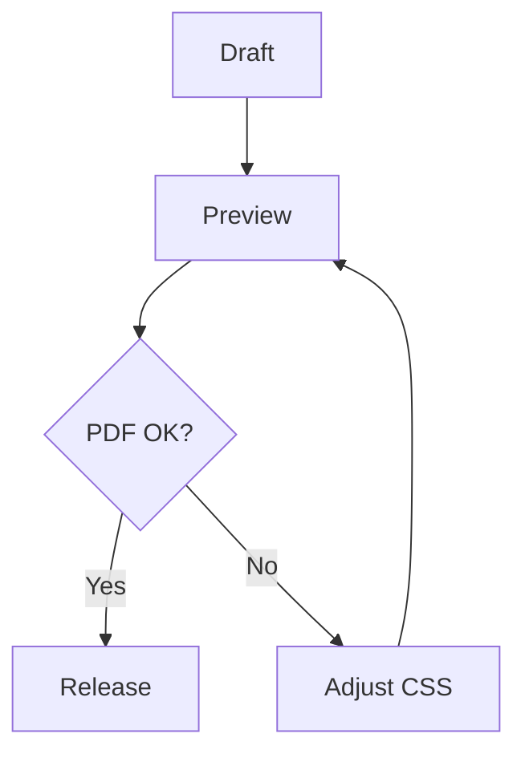

# PDF Export QA Sample

> [!summary] 목적
> A3/PDF 출력에서 제목, callout, 표, Mermaid, 코드블록, 이미지, footnote가 서로 겹치거나 중간 분할되지 않는지 확인한다.

## 긴 제목과 본문 흐름 확인

한국어 문단과 영어 제품명, 숫자, URL이 섞여도 줄바꿈이 안정적인지 확인한다. Microsoft Defender, Entra ID, Obsidian Live Preview, PDF Export 같은 혼합 텍스트가 본문 폭을 밀어내지 않아야 한다.

## Callout 연속 확인

> [!decision] 판단
> PDF 출력에서는 callout 제목, 본문, 아이콘이 한 카드 안에 유지되어야 한다.

> [!risk] 위험
> 긴 callout이 페이지 하단에 걸릴 때 제목만 남고 본문이 다음 페이지로 크게 밀리면 실패로 본다.

> [!success] 완료 기준
> callout 카드, 내부 task, 마지막 문장이 모두 읽기 좋게 남는다.

## 표 3종 확인

### 기본 Markdown 표

| 항목 | 상태 | 메모 |
| --- | --- | --- |
| 짧은 상태표 | Pass | Markdown table widget editability 기준 |
| 긴 설명 | Review | 긴 문장은 표 밖으로 빼는 것을 권장 |

### 보고서 표

<table class="ogd-report-table print-fit-table">
  <thead>
    <tr>
      <th>Control</th>
      <th>Owner</th>
      <th>Status</th>
      <th>Evidence</th>
    </tr>
  </thead>
  <tbody>
    <tr>
      <td>Header repeat</td>
      <td>Theme CSS</td>
      <td>Pass</td>
      <td>Exported PDF page boundary</td>
    </tr>
    <tr>
      <td>Numeric alignment</td>
      <td>Author</td>
      <td>Pass</td>
      <td>Tabular number columns</td>
    </tr>
  </tbody>
</table>

### 위험도 표

<table class="risk-table print-fit-table">
  <thead>
    <tr>
      <th>Risk</th>
      <th>Impact</th>
      <th>Action</th>
      <th>Level</th>
    </tr>
  </thead>
  <tbody>
    <tr class="risk-high">
      <td>Page split</td>
      <td>High</td>
      <td>Use avoid-break guard</td>
      <td>High</td>
    </tr>
    <tr class="risk-medium">
      <td>Long token overflow</td>
      <td>Medium</td>
      <td>Use wrap-table or scroll-token-table</td>
      <td>Medium</td>
    </tr>
    <tr class="risk-ok">
      <td>Short status</td>
      <td>Low</td>
      <td>Keep Markdown table</td>
      <td>OK</td>
    </tr>
  </tbody>
</table>

## Mermaid 확인



## 코드블록 확인

```powershell
$ErrorActionPreference = "Stop"
npm.cmd run build
python scripts/validate_theme.py
```

```json
{
  "theme": "Owen Graphite",
  "mode": "report",
  "pdf": "A3 landscape"
}
```

## 이미지와 Footnote 확인


이미지 다음 문단과 footnote[^1]가 PDF에서 겹치지 않아야 한다.

[^1]: Footnote 영역은 본문과 분리되어야 하며 다크 모드가 아닌 PDF 출력에서는 잉크 대비가 충분해야 한다.