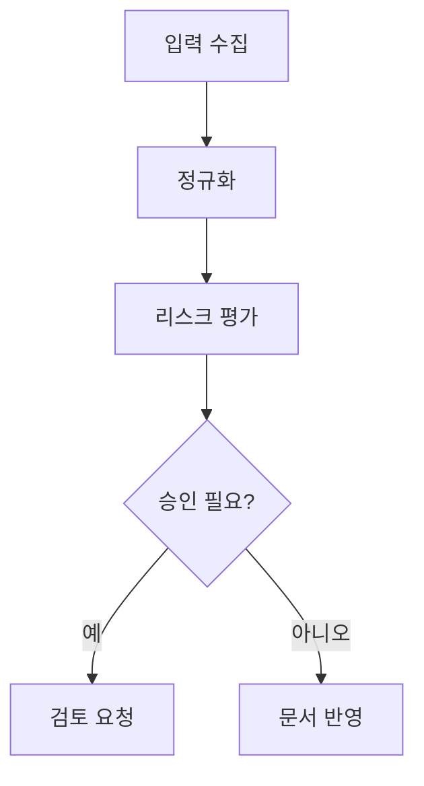

# Owen Graphite AI 문서 작성 가이드

이 문서는 LLM-WIKI, Copilot, ChatGPT, Claude 같은 AI가 **Owen Graphite** 테마의 문서 작성 기능을 활용해 Obsidian 문서를 모던한 보고서/위키 형식으로 생성하도록 돕는 작성 규칙입니다.

목표는 단순히 예쁜 Markdown을 만드는 것이 아니라, Live Preview, Reading View, PDF 출력에서 모두 안정적으로 보이는 문서 구조를 만드는 것입니다.

## 핵심 원칙

- 문서는 `H1 → 요약 → 핵심 섹션 → 표/근거 → 결론/액션` 순서로 작성한다.
- 큰 장식보다 구조를 우선한다. 제목, callout, 표, 코드블록, Mermaid, 목차 유틸리티를 필요한 위치에만 쓴다.
- 본문은 짧은 단락으로 나누고, 한 단락에는 하나의 주장만 담는다.
- 긴 URL, 정책 ID, 리소스명, 로그 값은 일반 표에 그대로 넣지 말고 테이블 유틸리티 클래스를 사용한다.
- PDF로 내보낼 문서는 `cover-page`, `ogd-print-toc`, `print-fit-table`, `wrap-table`을 우선 고려한다.

## AI 기본 출력 형식

AI가 새 문서를 만들 때는 아래 구조를 기본값으로 사용한다.

```markdown
---
cssclasses:
  - ogd-report-mode
  - ogd-auto-number-headings
  - ogd-print-avoid-breaks
---

<div class="cover-page">

# 문서 제목

<div class="cover-rule"></div>

<div class="cover-meta">
작성일: YYYY-MM-DD · 버전: v1.0 · 작성: Owen WIKI
</div>

</div>

<div class="ogd-print-toc"></div>

# Executive Summary

> [!summary] 요약
> 핵심 결론을 3~5문장으로 정리한다.

> [!decision] 판단
> 현재 문서의 최종 판단이나 채택 방향을 명시한다.

# Context

문제가 발생한 배경, 범위, 전제 조건을 설명한다.

# Findings

| 항목 | 관찰 | 영향 | 권장 조치 |
|------|------|------|-----------|
| 예시 | 내용 | 높음 | 조치 |

# Recommendations

> [!recommendation] 권장 조치
> 실행 가능한 조치를 우선순위 순서로 작성한다.

# Action Items

| 우선순위 | 작업 | 담당 | 상태 |
|----------|------|------|------|
| P0 | 즉시 처리할 작업 | TBD | 예정 |

# Appendix

추가 근거, 로그, 코드, 참고 링크를 배치한다.
```

## 문서 유형별 권장 구조

| 문서 유형 | 권장 구조 | 주요 기능 |
|-----------|-----------|-----------|
| 전략 보고서 | 표지 → 요약 → 배경 → 분석 → 의사결정 → 액션 | `cover-page`, `summary`, `decision`, `recommendation` |
| 기술 분석 | 요약 → 아키텍처 → 비교표 → 리스크 → 구현안 | `comparison-table`, `risk-table`, Mermaid, 코드블록 |
| 장애/회귀 리포트 | 증상 → 영향 → 원인 → 해결 → 재발 방지 | `warning`, `bug`, `success`, `action` |
| 회의록 | 목적 → 결정사항 → 논의 → 액션 → 후속 일정 | `decision`, `action`, compact table |
| 지식 카드 | 정의 → 핵심 개념 → 예시 → 관련 링크 | `note`, `example`, tag pill, callout |
| 체크리스트 | 목표 → 체크 항목 → 상태표 → 완료 기준 | task glyph, `compact-table`, `success` |

## Callout 사용 규칙

AI는 callout을 장식용으로 남발하지 말고, 문서의 의미를 구분할 때만 사용한다.

| 목적 | Callout | 사용 위치 |
|------|---------|-----------|
| 전체 요약 | `summary`, `tldr` | 문서 초반 |
| 최종 판단 | `decision`, `conclusion` | 요약 직후 또는 결론 |
| 권장 조치 | `recommendation` | 실행안 섹션 |
| 위험/주의 | `risk`, `warning`, `danger` | 리스크 섹션 |
| 다음 작업 | `action` | 문서 말미 |
| 참고 정보 | `note`, `info` | 본문 중간 보조 설명 |
| 예시 | `example` | 개념 설명 뒤 |
| 완료 확인 | `success`, `check`, `done` | 검증/완료 섹션 |
| 숨김 정보 | `secret`, `hidden` | 민감 정보가 필요한 경우 |

권장 예시:

```markdown
> [!summary] 핵심 요약
> 이 문서는 현재 상태, 주요 위험, 권장 조치를 빠르게 판단하기 위한 보고서다.

> [!risk] 주요 위험
> 인증 토큰 만료 정책이 명확하지 않아 장기 세션 노출 가능성이 있다.

> [!action] 다음 작업
> 1주 안에 토큰 만료 정책과 재인증 UX를 확정한다.
```

## 표 작성 규칙

표는 문서의 밀도를 높이는 핵심 도구다. 단, 긴 텍스트를 표에 억지로 넣으면 가독성이 무너진다.

| 상황 | 권장 클래스 | 목적 |
|------|-------------|------|
| 열이 많은 비교표 | `wide-table comparison-table` | 열 폭과 헤더 강조 최적화 |
| 로그/체크리스트 | `compact-table` | 행 간격 축소 |
| 숫자 중심 표 | `numeric-table` 또는 `.num` | 우측 정렬 + tabular nums |
| 위험도 표 | `risk-table` + `.risk-high/.risk-medium/.risk-low/.risk-ok` | 상태 구분 |
| 긴 URL/식별자 | `wrap-table` | 줄바꿈 강화 |
| 긴 코드 토큰 | `nowrap-code-table` 또는 `scroll-token-table` | 행 높이 급증 방지 |
| PDF에 맞춰야 하는 표 | `print-fit-table` | 인쇄 시 폰트/패딩 축소 |
| 넓은 표 | `scroll-table` | 화면 가로 스크롤 |

Live Preview에서 셀을 직접 클릭해 수정해야 하는 표는 Markdown table을 우선 사용한다. Obsidian은 HTML `<table>` 블록을 클릭하면 원본 HTML 소스를 활성화하므로, 편집 중인 숫자표·매트릭스·간단 비교표는 아래처럼 Markdown alignment row로 정렬을 표현한다.

| 작성 단계 | 권장 형식 | 기준 |
|---|---|---|
| 초안 작성·리뷰 | Markdown table | 셀 단위 클릭 수정과 빠른 행/열 편집이 필요할 때 |
| 숫자표·매트릭스·간단 비교 | Markdown table | 우측 정렬은 alignment row(`---:`)로 표현 |
| 최종 보고서/PDF | HTML table utility | `wide-table`, `risk-table`, `print-fit-table` 등 class 기반 출력 품질이 필요할 때 |
| 긴 URL·토큰·복합 셀 | HTML table utility 또는 본문 분리 | 줄바꿈/스크롤/배지 class 제어가 편집성보다 중요할 때 |

```markdown
| 월 | 생성 문서 | 검증 완료 | 성공률 |
|---|---:|---:|---:|
| 2026-01 | 42 | 39 | 92.86% |
| 2026-02 | 58 | 56 | 96.55% |
```

HTML table이 필요한 경우:

- 최종 보고서/PDF 출력에서 `wide-table`, `risk-table`, `print-fit-table` 같은 Owen Graphite table utility가 반드시 필요할 때
- 셀 단위 Live Preview 편집보다 출력 품질과 세부 class 제어가 더 중요할 때

```html
<table class="wide-table comparison-table print-fit-table">
  <thead>
    <tr>
      <th>항목</th>
      <th>옵션 A</th>
      <th>옵션 B</th>
      <th>판단</th>
    </tr>
  </thead>
  <tbody>
    <tr>
      <td>운영 복잡도</td>
      <td>낮음</td>
      <td>중간</td>
      <td>옵션 A 우선</td>
    </tr>
  </tbody>
</table>
```

Markdown table만 사용할 때는 표 바로 앞에 용도를 설명하고, 긴 내용은 표 밖 본문으로 분리한다.

## Mermaid 작성 규칙

Owen Graphite는 Mermaid를 카드형 표면으로 보여준다. AI는 Mermaid를 복잡한 설명의 대체가 아니라, 흐름/구조를 빠르게 이해시키는 보조 도식으로 사용한다.

- 노드 라벨은 짧게 쓴다.
- 긴 노드는 `<br/>`로 명시적 줄바꿈을 넣는다.
- 노드가 6개를 넘으면 `flowchart TB` 또는 `subgraph`로 나눈다.
- edge label은 짧게 유지한다.



## 코드블록 작성 규칙

- 코드블록에는 언어명을 반드시 붙인다.
- 설명은 코드 위나 아래에 두고, 코드 내부 주석은 꼭 필요한 경우에만 쓴다.
- diff는 `diff` 코드블록을 사용한다.

```diff
- oldValue = true
+ newValue = false
```

## PDF/보고서 모드 권장 설정

보고서나 공유용 문서를 만들 때 AI는 다음 cssclasses를 우선 제안한다.

```yaml
cssclasses:
  - ogd-report-mode
  - ogd-auto-number-headings
  - ogd-print-avoid-breaks
  - ogd-spacing-standard
```

상황별 추가 클래스:

| 상황 | 추가 클래스 |
|------|-------------|
| 짧은 내부 보고서 | `ogd-spacing-compact` |
| 외부 공유용 보고서 | `ogd-spacing-relaxed` |
| 표지가 필요한 문서 | `cover-page`, `cover-meta`, `cover-rule` |
| 인쇄 목차가 필요한 문서 | `ogd-print-toc` |
| 넓은 표가 많은 문서 | `wide-table`, `print-fit-table`, `scroll-table` |

## AI가 피해야 할 패턴

- 모든 섹션을 callout으로 감싸지 않는다.
- 표 안에 여러 문단을 넣지 않는다.
- 긴 URL과 코드 토큰을 일반 표 셀에 그대로 넣지 않는다.
- H1을 여러 번 남발하지 않는다. 큰 장은 H1, 내부 장은 H2/H3를 쓴다.
- Mermaid 노드에 긴 문장을 넣지 않는다.
- PDF 문서에서 이미지, 표, callout을 섹션 제목과 분리된 위치에 방치하지 않는다.
- Obsidian에서 지원하지 않는 임의 HTML/CSS를 문서 본문에 과하게 넣지 않는다.

## LLM-WIKI용 시스템 프롬프트 예시

아래 프롬프트를 LLM-WIKI의 문서 생성 에이전트에 넣으면 Owen Graphite 스타일에 맞는 문서를 더 일관되게 만들 수 있다.

```text
너는 Owen Graphite 테마로 Obsidian 문서를 작성하는 문서 설계자다.

작성 규칙:
- Markdown을 기본으로 작성하고, 필요한 경우에만 HTML table/div wrapper를 사용한다.
- 문서는 H1 → summary/decision callout → 본문 섹션 → 표/근거 → recommendations/action items 순서로 구성한다.
- 보고서 문서에는 YAML cssclasses로 ogd-report-mode, ogd-auto-number-headings, ogd-print-avoid-breaks를 제안한다.
- 표지는 cover-page, cover-rule, cover-meta를 사용한다.
- PDF 목차가 필요하면 ogd-print-toc div를 표지 다음에 둔다.
- 위험/판단/권장/액션은 각각 risk, decision, recommendation, action callout을 사용한다.
- 비교표에는 comparison-table, 위험표에는 risk-table, 긴 토큰 표에는 nowrap-code-table 또는 scroll-token-table, PDF 표에는 print-fit-table을 사용한다.
- Mermaid는 흐름/구조 설명에만 쓰고, 노드 라벨은 짧게 유지한다.
- 코드블록에는 언어명을 붙인다.
- 긴 문장, 긴 URL, 긴 식별자는 표 안에 밀어 넣지 말고 본문 또는 wrap-table/scroll-token-table로 처리한다.

출력은 설명 없이 완성된 Markdown 문서로 제공한다.
```

## 빠른 품질 체크리스트

- 첫 화면에서 제목, 요약, 판단이 바로 보이는가?
- 위험과 액션이 callout으로 분리되어 있는가?
- 표는 목적에 맞는 클래스를 사용했는가?
- PDF 출력 시 표/코드/callout이 페이지 중간에서 부자연스럽게 갈라질 가능성이 낮은가?
- Mermaid와 표가 본문 이해를 돕고 있는가?
- 긴 토큰 때문에 행 높이가 과도하게 커지지 않는가?
- 문서 말미에 다음 작업이나 결론이 있는가?

## 관련 문서

- [README.md](../README.md) — 테마 소개와 신기능 요약
- [style-settings.md](style-settings.md) — Style Settings와 사용자 클래스 전체 목록
- [CHANGELOG.md](../CHANGELOG.md) — 릴리즈별 변경 이력